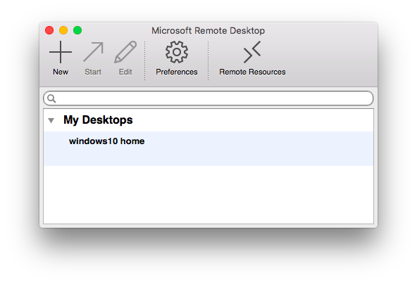
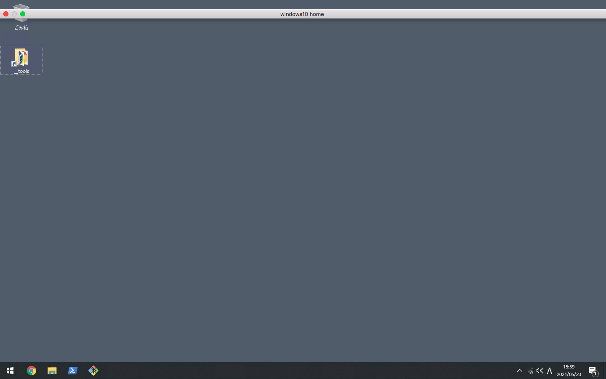
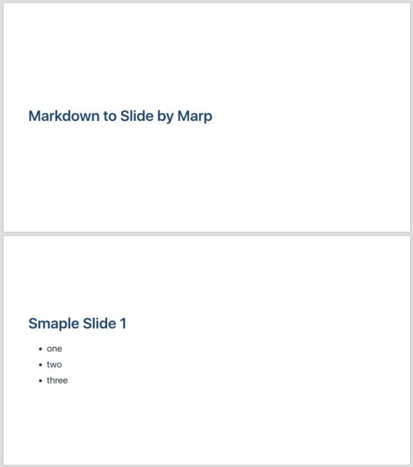

# 2021/05

## 2021/05/21 Fri

MySQL の大文字小文字を区別する  

MySQL を使ってて英語の大文字小文字が識別できないという問題があった  
`BINARY` 演算子を使って試したが、データ量が多いので根本的に見直す必要がありそう  

```sql
SELECT BINARY 'a' = 'A';
```

カラムの照合順序が `utf8_general_ci` だから `utf8_bin` に直せば良いのかな  

```sql
ALTER TABLE `xxx_table` MODIFY COLUMN `xxx_column` TEXT COLLATE 'utf8_bin';
```

DB でアプリケーションの仕様に影響が出てきてしまうので難しいですね  

- 参考
  - MySQL 5.6 のドキュメントだけど......
    - [MySQL :: MySQL 5.6 リファレンスマニュアル :: 10.1.7.7 BINARY 演算子](https://dev.mysql.com/doc/refman/5.6/ja/charset-binary-op.html)
    - [MySQL :: MySQL 5.6 リファレンスマニュアル :: 10.1.7.6 _bin および binary 照合順序](https://dev.mysql.com/doc/refman/5.6/ja/charset-binary-collations.html)
  - [MySQL: utf8_bin と utf8_general_ci と utf8_unicode_ci - fメモ いまさら館](http://ftsh.hateblo.jp/entry/2016/04/16/100937)


## 2021/05/22 Sat

Windows 10 Home へのリモートデスクトップ接続をしたい  

Windows へのリモートデスクトップ接続をしたいなと思って  
前できたよなと思ったらどうやら Pro エディションじゃないとリモートデスクトップ接続ができないみたい  
そもそも Home エディションにはリモートデスクトップ接続の設定がない  

はて、と調べてみると [RDPWrap](https://github.com/stascorp/rdpwrap/releases) とういうものがある  
設定すれば Home エディションでもリモートデスクトップ接続ができるらしい  

明日あたりにでもやってみようかな  

- 参考
  - [Windows10Homeでリモートデスクトップ出来ない人へ！簡単に接続可能！ | 快晴ブログ](https://kaisei-eigo.com/remote-desktop-home-edition)


## 2021/05/23 Sun

RDPWrap を使って Windows 10 Home へのリモートデスクトップ接続をした  

昨日の続き  
[参考記事](https://kaisei-eigo.com/remote-desktop-home-edition)の通りにやってみたが Listener State が `Not Listening` となり接続ができない  
[別の記事](https://kaoruya.org/blog/rdpwrap/)を試したら接続することができた  

主にやったことは下記 3 点

- `Remote Desktop Service` の停止
- `rdpwrap.ini` の更新
- 再起動

上記で Listener State が `Listening` となり接続ができた  

  

  

  

ここまでやったが Chrome リモート デスクトップの方が早くて簡単かもしれない......  

- 参考
  - [【画像つき】Windows10 Homeでもリモートデスクトップを使う方法](https://kaoruya.org/blog/rdpwrap/)


## 2021/05/24 Mon

Python の main 関数  

高校面子が Python 学んでる  
ちょっと話すのに簡単なスクリプトを書いてたりした  

```py
print('Hello World!')
```

こんな感じで標準出力ができるのだが、ふと main 関数ってあるの？って気になった  
Perl でなにか書きたいときは以下のように main ルーチンを用意している  

```pl
#!/usr/bin/env perl

use strict;
use warnings;

sub main {
  &_helloWorld();
}

sub _helloWorld {
  print 'Hello World!';
}

&main();

1;
```

Python の main 関数で調べてみると以下のようにやるらしい  

```py
def main():
    helloWorld()

def helloWorld():
    print('Hello World!')

if __name__ == "__main__":
    main()
```

`if __name__ == "__main__":` はモジュールとしてインポートした際に処理が動かないようにするために必要みたい  
今日は朝が早かったのでこのへんで  

- 参考
  - [Python Tips: Python で main 関数を定義することのメリット - Life with Python](https://www.lifewithpython.com/2021/01/python-main-function.html)
  - [pythonのmain関数についてメモ - paloma blog](https://paloma69.hatenablog.com/entry/2018/06/28/005550)
  - [Pythonのif __name__ == "__main__" とは何ですか？への回答 - Python学習チャンネル by PyQ](https://blog.pyq.jp/entry/Python_kaiketsu_180207)


## 2021/05/25 Tue

history には過去が詰まっている ~ $RANDOM, uuidgen ~  

history を見ていた  
やたらランダムの数値を出力していたり、 UUID を出力していたりしてた  

`echo $RANDOM` でランダムな数値を出力  

```sh
$ echo $RANDOM
18482

$ echo $RANDOM
7361

$ echo $RANDOM
14770
```

`uuidgen` で UUID を出力

```sh
$ uuidgen
0CD66C07-BFFD-4EBB-9698-D0CA0D485978

$ uuidgen
686BE74A-B459-4FCC-BD12-60BC3F814627

$ uuidgen
87A3C807-96B2-4927-AB61-9B7947F287DA
```

当時はなんで出力していたのかわからないが、ランダムな数値や UUID を活かしたシェルスクリプトを書くのも良いかもね  


## 2021/05/26 Wed

MySQL クライアントのパスワード入力を省略したい  

GUI クライアントはあまり使わず、大体 CUI で行っており `mysql-client` にはお世話になっている  
よく接続で使うコマンドは下記、開発環境などに多い  

```sh
$ mysql -uyour_user -p -hlocalhost
Enter password:
```

`Enter password` が出てパスワードを入力しているが、何回か実行すると入力が大変だったりする  
`-p` オプションで渡す際に環境変数などで隠すこともできるが......  

```sh
$ export MYSQL_PASSWORD=your_password
$ printenv MYSQL_PASSWORD
your_password

$ mysql -uyour_user -p$MYSQL_PASSWORD -hlocalhost
```

調べてみると外部ファイルを読み込んで接続できるみたい  
`--defaults-file` オプションを使用する  

設定ファイルを用意する  
`/path/to/.develop.my.cnf`  
```cnf
[client]
host=localhost
user=your_user
password=your_password

[mysqldump]
host=localhost
user=your_user
password=your_password
```

でファイルを指定する  
```sh
$ mysql --defaults-file=/path/to/.develop.my.cnf
```

設定ファイルにはいろいろ項目書けるみたい  

- 参考
  - [MySQL :: MySQL 8.0 リファレンスマニュアル :: 6.1.2.1 パスワードセキュリティーのためのエンドユーザーガイドライン](https://dev.mysql.com/doc/refman/8.0/ja/password-security-user.html)
  - [MySQLクライアントを快適に使う設定 - Qiita](https://qiita.com/muramount/items/3b3dbad242e16ff87f6c)


## 2021/05/27 Thu

2021 Octoverse Survey  

GitHub を見てると、 **2021 Octoverse Survey** という通知があった  


文章  

```
2021 Octoverse Survey
Contribute to this year’s Octoverse Report by sharing your experience writing code.
```

「 10 月調査のサーベイに協力してください」って感じかな  
そもそも Octoverse Survey って定期的にやっているのかなと調べてみたら去年のレポートが出てきた  

[The State of the Octoverse | The State of the Octoverse explores a year of change with new deep dives into developer productivity, security, and how we build communities on GitHub.](https://octoverse.github.com/)

非常に読み応えのあるレポートだけど翻訳は必死にしないとな......  
肝心のサーベイ内容もちょっと量が多そうだったので、次のお休みあたりにでも  


## 2021/05/28 Fri

マークダウンでプレゼンテーション資料を作りたい  

クローズドな環境で話す機会が増えるかもで、手を動かしながら資料を作るのも良いんだけどできればマークダウンから変換したい  
デザインもそんなにこだわるわけではないので、マークダウンで文章書いたらそれをそのまま使いたい  

資料を考えて、作って、話す  
このリードタイムが短ければある程度文字だけでも簡単に話は膨らませることができるのかなと  
ドキュメントツール・サービスでそういう機能もあるけど、 Git で管理したい気持ちがある  

調べてみるとそういう情報やツールがいっぱい出てきたわけで  
なんだかんだこういう事は誰もが通る道なんだなと  
触らないとわからないので、触ってみたらまたここに書こうかな  

- 参考
  - [【2021年版】Markdownでスライド作成できるツール・サービス × 14選 | NotePM](https://notepm.jp/blog/5994)
  - [[ Markdownでスライド作成 ] 5種類くらいツールを試してみた結果 - Qiita](https://qiita.com/ykhirao/items/74a23f812dd5d22b3b88)
  - [LTのスライド作成に時間をかけたくない - Qiita](https://qiita.com/ta9star/items/da9af53c4bf542d3ae7a)


## 2021/05/29 Sat

Slidev を触りたかった  

昨日の続き  
たまたま会社の同期と話す機会があり [Slidev](https://sli.dev/) をおすすめされた  

`npm` or `yarn` があればすぐ使えるみたい  
下記で[コマンド](https://sli.dev/guide/#scaffolding-your-first-presentation)で雛形を作成する  

node のバージョンは 14 以上にしておくこと  

```sh
$ yarn create slidev
```

name や version などを対話形式で入力して完了させる  
がやってみるとエラーが出てきており、 `yarn install` も失敗した  

```sh
warning Error running install script for optional dependency: "/Users/user/.config/yarn/global/node_modules/fsevents: Command failed.
```

```sh
Install unsuccessful
info Visit https://yarnpkg.com/en/docs/cli/install for documentation a
Error: Command failed with exit code 1: yarn install
    at makeError (/Users/user/.config/yarn/global/node_modules/create-slidev/node_modules/execa/lib/error.js:59:11)
    at handlePromise (/Users/user/.config/yarn/global/node_modules/create-slidev/node_modules/execa/index.js:114:26)
    at processTicksAndRejections (internal/process/task_queues.js:95:5)
    at async init (/Users/user/.config/yarn/global/node_modules/create-slidev/index.js:121:5) {
  shortMessage: 'Command failed with exit code 1: yarn install',
  command: 'yarn install',
  exitCode: 1,
  signal: undefined,
  signalDescription: undefined,
  stdout: undefined,
  stderr: undefined,
  failed: true,
  timedOut: false,
  isCanceled: false,
  killed: false
}
✨  Done in 112.85s.
```

`package.json` を編集したり、再度 `yarn install` も失敗してしてしまうので今日はあきらめることにした  

- 参考
  - 公式ドキュメント
    - [Home | Slidev](https://sli.dev/)
    - [Getting Started | Slidev](https://sli.dev/guide/#scaffolding-your-first-presentation)
  - 触ってみた内容
    - [開発者のためのスライド作成ツール Slidev がすごい](https://zenn.dev/ryo_kawamata/articles/introduce-slidev)
    - [Slidev を使ってみる](https://zenn.dev/ima1zumi/scraps/3d5c1dc8e523e8)
  - トラブルシューティング
    - [Reactのversionを上げるためにyarnを実行したらfseventsでERRORが発生した - Qiita](https://qiita.com/keiya01/items/5ea1ef8c2f70b68fde6c)


## 2021/05/30 Sun

Marp を VSCode で触る  

昨日の Slidev がうまくできなかったので、今日は [Marp](https://yhatt.github.io/marp/) を触ってみた  
公式では [Marp for VS Code](https://marketplace.visualstudio.com/items?itemName=marp-team.marp-vscode) が推奨されていたのでそちらを使用してみる  
VSCode 上で動くのは楽ですね  

適当にマークダウンを用意して.....

```md
# Markdown to Slide by Marp

---

# Smaple Slide 1

- one
- two
- three
```

VS Code 上で `Export slide deck...` を選択して作成する  
PDF で中身が確認できる  

  

細かいフォーマットなどはドキュメントを見て都度調整かな  

- 参考
  - [Marp - Markdown Presentation Writer](https://yhatt.github.io/marp/)
  - [Marpを使ってmarkdownでスライド資料を作成する | DevelopersIO](https://dev.classmethod.jp/articles/make-slides-from-markdown-with-marp/)

