# 2021/06

<!-- TOC -->

- [2021/06](#202106)
    - [2021/06/01 Tue](#20210601-tue)
    - [2021/06/02 Wed](#20210602-wed)
    - [2021/06/03 Thu](#20210603-thu)
    - [2021/06/04 Fri](#20210604-fri)
    - [2021/06/05 Sat](#20210605-sat)
    - [2021/06/06 Sun](#20210606-sun)
    - [2021/06/07 Mon](#20210607-mon)
    - [2021/06/08 Tue](#20210608-tue)
    - [2021/06/09 Wed](#20210609-wed)
    - [2021/06/10 Thu](#20210610-thu)
    - [2021/06/11 Fri](#20210611-fri)
    - [2021/06/12 Sat](#20210612-sat)
    - [2021/06/13 Sun](#20210613-sun)
    - [2021/06/14 Mon](#20210614-mon)
    - [2021/06/15 Tue](#20210615-tue)
    - [2021/06/16 Wed](#20210616-wed)
    - [2021/06/17 Thu](#20210617-thu)
    - [2021/06/18 Fri](#20210618-fri)
    - [2021/06/19 Sat](#20210619-sat)
    - [2021/06/20 Sun](#20210620-sun)
    - [2021/06/21 Mon](#20210621-mon)
    - [2021/06/22 Tue](#20210622-tue)
    - [2021/06/23 Wed](#20210623-wed)
    - [2021/06/24 Thu](#20210624-thu)
    - [2021/06/25 Fri](#20210625-fri)
    - [2021/06/26 Sat](#20210626-sat)

<!-- /TOC -->

## 2021/06/01 Tue

普段 GitLab 使ってて GitHub 使うと戸惑ったところ  

GitHub に自由に記録を残し初めて 6 月に入りました  
GitHub Pull Request ベースで作っていますが、普段お仕事では GitLab を使ってて  
〇〇がしたいってなった時に UI が異なってるので操作が戸惑っている  

ブランチを作る  

最初どこからブランチを作れば良いのかとなったが、実はブランチ切り替えの場所から作ることができる  
本当に GitHub を触ってなかったので戸惑った......
Issue は使えてないので本当はそこから作るよーかもだけど  

  
  

ブランチを消す  

最初はブランチ一覧で都度消していたが、実は PR を merge したあとに削除ができる  
merge 後に Delete branch と出てくるのでそこを押せば OK  
画像はボタン押したあとだけど

  

確か他にもあった気がするので、都度書いてければ良いかな  


## 2021/06/02 Wed

テキストファイルを複数行出力したい  

ちょっとしたテキストファイルの内容を複数行出力したくて、該当箇所をコピー&ペーストしたい  
cat は全内容をサクッと出力したい時に使うけど、対象箇所までスクロール移動が必要  
grep は対象文字列の検索で使っているので、検索次第では内容が無い場合がある  
less などである場所まで見てみるのもいいけど、これも結局スクロール移動が必要  

調べてみると tail や head をうまく使いこなせばできるみたい  

こんなテキストファイルを用意する  

```txt
1 a い あ 一
2 b ろ い 二
3 c は う 三
4 d に え 四
5 e ほ お 五
6 f へ か 六
7 g と き 七
8 h ち く 八
9 i り け 九
0 j ぬ こ 十
```

`cat [file] | head -n [出力したい末尾の行番号] | tail -n [出力したい末尾の行番号 - (出力したい開始の行番号 + 1)]` で出力できる  

例えば 4~8 行目を出力させたい場合はこんな感じでできる  

```sh
$ cat ./test.txt | head -n 8 | tail -n 5
4 d に え 四
5 e ほ お 五
6 f へ か 六
7 g と き 七
8 h ち く 八
```

やりたいことは cat でやりましたが sed で抽出した方が簡単でした......  
こういう時に同じコマンドばっかり使うのはよろしくない  

```sh
$ sed -n '4, 8p' ./test.txt
4 d に え 四
5 e ほ お 五
6 f へ か 六
7 g と き 七
8 h ち く 八
```

- 参考
  - [【linux】ファイルの特定の範囲の行を取り出すコマンド（headとtail） at softelメモ](https://www.softel.co.jp/blogs/tech/archives/1210)

ちょっと体調が思わしくないので明日以降は更新できない可能性があります  


## 2021/06/03 Thu

Scala 3 のガイドドキュメントを流し見する  

Scala 3 が 2021/05/14 に正式リリースされて、全然情報を追えてないことを反省しながらも[ガイドドキュメント](https://docs.scala-lang.org/ja/scala3/guides.html)があったので軽く見ることにした  
[Compatibility Reference](https://docs.scala-lang.org/scala3/guides/migration/compatibility-intro.html)、[Tour of the Migration Tools | Scala 3 Migration Guide | Scala Documentation](https://docs.scala-lang.org/scala3/guides/migration/tooling-tour.html)、[Scala 3 Migration Mode | Scala 3 Migration Guide | Scala Documentation](https://docs.scala-lang.org/scala3/guides/migration/tooling-migration-mode.html)あたりを見ました  
まだまだ見きれてないけど、メモとしてはこんな感じ  

- Scala 2.13 からの移行はスムーズにできる
  - クロスコンパイルできる
  - Scala 2.13 <- Scala 3 で依存可能
  - 下位／上位互換ができる
  - コンパイルオプション有
- sbt は sbt 1.5 から Scala 3 をサポート
- Metals はサポート有、IntelliJ IDEA は本格的なサポートは準備段階
- Scalafmt v3.0.0-RC3 は Scala 2.13, Scala 3 をサポート
- Scalafix はまだで Scala 2.13 のみ
- [Scala 3 Migrate](https://github.com/scalacenter/scala3-migrate) という移行 sbt プラグインがある
- scalac migration オプション、 rewrite オプションで書き換え可能

ちゃんと言語もライブラリもアップデートしていないと......  

- 参考
  - [Scala 3 のガイド | Scala Documentation](https://docs.scala-lang.org/ja/scala3/guides.html)

胃腸の調子、疲労感は昨日と比べて回復しました  


## 2021/06/04 Fri

個人の環境依存ファイルの除外の仕方を考える  

Git ではバージョン管理したくないファイルを `.gitignore` で管理している  
この `honyanya / 365` リポジトリも `.gitignore` を用意している  

今ある `.gitignore` はこんな感じ  

```sh
## Mac
.DS_Store
```

macOS で自動生成される `.DS_Store` を除外扱いにしている  
他にも `.swp` や Windows で生成される `Thumb.db` とかもよく入るかな  
ディレクトリで言うと `.idea/` とかも入るみたい  

同期から↑のような個人の環境依存ファイルは `.gitignore` は含めないで、 `core.excludesFile` に含めると良いアドバイスをもらった   

`.gitignore_global` というようなファイルを作って  

```sh
$ cat ~/.gitignore_global
## Mac
.DS_Store
```

git global に設定すれば良いみたい  

```sh
## 設定
$ git config --global core.excludesfile ~/.gitignore_global

## 確認
$ git config --list | grep core.excludesfile
core.excludesfile=/Users/user/.gitignore_global
```

いろいろ調べてみると個人の環境依存ファイルを含めないプロジェクトもあれば含めるプロジェクトもあるみたい  
基本的に `core.excludesFile` で良いかなと思ったけど、いちいち説明をするのも大変だし、 `git add .` されてああ......ってなるぐらいなら `.gitignore` でも良いのかなと思ったり  
個人のものは `core.excludesFile` に持っていこう  

- 参考
  - [Ignoring files - GitHub Docs](https://help.github.com/articles/ignoring-files)
  - [プロジェクトの.gitignoreに.swpファイルなど個人環境依存のファイルは含めない | 高木のブログ](https://takagi.blog/gitignore_global/)
  - [.gitignoreに.DS_Storeなど個人環境依存のファイルを含めても良いのではないか | blog.tai2.net](https://blog.tai2.net/gitignore.html)
  - [gitignore に書くべきでないものは gitignore_global へ - Qiita](https://qiita.com/elzup/items/4c92a2abdab56db3fb4e)


## 2021/06/05 Sat

textlint を実行してみる  

text にも lint があって、せっかくなので入れてみて実行してみた  

yarn で追加する  

```sh
$ yarn add --dev \
    textlint \
    textlint-rule-preset-ja-spacing \
    textlint-rule-preset-ja-technical-writing \
    textlint-rule-spellcheck-tech-word
```

作られた `package.json` はこんな感じ  

```json
$ cat 
{
  "devDependencies": {
    "textlint": "^12.0.0",
    "textlint-rule-preset-ja-spacing": "^2.1.3",
    "textlint-rule-preset-ja-technical-writing": "^6.0.0",
    "textlint-rule-spellcheck-tech-word": "^5.0.0"
  }
}
```

ルールを書く `.textlintrc` を作成する  

```sh
$ yarn textlint --init
```

作られた `.textlintrc`  
基本的に yarn add したルールは `true` になっている  

```sh
$ cat .textlintrc
{
  "filters": {},
  "rules": {
    "preset-ja-spacing": true,
    "preset-ja-technical-writing": true,
    "spellcheck-tech-word": true
  }
}
```

`textlint` を実行してみる  
いろいろエラーが出てくる  

```sh
$ yarn textlint 2021/05/README.md 
yarn run v1.22.10
warning package.json: No license field
$ /Users/user/workspace/365/node_modules/.bin/textlint 2021/05/README.md

/Users/user/workspace/365/2021/05/README.md
   22:6   ✓ error  原則として、全角文字と半角文字の間にスペースを入れません。                                                ja-spacing/ja-space-between-half-and-full-width
   22:18  error    文末が"。"で終わっていません。                                                                            ja-technical-writing/ja-no-mixed-period
   24:6   ✓ error  原則として、全角文字と半角文字の間にスペースを入れません。                                                ja-spacing/ja-space-between-half-and-full-width
   24:11  error    "て" が連続して2回使われています。                                                                        ja-technical-writing/ja-no-successive-word
   25:44  error    文末が"。"で終わっていません。                                                                            ja-technical-writing/ja-no-mixed-period
   31:52  error    文末が"。"で終わっていません。                                                                            ja-technical-writing/ja-no-mixed-period
   37:3   ✓ error  原則として、全角文字と半角文字の間にスペースを入れません。                                                ja-spacing/ja-space-between-half-and-full-width
   37:34  error    文末が"。"で終わっていません。                                                                            ja-technical-writing/ja-no-mixed-period
   40:14  ✓ error  原則として、全角文字と半角文字の間にスペースを入れません。                                                ja-spacing/ja-space-between-half-and-full-width
   43:40  error    一文に二回以上利用されている助詞 "と" がみつかりました。                                                  ja-technical-writing/no-doubled-joshi
   48:16  ✓ error  原則として、全角文字と半角文字の間にスペースを入れません。                                                ja-spacing/ja-space-between-half-and-full-width
   48:34  error    文末が"。"で終わっていません。                                                                            ja-technical-writing/ja-no-mixed-period
   50:1   error    Line 50 sentence length(120) exceeds the maximum sentence length of 100.
Over 20 characters                                  ja-technical-writing/sentence-length
   50:8   ✓ error  原則として、全角文字と半角文字の間にスペースを入れません。                                                ja-spacing/ja-space-between-half-and-full-width
   51:16  ✓ error  原則として、全角文字と半角文字の間にスペースを入れません。                                                ja-spacing/ja-space-between-half-and-full-width
   51:20  ✓ error  原則として、全角文字と半角文字の間にスペースを入れません。                                                ja-spacing/ja-space-between-half-and-full-width
   52:5   ✓ error  原則として、全角文字と半角文字の間にスペースを入れません。                                                ja-spacing/ja-space-between-half-and-full-width
   52:10  ✓ error  原則として、全角文字と半角文字の間にスペースを入れません。                                                ja-spacing/ja-space-between-half-and-full-width
   52:36  error    文末が"。"で終わっていません。                                                                            ja-technical-writing/ja-no-mixed-period
   55:6   ✓ error  原則として、全角文字と半角文字の間にスペースを入れません。                                                ja-spacing/ja-space-between-half-and-full-width
   55:11  ✓ error  原則として、全角文字と半角文字の間にスペースを入れません。                                                ja-spacing/ja-space-between-half-and-full-width
   55:38  error    文末が"。"で終わっていません。                                                                            ja-technical-writing/ja-no-mixed-period
   57:16  error    文末が"。"で終わっていません。                                                                            ja-technical-writing/ja-no-mixed-period
   65:8   ✓ error  原則として、全角文字と半角文字の間にスペースを入れません。                                                ja-spacing/ja-space-between-half-and-full-width
   65:13  ✓ error  原則として、全角文字と半角文字の間にスペースを入れません。                                                ja-spacing/ja-space-between-half-and-full-width
   65:29  ✓ error  原則として、全角文字と半角文字の間にスペースを入れません。                                                ja-spacing/ja-space-between-half-and-full-width
   65:46  error    文末が"。"で終わっていません。                                                                            ja-technical-writing/ja-no-mixed-period
   68:70  ✓ error  原則として、全角文字と半角文字の間にスペースを入れません。                                                ja-spacing/ja-space-between-half-and-full-width
   68:85  ✓ error  原則として、全角文字と半角文字の間にスペースを入れません。                                                ja-spacing/ja-space-between-half-and-full-width
   69:49  ✓ error  【dict2】 "することができた"は冗長な表現です。"することが"を省き簡潔な表現にすると文章が明瞭になります。
解説: https://github.com/textlint-ja/textlint-rule-ja-no-redundant-expression#dict2  ja-technical-writing/ja-no-redundant-expression
   69:56  error    文末が"。"で終わっていません。                                                                            ja-technical-writing/ja-no-mixed-period
   71:11  ✓ error  原則として、全角文字と半角文字の間にスペースを入れません。                                                ja-spacing/ja-space-between-half-and-full-width
   71:13  ✓ error  原則として、全角文字と半角文字の間にスペースを入れません。                                                ja-spacing/ja-space-between-half-and-full-width
   71:14  error    文末が"。"で終わっていません。                                                                            ja-technical-writing/ja-no-mixed-period
   77:4   ✓ error  原則として、全角文字と半角文字の間にスペースを入れません。                                                ja-spacing/ja-space-between-half-and-full-width
   77:19  ✓ error  原則として、全角文字と半角文字の間にスペースを入れません。                                                ja-spacing/ja-space-between-half-and-full-width
   77:42  error    文末が"。"で終わっていません。                                                                            ja-technical-writing/ja-no-mixed-period
   85:9   ✓ error  原則として、全角文字と半角文字の間にスペースを入れません。                                                ja-spacing/ja-space-between-half-and-full-width
   85:16  ✓ error  原則として、全角文字と半角文字の間にスペースを入れません。                                                ja-spacing/ja-space-between-half-and-full-width
   85:36  error    弱い表現: "かも" が使われています。                                                                       ja-technical-writing/ja-no-weak-phrase
   85:47  ✓ error  文末が"。"で終わっていません。                                                                            ja-technical-writing/ja-no-mixed-period
   93:7   ✓ error  原則として、全角文字と半角文字の間にスペースを入れません。                                                ja-spacing/ja-space-between-half-and-full-width
   93:9   ✓ error  原則として、全角文字と半角文字の間にスペースを入れません。                                                ja-spacing/ja-space-between-half-and-full-width
   93:14  ✓ error  原則として、全角文字と半角文字の間にスペースを入れません。                                                ja-spacing/ja-space-between-half-and-full-width
   93:16  error    文末が"。"で終わっていません。                                                                            ja-technical-writing/ja-no-mixed-period
   95:6   ✓ error  原則として、全角文字と半角文字の間にスペースを入れません。                                                ja-spacing/ja-space-between-half-and-full-width
   95:13  ✓ error  原則として、全角文字と半角文字の間にスペースを入れません。                                                ja-spacing/ja-space-between-half-and-full-width
   96:24  error    文末が"。"で終わっていません。                                                                            ja-technical-writing/ja-no-mixed-period
  102:21  ✓ error  原則として、全角文字と半角文字の間にスペースを入れません。                                                ja-spacing/ja-space-between-half-and-full-width
  102:26  ✓ error  原則として、全角文字と半角文字の間にスペースを入れません。                                                ja-spacing/ja-space-between-half-and-full-width
  102:34  ✓ error  ？っ => ？ っ                                                                                             spellcheck-tech-word
  102:34  error    Disallow to use "？"                                                                                      ja-technical-writing/no-exclamation-question-mark
  103:5   ✓ error  原則として、全角文字と半角文字の間にスペースを入れません。                                                ja-spacing/ja-space-between-half-and-full-width
  103:23  ✓ error  原則として、全角文字と半角文字の間にスペースを入れません。                                                ja-spacing/ja-space-between-half-and-full-width
  103:28  ✓ error  原則として、全角文字と半角文字の間にスペースを入れません。                                                ja-spacing/ja-space-between-half-and-full-width
  103:39  error    文末が"。"で終わっていません。                                                                            ja-technical-writing/ja-no-mixed-period
  124:7   ✓ error  原則として、全角文字と半角文字の間にスペースを入れません。                                                ja-spacing/ja-space-between-half-and-full-width
  124:9   ✓ error  原則として、全角文字と半角文字の間にスペースを入れません。                                                ja-spacing/ja-space-between-half-and-full-width
  124:14  ✓ error  原則として、全角文字と半角文字の間にスペースを入れません。                                                ja-spacing/ja-space-between-half-and-full-width
  124:34  error    文末が"。"で終わっていません。                                                                            ja-technical-writing/ja-no-mixed-period
  137:62  error    一文に二回以上利用されている助詞 "に" がみつかりました。                                                  ja-technical-writing/no-doubled-joshi
  138:16  error    文末が"。"で終わっていません。                                                                            ja-technical-writing/ja-no-mixed-period
  148:8   ✓ error  原則として、全角文字と半角文字の間にスペースを入れません。                                                ja-spacing/ja-space-between-half-and-full-width
  148:40  error    文末が"。"で終わっていません。                                                                            ja-technical-writing/ja-no-mixed-period
  150:8   ✓ error  原則として、全角文字と半角文字の間にスペースを入れません。                                                ja-spacing/ja-space-between-half-and-full-width
  151:25  ✓ error  原則として、全角文字と半角文字の間にスペースを入れません。                                                ja-spacing/ja-space-between-half-and-full-width
  151:36  error    文末が"。"で終わっていません。                                                                            ja-technical-writing/ja-no-mixed-period
  153:26  error    文末が"。"で終わっていません。                                                                            ja-technical-writing/ja-no-mixed-period
  166:12  ✓ error  原則として、全角文字と半角文字の間にスペースを入れません。                                                ja-spacing/ja-space-between-half-and-full-width
  166:17  ✓ error  原則として、全角文字と半角文字の間にスペースを入れません。                                                ja-spacing/ja-space-between-half-and-full-width
  166:20  error    文末が"。"で終わっていません。                                                                            ja-technical-writing/ja-no-mixed-period
  179:30  ✓ error  原則として、全角文字と半角文字の間にスペースを入れません。                                                ja-spacing/ja-space-between-half-and-full-width
  179:35  ✓ error  原則として、全角文字と半角文字の間にスペースを入れません。                                                ja-spacing/ja-space-between-half-and-full-width
  179:58  error    文末が"。"で終わっていません。                                                                            ja-technical-writing/ja-no-mixed-period
  184:6   ✓ error  原則として、全角文字と半角文字の間にスペースを入れません。                                                ja-spacing/ja-space-between-half-and-full-width
  184:26  error    文末が"。"で終わっていません。                                                                            ja-technical-writing/ja-no-mixed-period
  186:4   ✓ error  原則として、全角文字と半角文字の間にスペースを入れません。                                                ja-spacing/ja-space-between-half-and-full-width
  186:21  ✓ error  原則として、全角文字と半角文字の間にスペースを入れません。                                                ja-spacing/ja-space-between-half-and-full-width
  186:25  ✓ error  原則として、全角文字と半角文字の間にスペースを入れません。                                                ja-spacing/ja-space-between-half-and-full-width
  187:24  error    文末が"。"で終わっていません。                                                                            ja-technical-writing/ja-no-mixed-period
  194:1   error    文中に逆接の接続助詞 "が" が二回以上使われています。                                                      ja-technical-writing/no-doubled-conjunctive-particle-ga
  195:37  ✓ error  文末が"。"で終わっていません。                                                                            ja-technical-writing/ja-no-mixed-period
  206:28  error    文末が"。"で終わっていません。                                                                            ja-technical-writing/ja-no-mixed-period
  222:10  error    文末が"。"で終わっていません。                                                                            ja-technical-writing/ja-no-mixed-period
  227:20  error    文末が"。"で終わっていません。                                                                            ja-technical-writing/ja-no-mixed-period
  238:7   ✓ error  原則として、全角文字と半角文字の間にスペースを入れません。                                                ja-spacing/ja-space-between-half-and-full-width
  238:49  error    文末が"。"で終わっていません。                                                                            ja-technical-writing/ja-no-mixed-period
  242:2   error    文末が"。"で終わっていません。                                                                            ja-technical-writing/ja-no-mixed-period
  249:2   ✓ error  かっこの外側、内側ともにスペースを入れません。                                                            ja-spacing/ja-no-space-around-parentheses
  249:5   ✓ error  原則として、全角文字と半角文字の間にスペースを入れません。                                                ja-spacing/ja-space-between-half-and-full-width
  250:5   ✓ error  原則として、全角文字と半角文字の間にスペースを入れません。                                                ja-spacing/ja-space-between-half-and-full-width
  250:22  ✓ error  原則として、全角文字と半角文字の間にスペースを入れません。                                                ja-spacing/ja-space-between-half-and-full-width
  250:55  error    文末が"。"で終わっていません。                                                                            ja-technical-writing/ja-no-mixed-period
  255:36  error    文末が"。"で終わっていません。                                                                            ja-technical-writing/ja-no-mixed-period
  260:23  error    文末が"。"で終わっていません。                                                                            ja-technical-writing/ja-no-mixed-period
  262:1   error    Line 262 sentence length(107) exceeds the maximum sentence length of 100.
Over 7 characters                                 ja-technical-writing/sentence-length
  263:46  error    文末が"。"で終わっていません。                                                                            ja-technical-writing/ja-no-mixed-period
  265:1   error    Line 265 sentence length(102) exceeds the maximum sentence length of 100.
Over 2 characters                                 ja-technical-writing/sentence-length
  267:32  ✓ error  原則として、全角文字と半角文字の間にスペースを入れません。                                                ja-spacing/ja-space-between-half-and-full-width
  267:44  error    文末が"。"で終わっていません。                                                                            ja-technical-writing/ja-no-mixed-period
  271:29  error    文末が"。"で終わっていません。                                                                            ja-technical-writing/ja-no-mixed-period
  281:7   ✓ error  原則として、全角文字と半角文字の間にスペースを入れません。                                                ja-spacing/ja-space-between-half-and-full-width
  281:14  error    文末が"。"で終わっていません。                                                                            ja-technical-writing/ja-no-mixed-period
  284:53  error    文末が"。"で終わっていません。                                                                            ja-technical-writing/ja-no-mixed-period
  287:70  error    一文に二回以上利用されている助詞 "で" がみつかりました。                                                  ja-technical-writing/no-doubled-joshi
  287:77  error    文末が"。"で終わっていません。                                                                            ja-technical-writing/ja-no-mixed-period
  289:5   ✓ error  原則として、全角文字と半角文字の間にスペースを入れません。                                                ja-spacing/ja-space-between-half-and-full-width
  289:13  ✓ error  原則として、全角文字と半角文字の間にスペースを入れません。                                                ja-spacing/ja-space-between-half-and-full-width
  289:16  ✓ error  原則として、全角文字と半角文字の間にスペースを入れません。                                                ja-spacing/ja-space-between-half-and-full-width
  289:25  error    文末が"。"で終わっていません。                                                                            ja-technical-writing/ja-no-mixed-period
  295:5   ✓ error  原則として、全角文字と半角文字の間にスペースを入れません。                                                ja-spacing/ja-space-between-half-and-full-width
  295:7   ✓ error  原則として、全角文字と半角文字の間にスペースを入れません。                                                ja-spacing/ja-space-between-half-and-full-width
  295:15  ✓ error  原則として、全角文字と半角文字の間にスペースを入れません。                                                ja-spacing/ja-space-between-half-and-full-width
  296:39  error    文末が"。"で終わっていません。                                                                            ja-technical-writing/ja-no-mixed-period
  325:65  error    文末が"。"で終わっていません。                                                                            ja-technical-writing/ja-no-mixed-period
  340:5   ✓ error  原則として、全角文字と半角文字の間にスペースを入れません。                                                ja-spacing/ja-space-between-half-and-full-width
  340:7   ✓ error  原則として、全角文字と半角文字の間にスペースを入れません。                                                ja-spacing/ja-space-between-half-and-full-width
  340:14  ✓ error  原則として、全角文字と半角文字の間にスペースを入れません。                                                ja-spacing/ja-space-between-half-and-full-width
  340:17  error    文末が"。"で終わっていません。                                                                            ja-technical-writing/ja-no-mixed-period
  342:4   ✓ error  原則として、全角文字と半角文字の間にスペースを入れません。                                                ja-spacing/ja-space-between-half-and-full-width
  342:11  ✓ error  原則として、全角文字と半角文字の間にスペースを入れません。                                                ja-spacing/ja-space-between-half-and-full-width
  344:7   ✓ error  原則として、全角文字と半角文字の間にスペースを入れません。                                                ja-spacing/ja-space-between-half-and-full-width
  344:17  error    文末が"。"で終わっていません。                                                                            ja-technical-writing/ja-no-mixed-period
  346:19  ✓ error  文末が"。"で終わっていません。                                                                            ja-technical-writing/ja-no-mixed-period
  360:8   ✓ error  原則として、全角文字と半角文字の間にスペースを入れません。                                                ja-spacing/ja-space-between-half-and-full-width
  361:4   ✓ error  原則として、全角文字と半角文字の間にスペースを入れません。                                                ja-spacing/ja-space-between-half-and-full-width
  361:13  error    文末が"。"で終わっていません。                                                                            ja-technical-writing/ja-no-mixed-period
  365:27  error    文末が"。"で終わっていません。                                                                            ja-technical-writing/ja-no-mixed-period
  374:11  error    文末が"。"で終わっていません。                                                                            ja-technical-writing/ja-no-mixed-period
  376:1   error    Line 376 sentence length(108) exceeds the maximum sentence length of 100.
Over 8 characters                                 ja-technical-writing/sentence-length
  376:68  ✓ error  原則として、全角文字と半角文字の間にスペースを入れません。                                                ja-spacing/ja-space-between-half-and-full-width
  376:70  ✓ error  原則として、全角文字と半角文字の間にスペースを入れません。                                                ja-spacing/ja-space-between-half-and-full-width
  378:34  error    文末が"。"で終わっていません。                                                                            ja-technical-writing/ja-no-mixed-period
  381:10  error    一文に二回以上利用されている助詞 "も" がみつかりました。                                                  ja-technical-writing/no-doubled-joshi
  381:13  error    文末が"。"で終わっていません。                                                                            ja-technical-writing/ja-no-mixed-period
  383:23  error    文末が"。"で終わっていません。                                                                            ja-technical-writing/ja-no-mixed-period
  399:53  error    Disallow to use "？"                                                                                      ja-technical-writing/no-exclamation-question-mark
  400:9   error    文末が"。"で終わっていません。                                                                            ja-technical-writing/ja-no-mixed-period
  416:31  error    文末が"。"で終わっていません。                                                                            ja-technical-writing/ja-no-mixed-period

✖ 139 problems (139 errors, 0 warnings)
✓ 75 fixable problems.
Try to run: $ textlint --fix [file]

error Command failed with exit code 1.
info Visit https://yarnpkg.com/en/docs/cli/run for documentation about this command.
```

`textlint --fix [file]` で修正できるみたいなので実施してみる  

```sh
$ yarn textlint --fix 2021/05/README.md 
yarn run v1.22.10
warning package.json: No license field
$ /Users/user/workspace/365/node_modules/.bin/textlint --fix 2021/05/README.md

/Users/user/workspace/365/2021/05/README.md
  102:34  ✔   ？っ => ？ っ                                                                                             spellcheck-tech-word
  249:2   ✔   かっこの外側、内側ともにスペースを入れません。                                                            ja-spacing/ja-no-space-around-parentheses
   22:6   ✔   原則として、全角文字と半角文字の間にスペースを入れません。                                                ja-spacing/ja-space-between-half-and-full-width
   24:6   ✔   原則として、全角文字と半角文字の間にスペースを入れません。                                                ja-spacing/ja-space-between-half-and-full-width
   37:3   ✔   原則として、全角文字と半角文字の間にスペースを入れません。                                                ja-spacing/ja-space-between-half-and-full-width
   40:14  ✔   原則として、全角文字と半角文字の間にスペースを入れません。                                                ja-spacing/ja-space-between-half-and-full-width
   48:16  ✔   原則として、全角文字と半角文字の間にスペースを入れません。                                                ja-spacing/ja-space-between-half-and-full-width
   50:8   ✔   原則として、全角文字と半角文字の間にスペースを入れません。                                                ja-spacing/ja-space-between-half-and-full-width
   51:16  ✔   原則として、全角文字と半角文字の間にスペースを入れません。                                                ja-spacing/ja-space-between-half-and-full-width
   51:20  ✔   原則として、全角文字と半角文字の間にスペースを入れません。                                                ja-spacing/ja-space-between-half-and-full-width
   52:5   ✔   原則として、全角文字と半角文字の間にスペースを入れません。                                                ja-spacing/ja-space-between-half-and-full-width
   52:10  ✔   原則として、全角文字と半角文字の間にスペースを入れません。                                                ja-spacing/ja-space-between-half-and-full-width
   55:6   ✔   原則として、全角文字と半角文字の間にスペースを入れません。                                                ja-spacing/ja-space-between-half-and-full-width
   55:11  ✔   原則として、全角文字と半角文字の間にスペースを入れません。                                                ja-spacing/ja-space-between-half-and-full-width
   65:8   ✔   原則として、全角文字と半角文字の間にスペースを入れません。                                                ja-spacing/ja-space-between-half-and-full-width
   65:13  ✔   原則として、全角文字と半角文字の間にスペースを入れません。                                                ja-spacing/ja-space-between-half-and-full-width
   65:29  ✔   原則として、全角文字と半角文字の間にスペースを入れません。                                                ja-spacing/ja-space-between-half-and-full-width
   68:70  ✔   原則として、全角文字と半角文字の間にスペースを入れません。                                                ja-spacing/ja-space-between-half-and-full-width
   68:85  ✔   原則として、全角文字と半角文字の間にスペースを入れません。                                                ja-spacing/ja-space-between-half-and-full-width
   71:11  ✔   原則として、全角文字と半角文字の間にスペースを入れません。                                                ja-spacing/ja-space-between-half-and-full-width
   71:13  ✔   原則として、全角文字と半角文字の間にスペースを入れません。                                                ja-spacing/ja-space-between-half-and-full-width
   77:4   ✔   原則として、全角文字と半角文字の間にスペースを入れません。                                                ja-spacing/ja-space-between-half-and-full-width
   77:19  ✔   原則として、全角文字と半角文字の間にスペースを入れません。                                                ja-spacing/ja-space-between-half-and-full-width
   85:9   ✔   原則として、全角文字と半角文字の間にスペースを入れません。                                                ja-spacing/ja-space-between-half-and-full-width
   85:16  ✔   原則として、全角文字と半角文字の間にスペースを入れません。                                                ja-spacing/ja-space-between-half-and-full-width
   93:7   ✔   原則として、全角文字と半角文字の間にスペースを入れません。                                                ja-spacing/ja-space-between-half-and-full-width
   93:9   ✔   原則として、全角文字と半角文字の間にスペースを入れません。                                                ja-spacing/ja-space-between-half-and-full-width
   93:14  ✔   原則として、全角文字と半角文字の間にスペースを入れません。                                                ja-spacing/ja-space-between-half-and-full-width
   95:6   ✔   原則として、全角文字と半角文字の間にスペースを入れません。                                                ja-spacing/ja-space-between-half-and-full-width
   95:13  ✔   原則として、全角文字と半角文字の間にスペースを入れません。                                                ja-spacing/ja-space-between-half-and-full-width
  102:21  ✔   原則として、全角文字と半角文字の間にスペースを入れません。                                                ja-spacing/ja-space-between-half-and-full-width
  102:26  ✔   原則として、全角文字と半角文字の間にスペースを入れません。                                                ja-spacing/ja-space-between-half-and-full-width
  103:5   ✔   原則として、全角文字と半角文字の間にスペースを入れません。                                                ja-spacing/ja-space-between-half-and-full-width
  103:23  ✔   原則として、全角文字と半角文字の間にスペースを入れません。                                                ja-spacing/ja-space-between-half-and-full-width
  103:28  ✔   原則として、全角文字と半角文字の間にスペースを入れません。                                                ja-spacing/ja-space-between-half-and-full-width
  124:7   ✔   原則として、全角文字と半角文字の間にスペースを入れません。                                                ja-spacing/ja-space-between-half-and-full-width
  124:9   ✔   原則として、全角文字と半角文字の間にスペースを入れません。                                                ja-spacing/ja-space-between-half-and-full-width
  124:14  ✔   原則として、全角文字と半角文字の間にスペースを入れません。                                                ja-spacing/ja-space-between-half-and-full-width
  148:8   ✔   原則として、全角文字と半角文字の間にスペースを入れません。                                                ja-spacing/ja-space-between-half-and-full-width
  150:8   ✔   原則として、全角文字と半角文字の間にスペースを入れません。                                                ja-spacing/ja-space-between-half-and-full-width
  151:25  ✔   原則として、全角文字と半角文字の間にスペースを入れません。                                                ja-spacing/ja-space-between-half-and-full-width
  166:12  ✔   原則として、全角文字と半角文字の間にスペースを入れません。                                                ja-spacing/ja-space-between-half-and-full-width
  166:17  ✔   原則として、全角文字と半角文字の間にスペースを入れません。                                                ja-spacing/ja-space-between-half-and-full-width
  179:30  ✔   原則として、全角文字と半角文字の間にスペースを入れません。                                                ja-spacing/ja-space-between-half-and-full-width
  179:35  ✔   原則として、全角文字と半角文字の間にスペースを入れません。                                                ja-spacing/ja-space-between-half-and-full-width
  184:6   ✔   原則として、全角文字と半角文字の間にスペースを入れません。                                                ja-spacing/ja-space-between-half-and-full-width
  186:4   ✔   原則として、全角文字と半角文字の間にスペースを入れません。                                                ja-spacing/ja-space-between-half-and-full-width
  186:21  ✔   原則として、全角文字と半角文字の間にスペースを入れません。                                                ja-spacing/ja-space-between-half-and-full-width
  186:25  ✔   原則として、全角文字と半角文字の間にスペースを入れません。                                                ja-spacing/ja-space-between-half-and-full-width
  238:7   ✔   原則として、全角文字と半角文字の間にスペースを入れません。                                                ja-spacing/ja-space-between-half-and-full-width
  249:4   ✔   原則として、全角文字と半角文字の間にスペースを入れません。                                                ja-spacing/ja-space-between-half-and-full-width
  250:5   ✔   原則として、全角文字と半角文字の間にスペースを入れません。                                                ja-spacing/ja-space-between-half-and-full-width
  250:22  ✔   原則として、全角文字と半角文字の間にスペースを入れません。                                                ja-spacing/ja-space-between-half-and-full-width
  267:32  ✔   原則として、全角文字と半角文字の間にスペースを入れません。                                                ja-spacing/ja-space-between-half-and-full-width
  281:7   ✔   原則として、全角文字と半角文字の間にスペースを入れません。                                                ja-spacing/ja-space-between-half-and-full-width
  289:5   ✔   原則として、全角文字と半角文字の間にスペースを入れません。                                                ja-spacing/ja-space-between-half-and-full-width
  289:13  ✔   原則として、全角文字と半角文字の間にスペースを入れません。                                                ja-spacing/ja-space-between-half-and-full-width
  289:16  ✔   原則として、全角文字と半角文字の間にスペースを入れません。                                                ja-spacing/ja-space-between-half-and-full-width
  295:5   ✔   原則として、全角文字と半角文字の間にスペースを入れません。                                                ja-spacing/ja-space-between-half-and-full-width
  295:7   ✔   原則として、全角文字と半角文字の間にスペースを入れません。                                                ja-spacing/ja-space-between-half-and-full-width
  295:15  ✔   原則として、全角文字と半角文字の間にスペースを入れません。                                                ja-spacing/ja-space-between-half-and-full-width
  340:5   ✔   原則として、全角文字と半角文字の間にスペースを入れません。                                                ja-spacing/ja-space-between-half-and-full-width
  340:7   ✔   原則として、全角文字と半角文字の間にスペースを入れません。                                                ja-spacing/ja-space-between-half-and-full-width
  340:14  ✔   原則として、全角文字と半角文字の間にスペースを入れません。                                                ja-spacing/ja-space-between-half-and-full-width
  342:4   ✔   原則として、全角文字と半角文字の間にスペースを入れません。                                                ja-spacing/ja-space-between-half-and-full-width
  342:11  ✔   原則として、全角文字と半角文字の間にスペースを入れません。                                                ja-spacing/ja-space-between-half-and-full-width
  344:7   ✔   原則として、全角文字と半角文字の間にスペースを入れません。                                                ja-spacing/ja-space-between-half-and-full-width
  360:8   ✔   原則として、全角文字と半角文字の間にスペースを入れません。                                                ja-spacing/ja-space-between-half-and-full-width
  361:4   ✔   原則として、全角文字と半角文字の間にスペースを入れません。                                                ja-spacing/ja-space-between-half-and-full-width
  376:68  ✔   原則として、全角文字と半角文字の間にスペースを入れません。                                                ja-spacing/ja-space-between-half-and-full-width
  376:70  ✔   原則として、全角文字と半角文字の間にスペースを入れません。                                                ja-spacing/ja-space-between-half-and-full-width
  102:33  ✔   文末に感嘆符を使用し、後に別の文が続く場合は、直後に全角スペースを挿入します。                            ja-spacing/ja-space-after-question
   85:45  ✔   文末が"。"で終わっていません。                                                                            ja-technical-writing/ja-no-mixed-period
  195:37  ✔   文末が"。"で終わっていません。                                                                            ja-technical-writing/ja-no-mixed-period
  346:19  ✔   文末が"。"で終わっていません。                                                                            ja-technical-writing/ja-no-mixed-period
   69:49  ✔   【dict2】 "することができた"は冗長な表現です。"することが"を省き簡潔な表現にすると文章が明瞭になります。
解説: https://github.com/textlint-ja/textlint-rule-ja-no-redundant-expression#dict2  ja-technical-writing/ja-no-redundant-expression

✔ Fixed 76 problems
✖ Remaining 51 problems

✨  Done in 4.60s.
```

けっこうな差分が出てきた  
今回の PR も作っておいた  
[[feature/add_textlint][add] textlint の導入と実施 by honyanya · Pull Request #20 · honyanya/365](https://github.com/honyanya/365/pull/20/)

ルールは他にもあるみたい  
どうしようかな  

- 参考
  - [textlint と VS Code で始める文章校正 - Qiita](https://qiita.com/takasp/items/22f7f72b691fda30aea2)
  - [textlintを導入した - Qiita](https://qiita.com/myazzy0/items/a1c5ddf3f2ae446cd1ed)


## 2021/06/06 Sun

プロンプトをサクッと変更する  

普段は bash を使っている（いい加減 zsh 切り替えたいなと思いつつ）  

ちょっと検証でコピペする時にわざわざユーザ名などを消すのは大変なので一時的にプロンプトの表示を変えたい  
`PS1` という環境変数を `~/.bashrc` に設定している  

```sh
$ printenv PS1
\[\033[32m\]\u@\h \[\033[35m\]bash \v \[\033[33m\]\w\[\033[36m\]$(__git_ps1) \[\033[00m\]\n \$
```

なので一時的に変更するには `PS1` 値を変更すれば OK  

```sh
$ PS1="$ "

$ printenv PS1
$
```

コピペしやすくなった  

```sh
$ echo 'hello'
hello
$ echo 'world'
world
```


## 2021/06/07 Mon

自分の gif 画像の作り方は回りくどい！  

良いアウトプットにはわかりやすい画像などがあるもの  
gif アニメーションなんか良い例だよね、欲しいよね  
という話を昔先輩としたことがある  

なので久々に gif 画像を作ろうとしたがこんなに大変だったか？と思った  
作成環境は Mac です  

こんな感じの gif 画像を作成した  

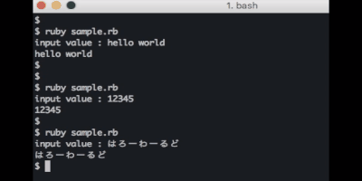

このコンソールのプロンプト変更は昨日の記事に書いた内容です  
画像、アニメーションだと事前に変更しておかないと加工がかなり大変になるので......  

まずは QuickTime Player で画像録画をした  
ちなみに MacOS Mojave 以降なら QuickTime Player を使わずともキーボードショートカットで録画できる  
つい QuickTime Player を使ってしまった  

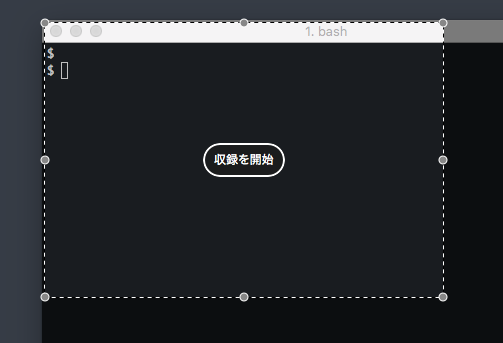

動画が `.mov` 拡張子で作られる  
このままでは余分なスペースや秒数があるので削減をしたい  
(QuickTime Player をどうやって止めたら良いのか大体迷うため、秒数が長くなる)  

次に iMovie を使う  
（iMovie は普段も使わないが）  

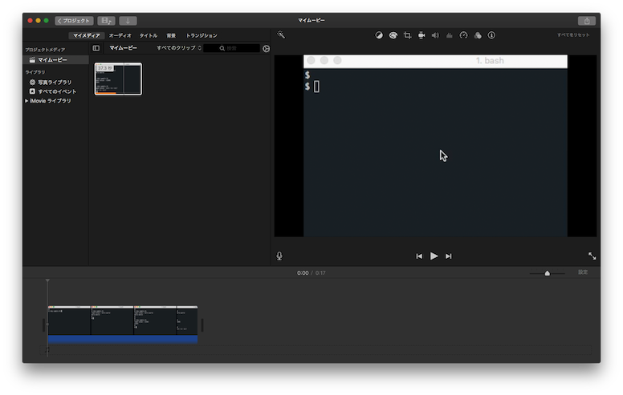

こんな感じでスペースの指定や、秒数を削減する  
大体、こういう GUI のソフトウェアは雰囲気で触ってしまうので良くない  
カットなどができたら書き出しを行う

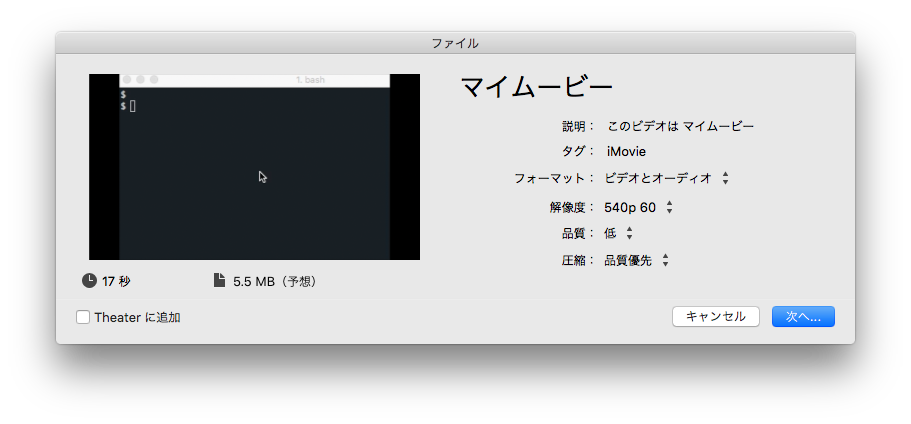

最後に作成したアニメーションを gif 画像にする  
設定してコマンドのみで gif にできるみたいだが、外部の WEB サービスを使った  
今回は [動画をGIFに変換：mp4からGIF作成 | ラッコツールズ🔧](https://rakko.tools/tools/86/) を使いました  

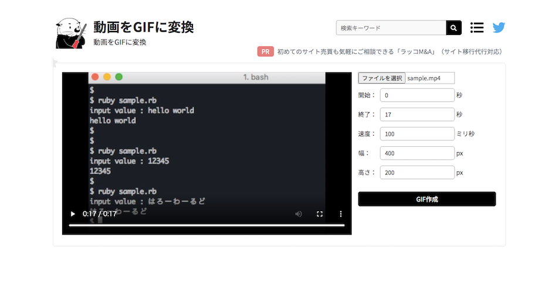

終了秒数を合わせて作成  
ダウンロードすることができる  


この手順を踏まえて gif 画像にすることができる  


うーむ、作るまでにいろいろ操作したり時間がかかりすぎてる気がする......  


## 2021/06/08 Tue

core.excludesFile は指定しなくても良い  

[2021/06/04](#20210604-Fri) の続き  
`core.excludesFile` を設定すると書いたが、まだまだ奥が深かった  

`$HOME/.config/git/ignore` に設定を置くと読み込んでくれるみたい  
んで [.gitigoreの設定](https://github.com/github/gitignore) がまとまっているリポジトリもあるのでそれを置けばほぼ考えなくて済むみたい  

悩みどころではあるけど、やっぱ明示的にプロジェクトごとに `.gitignore` を設定したい感  
`.gitignore` の話ができるチームであればより良い選択は取れそうだけど、大体最初に決めちゃってそこから追記するパターンが多い気がする  

- 参考
  - [まだ .gitconfig に core.excludesfile を設定しているの？ - Qiita](https://qiita.com/ueokande/items/e0409219e7c68e4277b9)
  - [グローバルな.gitignoreの設定 - みぴん](http://mipin.blog6.fc2.com/blog-entry-130.html)
  - [github/gitignore: A collection of useful .gitignore templates](https://github.com/github/gitignore)


## 2021/06/09 Wed

ドメインモデリングとは  

設計の前にドメインモデリングをすることになりそうで  
聞いたことはあるけど実践は無い感じ  

間違っているかもだけど端的に言うと要件の整理や落とし込みに近いものだと思ってる  
流れとしては下記を想定している  

- ユースケース図を書く
- ドメインモデル図を書く
- 集約（オブジェクト）を決める
- コード（インターフェース設計、内部設計）に落とし込む
  - これはもう設計かも

やることはやれると思うけど、それが繋がって実際の開発に落とし込めるかは難しそう  
良くないモデリングをしてしまうと、良くない設計になって開発も難しくなる  
DDD もオレオレ DDD 感が強いので正しいドメインモデリングができるかはわからない  

開発、コーディングも同じく、設計も経験がものを言うがまだまだ足りないな  

- 参考
  - [DDDのモデリングとは何なのか、 そしてどうコードに落とすのか](https://www.slideshare.net/koichiromatsuoka/domain-modeling-andcoding)
  - [ドメインをモデリングするには - Qiita](https://qiita.com/putan/items/3aa0ec1c104f1defa329)
  - [DDD ドメインモデリングサンプル - Qiita](https://qiita.com/little_hand_s/items/dfa4b156f533ba1a1491)
  - [ドメイン駆動設計の2つのモデリング手法　ユースケース図とドメインモデル図をどう作る？ - ログミーTech](https://logmi.jp/tech/articles/322835)
  - [ドメインモデリングの始め方 - Speaker Deck](https://speakerdeck.com/j5ik2o/tomeinmoterinkufalseshi-mefang)


## 2021/06/10 Thu

master ブランチから main ブランチへ切り替える  

時代の流れ的に main ブランチが使われるようになっているものの、このリポジトリは master ブランチになっている  
なので main ブランチへの切り替えを行う  

ローカルでの作業  
ブランチ名を変更して、 push をすれば OK  

```sh
## 今は master ブランチ
$ git branch
  feature/add_2021-06-10
* master

## ブランチ名変更
$ git branch -m master main

## main ブランチになった
$ git branch
  feature/add_2021-06-10
* main

## プッシュしてリモートブランチを作る
$ git push origin main
```

`git branch` の `-m` / `-M` オプションの違い  
変更先のブランチがあった場合に、小文字オプションは変更しない  
大文字オプションは上書きになる  

push したら GitHub を確認する  
Your Branches に main ブランチがある  
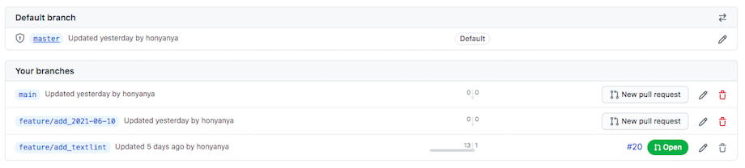  

次にデフォルトブランチや protectec branch の設定を行う  
master ブランチから main ブランチへ  
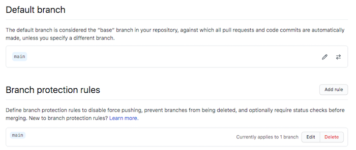  

最後に master ブランチを削除する  
ちなみに既存の PR を master に向けていると削除できないため、向き先は main へ変更する  
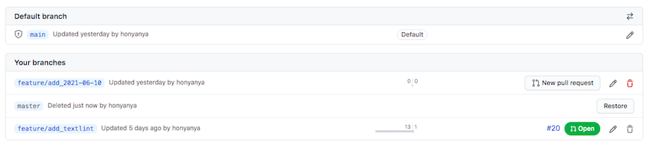  

ローカルの master ブランチも忘れずに削除すること  

```sh
$ git branch -D master
Deleted branch master (was bfa5096).

$ git branch
  feature/add_2021-06-11
* main
```

GitHub での作業だったが、 GitLab も GitLab 14.0 以降は main ブランチがデフォルトになるみたい  

- 参考
  - [masterからmainに変更する（githubのリモート＆ローカルブランチ）branches - Qiita](https://qiita.com/masakinihirota/items/1a657674e609be112fc6)
  - [git-branch – Git コマンドリファレンス（日本語版）](https://tracpath.com/docs/git-branch/)
  - [GitLabもデフォルトのブランチ名を「master」から「main」に変更へ、5月から － Publickey](https://www.publickey1.jp/blog/21/gitlabmastermain5.html)


## 2021/06/11 Fri

コミットメッセージの lint  

最近コミットについての話をすることが多くて、個人的にもちょっと拘りを持っている  
textlint もあるし、コミットメッセージの lint とかあるのかなー？と思って調べてみるとあった  

[commitlint - Lint commit messages](https://commitlint.js.org/#/)  
[conventional-changelog/commitlint: 📓 Lint commit messages](https://github.com/conventional-changelog/commitlint)  

npm / yarn があれば使えて、ルールもいろいろ書けるみたい  
個人的にちょっと入れてみて触ってみようかな  

いろいろなチームのコミット規約も見てみたいなとも思ったり  

- 参考
  - [commitlint - Lint commit messages](https://commitlint.js.org/#/)
  - [conventional-changelog/commitlint: 📓 Lint commit messages](https://github.com/conventional-changelog/commitlint)
  - [commitlint の紹介 - Qiita](https://qiita.com/ybiquitous/items/74225bc4bf0a9ddcd7dd)
  - [commitlint + husky でConventional Commitを強制する | WP Kyoto](https://wp-kyoto.net/add-commitlint-with-husky-to-lint-git-commit-message/)


## 2021/06/12 Sat

CMS, Headless CMS, SSG を見る  

静的サイトジェネレーター Static Site Generator（SSG）を調べていた  
[#25](https://github.com/honyanya/365/issues/25) とかでやりたい旨を簡単に書いていこうとしている  

CMS や Headless CMS との違い？とか気になったので簡単にまとめてみる  

| name | summary | example |
| --- | --- | --- |
| CMS | Web サイトのテキスト、画像などのコンテンツを一元管理 | WordPress |
| Headless CMS | コンテンツ管理はしているが、API で提供する | Contentful |
| SSG | ビルドして、静的コンテンツとして提供 | Gatsby |

- 参考
  - [Headless CMSとは？ 代表的な９のCMSを比較してみました！ | 株式会社ウェブ企画パートナーズ](https://wk-partners.co.jp/homepage/blog/hpseisaku/htmlcss/headless-cms/)
  - [【2021注目】フロントエンド開発「静的サイトジェネレータ」 | FASTCODING BLOG](https://fastcoding.jp/blog/all/info/ssg/)


## 2021/06/13 Sun

Nodejs MODULE_NOT_FOUND エラー  

しょーもない内容ですが......  
ただ hello world を出力させようとしている JS ファイルがあって  

```js
console.log('hello world');
```

`MODULE_NOT_FOUND` というエラーが出てきてしまう  

```sh
$ node test.js
internal/modules/cjs/loader.js:888
  throw err;
  ^

Error: Cannot find module '/Users/user/workspace/path/to/test/test.js'
    at Function.Module._resolveFilename (internal/modules/cjs/loader.js:885:15)
    at Function.Module._load (internal/modules/cjs/loader.js:730:27)
    at Function.executeUserEntryPoint [as runMain] (internal/modules/run_main.js:72:12)
    at internal/main/run_main_module.js:17:47 {
  code: 'MODULE_NOT_FOUND',
  requireStack: []
}
```

結果から言うと、実行ファイル名を誤っていただけでした  

```sh
$ node index.js 
hello world.
```

ちなみに `code: 'MODULE_NOT_FOUND', requireStack: []` というエラーを軽く調べてみた  
バージョンアップして出てくる場合はキャッシュをクリアしたり、 `node_modules` を削除して再インストールすると良いみたい  

- 参考
  - [node.js - Node MODULE_NOT_FOUND - Stack Overflow](https://stackoverflow.com/questions/47083351/node-module-not-found)
  - [node.js — Node MODULE_NOT_FOUND](https://www.it-swarm-ja.com/ja/node.js/node-modulenotfound/835400535/)


## 2021/06/14 Mon

textlint-rule-preset-ja-spacing を見る  

2021/06/05 の続き  
`textlint-rule-preset-ja-spacing` を簡単に見ていく  

GitHub のリポジトリ：  
[textlint-ja/textlint-rule-preset-ja-spacing: スペース周りのスタイルを扱うtextlintルール集](https://github.com/textlint-ja/textlint-rule-preset-ja-spacing)  
[ルール一覧](https://github.com/textlint-ja/textlint-rule-preset-ja-spacing#%E3%83%AB%E3%83%BC%E3%83%AB%E4%B8%80%E8%A6%A7)  

こんな感じで `.textlintrc` を変更することでルールを変更することできる  

```js
{
  "filters": {},
  "rules": {
    "preset-ja-spacing": {
      "ja-space-between-half-and-full-width": {
        "space": "always"
      },
      "ja-space-around-code": {
         "before": false,
         "after": false
      }
    },
    "preset-ja-technical-writing": true,
    "spellcheck-tech-word": true
  }
}
```

変更した内容は [#20](https://github.com/honyanya/365/pull/20/commits/a3a95a74aa4ecfcf27fd9f132f32b830712d226f) で見れる  


## 2021/06/15 Tue

Git ブランチの複数削除  

ローカルの Git ブランチが増えてきたから削除したいなと思い  

```sh
$ git branch
  feature/add_2021-05-26
  feature/add_2021-05-27
  feature/add_2021-05-28
  feature/add_2021-05-29
  feature/add_2021-05-30
  feature/add_2021-05-31
* master
```

こんな感じで削除できたら良いのになと思いつつ  

```sh
$ git branch -d feature/*
error: branch 'feature/*' not found.
```

基本 `-d` オプションで削除できるブランチは 1 つ  

複数消す方法としては git branch で一覧出力して、 grep で対象を絞り込み、 xargs で渡してあげれば削除可能  

```sh
$ git branch | grep feature | xargs git branch -d
Deleted branch feature/add_2021-05-26 (was e4f25af).
Deleted branch feature/add_2021-05-27 (was f618292).
Deleted branch feature/add_2021-05-28 (was f559750).
Deleted branch feature/add_2021-05-29 (was 9b8eb43).
Deleted branch feature/add_2021-05-30 (was 0a77816).
Deleted branch feature/add_2021-05-31 (was 4fe2a5d).
```

- 参考
  - [gitの複数のブランチを一括で削除する - Qiita](https://qiita.com/satoshi03/items/c53aab17f3270477e33a)


## 2021/06/16 Wed

PlantUML を触る  

ドメインモデリングを行ってて、その時は手書きや他のツールで書いたが最終的にはコードとして残しておきたいなと思った  
手段の一つで PlantUML があるので触ってみる  

サクッと Visual Studio Code で PlantUML を触りたい場合は下記拡張機能を入れると良い  
[PlantUML - Visual Studio Marketplace](https://marketplace.visualstudio.com/items?itemName=jebbs.plantuml)  

フロー図みたいなのを PlantUML で作ってみる  
テーマは「フードデリバリー」  
基本家に居る機会が多く、自炊もほぼしないため、とても使う機会が多い  

`index.pu`

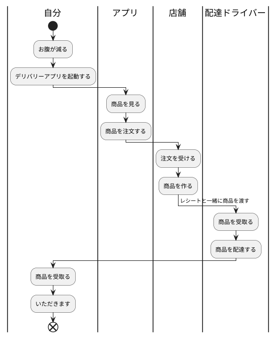

作成後、 Visual Studio Code で Alt + d でプレビューが表示される  

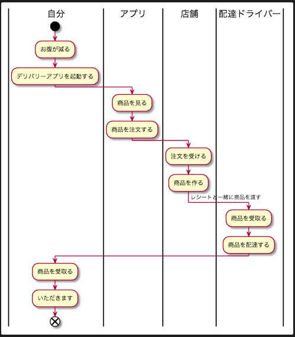


他の図を作ったり、 Visual Studio Code 以外でも見れるようにするためには諸々インストールなのが必要なので明日以降触ってみる  

- 参考
  - [Visual Studio Code で UML を描こう！ - Qiita](https://qiita.com/couzie/items/9dedb834c5aff09ea7b2)
  - [PlantUML使い方メモ - Qiita](https://qiita.com/opengl-8080/items/98c510b8ca060bdd2ea3)


## 2021/06/17 Thu

Fork したリポジトリを最新の状態にする  

久々に Fork したリポジトリを変更する必要が出てきた  
普段は Fork はせずに権限をもらって直接リポジトリに対して PR を投げている  

Fork した日時はかなり前になっている  
なので Fork したリポジトリを最新の状態にしないと開発ができない状況である  

手順は下記の通り  

- Fork 元のリポジトリを upstream として登録する
- upstream の更新を取得する
- ローカルの main ブランチに対して upstream/main ブランチの内容をマージする
- origin/main ブランチに対して push する

git での手順は下記になる  
（記録用なのでコマンドの内容などは書き換えている）  

```sh
## ローカルとリモートの main ブランチがある
$ git branch -a
* main
  remotes/origin/main

## Fork 元を upstream として登録する
$ git remote add upstream git@github.com:example_user/example_repository.git

## upstream の更新を取得する
$ git fetch upstream
...
From github.com:example_user/example_repository.git
 * [new branch]      main -> upstream/main

## upstream/main が一覧で見れる
$ git branch -a
* main
  remotes/origin/main
  remotes/upstream/main

## main ブランチでなければ切り替える
$ git switch main

## ローカルの main ブランチに対して upstream/main ブランチの内容をマージする
$ git merge upstream/main

## origin/main ブランチに対して push する
$ git push origin main
```

これで Fork したリポジトリが更新され、 Fork 元リポジトリと同じ更新になる  

- 参考
  - [GitHubでFork/cloneしたリポジトリを本家リポジトリに追従する - Qiita](https://qiita.com/xtetsuji/items/555a1ef19ed21ee42873)


## 2021/06/18 Fri

普段使っている VSCode の Markdown TOC 拡張機能は無くなっていた  

TOC？  
TOC は Table of Contents の略で目次の事を指している  
TOC には見出しが出力されます  

イメージ（2021/05 の画像）  


TOC を作るために [AlanWalk.Markdown-TOC](https://marketplace.visualstudio.com/items?itemName=AlanWalk.markdown-toc) をインストールしていたが、今はできないことが判明した  
GitHub のリポジトリ [AlanWalk/markdown-toc: MarkdownTOC(Table Of Contents) Plugin for Visual Studio Code.](https://github.com/AlanWalk/markdown-toc) もアーカイブされていた  
（GitHub でアーカイブされたリポジトリは初めて見たかも）  

新しい拡張機能を探さないとなー  


## 2021/06/19 Sat

GitHub Actions を触る  

[GitHub Actions](https://github.co.jp/features/actions) は GitHub が提供している CI/CD サービス  
push や merge のイベントで自動でテストやデプロイをすることができる  
[GitLab CI/CD](https://docs.gitlab.com/ce/ci/) は使ったことあるので GitHub での CI/CD を触ってみることにする  

`./github/workflows/` に yml ファイルを置く  
今回は `helloworld.yml` を書いた  

```yaml
name: GitHub Actions Hello World!

on:
  push:
    branches:
      - main

jobs:
  build:
    name: echo
    runs-on: ubuntu-latest
    steps:
      - run: echo "Hello World!"
```

yml 自体はただ Hellow World! を出力しているだけ  
こんなファイルを置くことで、 main ブランチの更新タイミングで GitHub Actions が実行される  

- 参考
  - [GitHub Actionsのワークフロー構文 - GitHub Docs](https://docs.github.com/ja/actions/reference/workflow-syntax-for-github-actions)
  - [GitHub Actions: Hello World | GitHub Learning Lab](https://lab.github.com/githubtraining/github-actions:-hello-world)
  - [GitHub ActionsでHello World - Qiita](https://qiita.com/Teach/items/d2c4d7bec98228df1807)
  - [GitHub Actions でプルリクのマージでワークフローを実行する - Qiita](https://qiita.com/okazy/items/7ab46f2c20ec341a2836)
  - [GitHub Actionsの理解とHello Worldを出力する | tech-broccoli.life](https://tech-broccoli.life/articles/engineer/use-github-actions-hello-world/)


## 2021/06/20 Sun

Next.js でブログを作ってみる  

2021/06/12 の続き  
SSG を調べてみると Next.js が一番人気そうだった  
[Static Site Generators - Top Open Source SSGs | Jamstack](https://jamstack.org/generators/)  

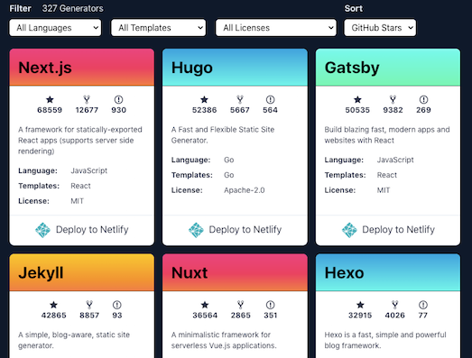

なので Next.js を触ってみることにした  
とりあえずリポジトリやドキュメントを見て下記コマンドで雛形を作ることができた  

```sh
$ yarn create next-app --example blog-starter-typescript blog-starter-typescript-app
```

んで動かしてみる  

```sh
$ cd ./blog-starter-typescript-app/
$ yarn dev
```

localhost:3000 に接続して確認ができる  

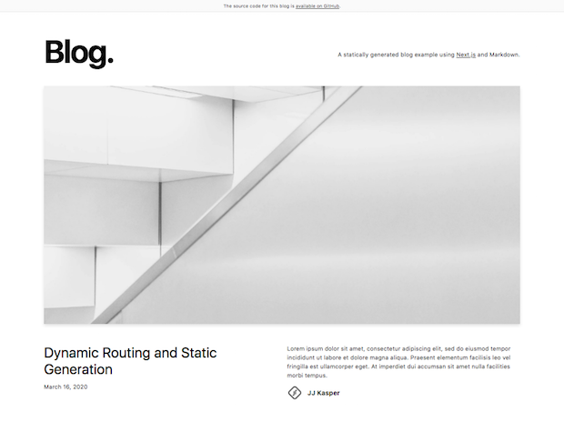  

そもそも Next.js の構成しかり、 TypeScript の定義だったり、デザインも苦手なので納得行く形まではすごく時間かかりそう......  

- 参考
  - [Getting Started | Next.js](https://nextjs.org/docs#setup)
  - [next.js/examples/blog-starter at canary · vercel/next.js](https://github.com/vercel/next.js/tree/canary/examples/blog-starter)
  - [next.js/examples/blog-starter-typescript at canary · vercel/next.js](https://github.com/vercel/next.js/tree/canary/examples/blog-starter-typescript)


## 2021/06/21 Mon

GitHub API を使ってみる  

このリポジトリ（自由に記録を残す、メモを書く）がなんと 1 ヶ月も続いた  
ふりかえり自体は別で書くとして、 PR を作って作成したのでうまくしたら分析ができるかもと思い GitHub API から PR の情報を取ってみることにした  

まずは Token を取得する  
[Personal Access Tokens](https://github.com/settings/tokens) にアクセスして取得すれば OK  
`repo:status` のみチェックを入れた  

Token を変数に登録する  

```sh
$ export token="your_token"
$ printenv token
your_token
```

ユーザ情報を取得する  

```sh
$ curl -u username:$token https://api.github.com/users/[your_github_account_name]
```

JSON で結果が返ってくるので準備完了  

PR の情報を API で取得する  
今回は close になったものを取得する  
ちなみにデフォルトだと 30 件取得できる  

API のレート制限（リクエスト数の制限）があるため、結果をファイルに書き込むことにした  

```sh
curl -u username:$token "https://api.github.com/repos/honyanya/365/pulls?state=close" > github_pr_close.json
```

あとは jq で触る  
タイトル、作成日時、マージ日時の 3 つを抽出してみる  

```sh
$ cat ./github_pr_close.json | jq '.[] | .title, .created_at, .merged_at'
"[feature/add_2021-06-20][add] Next.js でブログを作ってみる"
"2021-06-20T14:15:55Z"
"2021-06-20T14:16:00Z"
"[feature/add_2021-06-19][add] GitHub Actions を触る"
"2021-06-19T14:27:59Z"
"2021-06-19T14:28:07Z"
"[feature/add_github_actions][add] GitHub Actions 追加"
"2021-06-19T07:41:18Z"
"2021-06-19T08:08:50Z"
"[feature/add_github_templates][fix] テンプレートが1つのため"
"2021-06-19T07:31:20Z"
"2021-06-19T07:31:29Z"
"[feature/add_github_templates][add] GitHub templates の追加"
"2021-06-19T07:12:55Z"
"2021-06-19T07:25:19Z"
"[feature/add_2021-06-18][add] 普段使っている VSCode の Markdown TOC 拡張機能は無くなっていた"
"2021-06-18T14:41:05Z"
"2021-06-18T14:41:14Z"
"[feature/fix_2021-06-17][fix] Fork したリポジトリを最新の状態にする typo があったため"
"2021-06-17T23:57:50Z"
"2021-06-17T23:57:59Z"
"[feature/add_2021-06-17][add] Fork したリポジトリを最新の状態にする"
"2021-06-17T14:41:05Z"
"2021-06-17T14:41:16Z"
"[feature/add_2021-06-16][add] PlantUML を触る"
"2021-06-16T14:17:43Z"
"2021-06-16T14:20:05Z"
"[feature/add_2021-06-15][add] Git ブランチの複数削除"
"2021-06-15T14:31:36Z"
"2021-06-15T14:31:44Z"
"[feature/add_2021-06-14][add] textlint-rule-preset-ja-spacing を見る"
"2021-06-14T14:57:49Z"
"2021-06-14T14:57:58Z"
"[feature/add_2021-06-13][add] Nodejs MODULE_NOT_FOUND エラー"
"2021-06-13T14:46:32Z"
"2021-06-13T14:47:14Z"
"[feature/add_2021-06-12][add] CMS, Headless CMS, SSG を見る"
"2021-06-13T14:45:23Z"
"2021-06-13T14:46:12Z"
"[feature/fix_2021-06-10][fix] ローカルのブランチ削除の記載が無かったため"
"2021-06-12T01:26:36Z"
"2021-06-12T01:27:19Z"
"[feature/add_2021-06-11][add] コミットメッセージの lint"
"2021-06-11T14:03:05Z"
"2021-06-11T14:03:16Z"
"[feature/add_2021-06-10][fix] master ブランチから main ブランチへ切り替える 画像名修正"
"2021-06-10T14:53:17Z"
"2021-06-10T14:53:25Z"
"[feature/add_2021-06-10][add] master ブランチから main ブランチへ切り替える"
"2021-06-10T14:46:05Z"
"2021-06-10T14:48:45Z"
"[feature/add_2021-06-09][add] ドメインモデリングとは"
"2021-06-09T14:41:29Z"
"2021-06-09T14:42:19Z"
"[feature/add_2021-06-08][add] core.excludesFile は指定しなくても良い"
"2021-06-08T14:11:44Z"
"2021-06-08T14:12:04Z"
"[feature/add_2021-06-07][fix] 過去に戻ってしまっていた"
"2021-06-07T15:04:55Z"
"2021-06-07T15:05:08Z"
"[feature/add_2021-06-07][add] 自分の gif 画像の作り方は回りくどい！"
"2021-06-07T14:46:14Z"
"2021-06-07T14:53:26Z"
"[feature/add_2021-06-06][add] プロンプトをサクッと変更する"
"2021-06-06T13:57:03Z"
"2021-06-06T13:59:15Z"
"[feature/add_2021-06-05][add] textlint を実行してみる"
"2021-06-05T14:31:16Z"
"2021-06-05T14:33:16Z"
"[feature/add_textlint][add] textlint の導入と実施"
"2021-06-05T14:21:49Z"
"2021-06-19T07:02:07Z"
"[feature/feature_2021-06-04][fix] 個人の環境依存ファイルの除外の仕方を考える 一部文章がおかしかったため"
"2021-06-04T14:33:47Z"
"2021-06-04T14:33:53Z"
"[feature/feature_2021-06-04][fix] 個人の環境依存ファイルの除外の仕方を考える"
"2021-06-04T14:27:40Z"
"2021-06-04T14:28:56Z"
"[feature/fix_2021-06-02][fix] 誤字があったため"
"2021-06-03T11:34:53Z"
"2021-06-03T11:35:39Z"
"[feature/add_2021-06-03][add] Scala 3 のガイドドキュメントを流し見する"
"2021-06-02T22:45:00Z"
"2021-06-02T22:45:11Z"
"[feature/add_2021-06-02][add] テキストファイルを復習行出力したい"
"2021-06-02T13:23:20Z"
"2021-06-02T13:24:38Z"
"[feature/add_2021-06-01][add] 普段 GitLab 使ってて GitHub 使うと戸惑ったところ"
"2021-05-31T21:57:38Z"
"2021-05-31T21:58:26Z"
```

これを CSV に変換する  

```sh
$ cat ./github_pr_close.json | jq '.[] | [.title, .created_at, .merged_at] | @csv'
"\"[feature/add_2021-06-20][add] Next.js でブログを作ってみる\",\"2021-06-20T14:15:55Z\",\"2021-06-20T14:16:00Z\""
"\"[feature/add_2021-06-19][add] GitHub Actions を触る\",\"2021-06-19T14:27:59Z\",\"2021-06-19T14:28:07Z\""
"\"[feature/add_github_actions][add] GitHub Actions 追加\",\"2021-06-19T07:41:18Z\",\"2021-06-19T08:08:50Z\""
"\"[feature/add_github_templates][fix] テンプレートが1つのため\",\"2021-06-19T07:31:20Z\",\"2021-06-19T07:31:29Z\""
"\"[feature/add_github_templates][add] GitHub templates の追加\",\"2021-06-19T07:12:55Z\",\"2021-06-19T07:25:19Z\""
"\"[feature/add_2021-06-18][add] 普段使っている VSCode の Markdown TOC 拡張機能は無くなっていた\",\"2021-06-18T14:41:05Z\",\"2021-06-18T14:41:14Z\""
"\"[feature/fix_2021-06-17][fix] Fork したリポジトリを最新の状態にする typo があったため\",\"2021-06-17T23:57:50Z\",\"2021-06-17T23:57:59Z\""
"\"[feature/add_2021-06-17][add] Fork したリポジトリを最新の状態にする\",\"2021-06-17T14:41:05Z\",\"2021-06-17T14:41:16Z\""
"\"[feature/add_2021-06-16][add] PlantUML を触る\",\"2021-06-16T14:17:43Z\",\"2021-06-16T14:20:05Z\""
"\"[feature/add_2021-06-15][add] Git ブランチの複数削除\",\"2021-06-15T14:31:36Z\",\"2021-06-15T14:31:44Z\""
"\"[feature/add_2021-06-14][add] textlint-rule-preset-ja-spacing を見る\",\"2021-06-14T14:57:49Z\",\"2021-06-14T14:57:58Z\""
"\"[feature/add_2021-06-13][add] Nodejs MODULE_NOT_FOUND エラー\",\"2021-06-13T14:46:32Z\",\"2021-06-13T14:47:14Z\""
"\"[feature/add_2021-06-12][add] CMS, Headless CMS, SSG を見る\",\"2021-06-13T14:45:23Z\",\"2021-06-13T14:46:12Z\""
"\"[feature/fix_2021-06-10][fix] ローカルのブランチ削除の記載が無かったため\",\"2021-06-12T01:26:36Z\",\"2021-06-12T01:27:19Z\""
"\"[feature/add_2021-06-11][add] コミットメッセージの lint\",\"2021-06-11T14:03:05Z\",\"2021-06-11T14:03:16Z\""
"\"[feature/add_2021-06-10][fix] master ブランチから main ブランチへ切り替える 画像名修正\",\"2021-06-10T14:53:17Z\",\"2021-06-10T14:53:25Z\""
"\"[feature/add_2021-06-10][add] master ブランチから main ブランチへ切り替える\",\"2021-06-10T14:46:05Z\",\"2021-06-10T14:48:45Z\""
"\"[feature/add_2021-06-09][add] ドメインモデリングとは\",\"2021-06-09T14:41:29Z\",\"2021-06-09T14:42:19Z\""
"\"[feature/add_2021-06-08][add] core.excludesFile は指定しなくても良い\",\"2021-06-08T14:11:44Z\",\"2021-06-08T14:12:04Z\""
"\"[feature/add_2021-06-07][fix] 過去に戻ってしまっていた\",\"2021-06-07T15:04:55Z\",\"2021-06-07T15:05:08Z\""
"\"[feature/add_2021-06-07][add] 自分の gif 画像の作り方は回りくどい！\",\"2021-06-07T14:46:14Z\",\"2021-06-07T14:53:26Z\""
"\"[feature/add_2021-06-06][add] プロンプトをサクッと変更する\",\"2021-06-06T13:57:03Z\",\"2021-06-06T13:59:15Z\""
"\"[feature/add_2021-06-05][add] textlint を実行してみる\",\"2021-06-05T14:31:16Z\",\"2021-06-05T14:33:16Z\""
"\"[feature/add_textlint][add] textlint の導入と実施\",\"2021-06-05T14:21:49Z\",\"2021-06-19T07:02:07Z\""
"\"[feature/feature_2021-06-04][fix] 個人の環境依存ファイルの除外の仕方を考える 一部文章がおかしかったため\",\"2021-06-04T14:33:47Z\",\"2021-06-04T14:33:53Z\""
"\"[feature/feature_2021-06-04][fix] 個人の環境依存ファイルの除外の仕方を考える\",\"2021-06-04T14:27:40Z\",\"2021-06-04T14:28:56Z\""
"\"[feature/fix_2021-06-02][fix] 誤字があったため\",\"2021-06-03T11:34:53Z\",\"2021-06-03T11:35:39Z\""
"\"[feature/add_2021-06-03][add] Scala 3 のガイドドキュメントを流し見する\",\"2021-06-02T22:45:00Z\",\"2021-06-02T22:45:11Z\""
"\"[feature/add_2021-06-02][add] テキストファイルを復習行出力したい\",\"2021-06-02T13:23:20Z\",\"2021-06-02T13:24:38Z\""
"\"[feature/add_2021-06-01][add] 普段 GitLab 使ってて GitHub 使うと戸惑ったところ\",\"2021-05-31T21:57:38Z\",\"2021-05-31T21:58:26Z\""
```

CSV までできればスプレッドシートなりで簡単に計算とかができる  
今日もだけど、作成日時とマージ日時にあまり差が無いので、先に PR は作らないとダメだなあ......  

- 参考
  - [REST APIを使ってみる - GitHub Docs](https://docs.github.com/ja/rest/guides/getting-started-with-the-rest-api)
  - [個人アクセストークンを使用する - GitHub Docs](https://docs.github.com/ja/github/authenticating-to-github/keeping-your-account-and-data-secure/creating-a-personal-access-token)
  - [GitHub APIでPull Requestを取得する - Qiita](https://qiita.com/kz800/items/f822fe7a3b285b14085c)
  - [jqコマンドで複数のキーを抽出する | ハックノート](https://hacknote.jp/archives/35873/)
  - [jq コマンドで JSON を CSV に変換する. jq command supports conversion from… | by Goro Yanagi | VELTRA Engineering | Medium](https://medium.com/veltra-engineering/jq-supports-json-to-csv-fb5c951a9575)


## 2021/06/22 Tue

GitHub API で 30 件先のデータ or 30 件以上のデータを取得する  

昨日の続き  
昨日の状態だと、 30 件しかできないのでそれ以降のデータを取得する  

`page` パラメータを渡してあげれば次の 30 件が取得できる  

```sh
$ curl -u username:$token "https://api.github.com/repos/honyanya/365/pulls?state=close&page=2" > ./github_pr_close2.json
```

最初に作成した 2021/05/21 の PR が見える  

```sh
$ cat ./github_pr_close2.json | jq '.[] | [.title, .created_at, .merged_at] | @csv'
"\"[feature/add_2021-06-01][add] 普段 GitLab 使ってて GitHub 使うと戸惑ったところ\",\"2021-05-31T21:57:38Z\",\"2021-05-31T21:58:26Z\""
"\"[feature/clean_directory][clean] 2021/05 を書いたので、いろいろ整える\",\"2021-05-31T14:10:05Z\",\"2021-05-31T14:11:27Z\""
"\"[feature/add_2021-05-31][add] はてなブログを書こうと\",\"2021-05-31T13:53:42Z\",\"2021-05-31T13:53:50Z\""
"\"[feature/add_2021-05-30][add] Marp を VSCode で触る\",\"2021-05-30T13:54:12Z\",\"2021-05-30T13:55:08Z\""
"\"[feature/add_2021-05-29][add] Slidev を触りたかった\",\"2021-05-29T12:17:52Z\",\"2021-05-29T12:19:24Z\""
"\"[feature/add_2021-05-28][add] typo があったため\",\"2021-05-28T14:46:57Z\",\"2021-05-28T14:47:26Z\""
"\"[feature/add_2021-05-28][add] マークダウンでプレゼンテーション資料を作りたい\",\"2021-05-28T14:44:27Z\",\"2021-05-28T14:44:58Z\""
"\"[feature/add_2021-05-27][add] 2021 Octoverse Survey\",\"2021-05-27T13:47:36Z\",\"2021-05-27T13:48:06Z\""
"\"[feature/add_2021-05-26][add] MySQL クライアントのパスワード入力を省略したい\",\"2021-05-26T13:49:07Z\",\"2021-05-26T13:49:41Z\""
"\"[feature/add_2021-05-25][add] history には過去が詰まっている ~ $RANDOM, uuidgen ~\",\"2021-05-25T14:55:10Z\",\"2021-05-25T14:57:13Z\""
"\"[feature/add_2021-05-24][add] Python の main 関数\",\"2021-05-24T11:59:15Z\",\"2021-05-24T12:00:15Z\""
"\"[feature/add_2021-05-23][add] RDPWrap を使って Windows 10 Home へのリモートデスクトップ接続をした\",\"2021-05-23T07:26:43Z\",\"2021-05-23T07:27:01Z\""
"\"[feature/add_2021-05-22][add] Windows 10 Home へのリモートデスクトップ接続をしたい\",\"2021-05-22T14:03:49Z\",\"2021-05-22T14:04:08Z\""
"\"[feature/add_2021-05-21][add] MySQL の大文字小文字を区別する\",\"2021-05-22T13:44:35Z\",\"2021-05-22T13:45:06Z\""
```

もしくは `per_page` で件数を指定する  

```sh
$ curl -u username:$token "https://api.github.com/repos/honyanya/365/pulls?state=close&&per_page=100" > ./github_pr_close3.json
```

2021/05/21 分から昨日分までが取得できている  

```sh
$ cat ./github_pr_close3.json | jq '.[] | [.title, .created_at, .merged_at] | @csv'
"\"[feature/add_2021-06-21][add] GitHub API を使ってみる\",\"2021-06-21T14:35:42Z\",\"2021-06-21T14:37:11Z\""
"\"[feature/add_2021-06-20][add] Next.js でブログを作ってみる\",\"2021-06-20T14:15:55Z\",\"2021-06-20T14:16:00Z\""
"\"[feature/add_2021-06-19][add] GitHub Actions を触る\",\"2021-06-19T14:27:59Z\",\"2021-06-19T14:28:07Z\""
"\"[feature/add_github_actions][add] GitHub Actions 追加\",\"2021-06-19T07:41:18Z\",\"2021-06-19T08:08:50Z\""
"\"[feature/add_github_templates][fix] テンプレートが1つのため\",\"2021-06-19T07:31:20Z\",\"2021-06-19T07:31:29Z\""
"\"[feature/add_github_templates][add] GitHub templates の追加\",\"2021-06-19T07:12:55Z\",\"2021-06-19T07:25:19Z\""
"\"[feature/add_2021-06-18][add] 普段使っている VSCode の Markdown TOC 拡張機能は無くなっていた\",\"2021-06-18T14:41:05Z\",\"2021-06-18T14:41:14Z\""
"\"[feature/fix_2021-06-17][fix] Fork したリポジトリを最新の状態にする typo があったため\",\"2021-06-17T23:57:50Z\",\"2021-06-17T23:57:59Z\""
"\"[feature/add_2021-06-17][add] Fork したリポジトリを最新の状態にする\",\"2021-06-17T14:41:05Z\",\"2021-06-17T14:41:16Z\""
"\"[feature/add_2021-06-16][add] PlantUML を触る\",\"2021-06-16T14:17:43Z\",\"2021-06-16T14:20:05Z\""
"\"[feature/add_2021-06-15][add] Git ブランチの複数削除\",\"2021-06-15T14:31:36Z\",\"2021-06-15T14:31:44Z\""
"\"[feature/add_2021-06-14][add] textlint-rule-preset-ja-spacing を見る\",\"2021-06-14T14:57:49Z\",\"2021-06-14T14:57:58Z\""
"\"[feature/add_2021-06-13][add] Nodejs MODULE_NOT_FOUND エラー\",\"2021-06-13T14:46:32Z\",\"2021-06-13T14:47:14Z\""
"\"[feature/add_2021-06-12][add] CMS, Headless CMS, SSG を見る\",\"2021-06-13T14:45:23Z\",\"2021-06-13T14:46:12Z\""
"\"[feature/fix_2021-06-10][fix] ローカルのブランチ削除の記載が無かったため\",\"2021-06-12T01:26:36Z\",\"2021-06-12T01:27:19Z\""
"\"[feature/add_2021-06-11][add] コミットメッセージの lint\",\"2021-06-11T14:03:05Z\",\"2021-06-11T14:03:16Z\""
"\"[feature/add_2021-06-10][fix] master ブランチから main ブランチへ切り替える 画像名修正\",\"2021-06-10T14:53:17Z\",\"2021-06-10T14:53:25Z\""
"\"[feature/add_2021-06-10][add] master ブランチから main ブランチへ切り替える\",\"2021-06-10T14:46:05Z\",\"2021-06-10T14:48:45Z\""
"\"[feature/add_2021-06-09][add] ドメインモデリングとは\",\"2021-06-09T14:41:29Z\",\"2021-06-09T14:42:19Z\""
"\"[feature/add_2021-06-08][add] core.excludesFile は指定しなくても良い\",\"2021-06-08T14:11:44Z\",\"2021-06-08T14:12:04Z\""
"\"[feature/add_2021-06-07][fix] 過去に戻ってしまっていた\",\"2021-06-07T15:04:55Z\",\"2021-06-07T15:05:08Z\""
"\"[feature/add_2021-06-07][add] 自分の gif 画像の作り方は回りくどい！\",\"2021-06-07T14:46:14Z\",\"2021-06-07T14:53:26Z\""
"\"[feature/add_2021-06-06][add] プロンプトをサクッと変更する\",\"2021-06-06T13:57:03Z\",\"2021-06-06T13:59:15Z\""
"\"[feature/add_2021-06-05][add] textlint を実行してみる\",\"2021-06-05T14:31:16Z\",\"2021-06-05T14:33:16Z\""
"\"[feature/add_textlint][add] textlint の導入と実施\",\"2021-06-05T14:21:49Z\",\"2021-06-19T07:02:07Z\""
"\"[feature/feature_2021-06-04][fix] 個人の環境依存ファイルの除外の仕方を考える 一部文章がおかしかったため\",\"2021-06-04T14:33:47Z\",\"2021-06-04T14:33:53Z\""
"\"[feature/feature_2021-06-04][fix] 個人の環境依存ファイルの除外の仕方を考える\",\"2021-06-04T14:27:40Z\",\"2021-06-04T14:28:56Z\""
"\"[feature/fix_2021-06-02][fix] 誤字があったため\",\"2021-06-03T11:34:53Z\",\"2021-06-03T11:35:39Z\""
"\"[feature/add_2021-06-03][add] Scala 3 のガイドドキュメントを流し見する\",\"2021-06-02T22:45:00Z\",\"2021-06-02T22:45:11Z\""
"\"[feature/add_2021-06-02][add] テキストファイルを復習行出力したい\",\"2021-06-02T13:23:20Z\",\"2021-06-02T13:24:38Z\""
"\"[feature/add_2021-06-01][add] 普段 GitLab 使ってて GitHub 使うと戸惑ったところ\",\"2021-05-31T21:57:38Z\",\"2021-05-31T21:58:26Z\""
"\"[feature/clean_directory][clean] 2021/05 を書いたので、いろいろ整える\",\"2021-05-31T14:10:05Z\",\"2021-05-31T14:11:27Z\""
"\"[feature/add_2021-05-31][add] はてなブログを書こうと\",\"2021-05-31T13:53:42Z\",\"2021-05-31T13:53:50Z\""
"\"[feature/add_2021-05-30][add] Marp を VSCode で触る\",\"2021-05-30T13:54:12Z\",\"2021-05-30T13:55:08Z\""
"\"[feature/add_2021-05-29][add] Slidev を触りたかった\",\"2021-05-29T12:17:52Z\",\"2021-05-29T12:19:24Z\""
"\"[feature/add_2021-05-28][add] typo があったため\",\"2021-05-28T14:46:57Z\",\"2021-05-28T14:47:26Z\""
"\"[feature/add_2021-05-28][add] マークダウンでプレゼンテーション資料を作りたい\",\"2021-05-28T14:44:27Z\",\"2021-05-28T14:44:58Z\""
"\"[feature/add_2021-05-27][add] 2021 Octoverse Survey\",\"2021-05-27T13:47:36Z\",\"2021-05-27T13:48:06Z\""
"\"[feature/add_2021-05-26][add] MySQL クライアントのパスワード入力を省略したい\",\"2021-05-26T13:49:07Z\",\"2021-05-26T13:49:41Z\""
"\"[feature/add_2021-05-25][add] history には過去が詰まっている ~ $RANDOM, uuidgen ~\",\"2021-05-25T14:55:10Z\",\"2021-05-25T14:57:13Z\""
"\"[feature/add_2021-05-24][add] Python の main 関数\",\"2021-05-24T11:59:15Z\",\"2021-05-24T12:00:15Z\""
"\"[feature/add_2021-05-23][add] RDPWrap を使って Windows 10 Home へのリモートデスクトップ接続をした\",\"2021-05-23T07:26:43Z\",\"2021-05-23T07:27:01Z\""
"\"[feature/add_2021-05-22][add] Windows 10 Home へのリモートデスクトップ接続をしたい\",\"2021-05-22T14:03:49Z\",\"2021-05-22T14:04:08Z\""
"\"[feature/add_2021-05-21][add] MySQL の大文字小文字を区別する\",\"2021-05-22T13:44:35Z\",\"2021-05-22T13:45:06Z\""
```

- 参考
  - [GitHub Search API only return 30 results - Stack Overflow](https://stackoverflow.com/questions/30656761/github-search-api-only-return-30-results)


## 2021/06/23 Wed

husky を入れて、コミット時に textlint を実行する  

pre-commit などを良い感じにしてくれる [husky](https://www.npmjs.com/package/husky) を追加してみる  
husky を入れたいなについては [Twitter](https://twitter.com/honyanyas/status/1399007819743957001) でも軽くつぶやいていた  
ゴールはコミット時に textlint が実行されること  
Pull Request ： [[feature/add_husky] husky を追加 by honyanya · Pull Request #51 · honyanya/365](https://github.com/honyanya/365/pull/51/)  

yarn で追加する  

```sh
yarn add -D husky
```

`package.json` の `scripts` に `prepare` を追記する  

```json
...
    "prepare": "husky install"
...
```

実行する  
`~/.husky/` が追加される  

```
$ yarn prepare
yarn run v1.22.10
$ husky install
husky - Git hooks installed
✨  Done in 0.28s.
```

pre-commit の設定を追加  
`~/.husky/pre-commit` が追加される  
（README に書いてあった npx を一旦そのまま叩いた）  

```sh
$ npx husky add .husky/pre-commit "textlint './**/*.md'"
```

```sh
$ cat .husky/pre-commit
#!/bin/sh
. "$(dirname "$0")/_/husky.sh"

yarn textlint './**/*.md'
```

こんなマークダウンを用意  
6 行目で textlint の今の設定に引っかかる  

```md
# test

## test2

testtesttest テスト・テストテスト  
testtesttestテスト・テストテスト  

```

コミットしてみる  

```sh
$ git commit -m "[feature/add_husky][add] test commit"
yarn run v1.22.10
$ /Users/user/workspace/365/node_modules/.bin/textlint './**/*.md'

/Users/user/workspace/365/test.md
  6:12  ✓ error  原則として、全角文字と半角文字の間にスペースを入れます。  ja-spacing/ja-space-between-half-and-full-width

✖ 1 problem (1 error, 0 warnings)
✓ 1 fixable problem.
Try to run: $ textlint --fix [file]

error Command failed with exit code 1.
info Visit https://yarnpkg.com/en/docs/cli/run for documentation about this command.
husky - pre-commit hook exited with code 1 (error)
```

commit 時に textlint が失敗して commit できないことが確認できた  

- 参考
  - [husky - npm](https://www.npmjs.com/package/husky)
  - [Prettier 入門 ～ESLintとの違いを理解して併用する～ - Qiita](https://qiita.com/soarflat/items/06377f3b96964964a65d)


## 2021/06/24 Thu

bash 複数行の変数展開  

こんなスクリプトを書いてて  

```sh
#!/usr/bin/env bash

readonly CONTENTS=$(cat << EOS
a
b
c
d
e
EOS
)

echo $CONTENTS
```

実行するとこんな感じ  

```sh
$ ./test.sh 
a b c d e
```

期待値としては改行がある状態で出力したい  
結果としてはただダブルクォーテーションを忘れていただけでした......  

```sh
echo "$CONTENTS"
```

```sh
$ ./sandbox/test.sh 
a
b
c
d
e
```

- 参考
  - [シェルスクリプトで変数に改行コードを含める方法 | 俺的備忘録 〜なんかいろいろ〜](https://orebibou.com/ja/home/201411/20141114_001/)


## 2021/06/25 Fri

Git でコミットを戻しすぎた場合の対応  

このリポジトリを触ってて誤ったコミットをしてしまった  
下記のコマンドで戻した  

```sh
## 戻す
git reset --hard [hash]
```

`HEAD` を指定する方が良いが、 hash を指定した  
が、たまたまハッシュを間違えて戻しすぎてしまった  

そんな時は origin のブランチを merge して最新の状態にした  

```sh
## 最新にする
git merge origin/feature_hogefuga
```

これが正しいお作法なのかは正直怪しい？  
が origin にプッシュしていない時などの課題はありそう  


## 2021/06/26 Sat

git reset オプション指定時の挙動を確認する  

昨日の続き  
同期から hard だとコード消えるから soft が良いよというアドバイスをもらった  

各種挙動を見てみる  

差分をこのような状態にして  

```sh
$ git diff README.md
diff --git a/README.md b/README.md
index cae421a..a1d66fc 100644
--- a/README.md
+++ b/README.md
@@ -15,3 +15,7 @@ $ yarn lint
 
 $ yarn lint:fix

+
+## Add Test
+
+追加してみる  
```

```sh
$ git status
On branch feature/add_2021-06-26
Your branch is up-to-date with 'origin/feature/add_2021-06-26'.
Changes not staged for commit:
  (use "git add <file>..." to update what will be committed)
  (use "git checkout -- <file>..." to discard changes in working directory)

        modified:   README.md

no changes added to commit (use "git add" and/or "git commit -a")
```

コミットをした  

```sh
$ git log --oneline | head -n 3
69684f3 test
5c47eb5 #55
a9333e3 Merge pull request #54 from honyanya/feature/add_2021-06-25
```

まずは soft オプションを付与して実施してみる  

```sh
$ git reset --soft 5c47eb5

$ git log --oneline | head -n 3
5c47eb5 #55
a9333e3 Merge pull request #54 from honyanya/feature/add_2021-06-25
5ccfa55 [feature/add_2021-06-25][add] Git でコミットを戻しすぎた場合の対応
```

status で見ると add はしているが commit していない状態  

```sh
$ git status
On branch feature/add_2021-06-26
Your branch is up-to-date with 'origin/feature/add_2021-06-26'.
Changes to be committed:
  (use "git reset HEAD <file>..." to unstage)

        modified:   README.md
```

再度コミットして、次は mixed オプションを実行してみる  
オプション指定無しでも mixed になる  

```sh
$ git reset --mixed 5c47eb5
Unstaged changes after reset:
M       README.md

$ git log --oneline | head -n 3
5c47eb5 #55
a9333e3 Merge pull request #54 from honyanya/feature/add_2021-06-25
5ccfa55 [feature/add_2021-06-25][add] Git でコミットを戻しすぎた場合の対応
```

status で見ると add もしていない状況  
diff で差分も出てくる  

```sh
$ git status
On branch feature/add_2021-06-26
Your branch is up-to-date with 'origin/feature/add_2021-06-26'.
Changes not staged for commit:
  (use "git add <file>..." to update what will be committed)
  (use "git checkout -- <file>..." to discard changes in working directory)

        modified:   README.md

no changes added to commit (use "git add" and/or "git commit -a")

$ git diff README.md
diff --git a/README.md b/README.md
index cae421a..a1d66fc 100644
--- a/README.md
+++ b/README.md
@@ -15,3 +15,7 @@ $ yarn lint
 
 $ yarn lint:fix

+
+## Add Test
+
+追加してみる  
```

再度コミットして、最後は hard オプションを実行してみる  

```sh
$ git reset --hard 5c47eb5
HEAD is now at 5c47eb5 #55

$ git log --oneline | head -n 3
5c47eb5 #55
a9333e3 Merge pull request #54 from honyanya/feature/add_2021-06-25
5ccfa55 [feature/add_2021-06-25][add] Git でコミットを戻しすぎた場合の対応
```

変更内容も無くなるため、 status でも変更がない状態になる  

```sh
$ git status
On branch feature/add_2021-06-26
Your branch is up-to-date with 'origin/feature/add_2021-06-26'.
nothing to commit, working tree clean
```

まとめるとこんな感じ  
hard は変更内容が無くなるため、割と注意が必要  
ちょっと直したい時には soft を使うと良い  
コミットしてしまってコメントなど直したい場合は mixed（オプション指定無し）で  

| オプション | 取り消し対象 | 挙動 | 実施後の操作 |
| --- | --- | --- | --- |
| soft | commit | `./README.md` の変更は add(stage) された状態 | 修正して commit する |
| mixed | add(stage), commit | `./README.md` の変更は残るが add(stage) されてない状態 | 修正して add する |
| hard | add(stage), coomit, file | `./README.md` の変更が無くなる | 修正したい内容を 1 からやり直す |

- 参考
  - [困ったときの git reset コマンド集 - Qiita](https://qiita.com/ChaaaBooo/items/459d5417ff4cf815abce)
  - [git resetでどのオプション(hard, mixed, soft)を指定すべきか、シチュエーション別に分けてみる - Qiita](https://qiita.com/kmagai/items/6b4bfe3fddb00769aec4)
  - [第6話 git reset 3種類をどこよりもわかりやすい図解で解説！【連載】マンガでわかるGit ～コマンド編～ - itstaffing エンジニアスタイル](https://www.r-staffing.co.jp/engineer/entry/20191129_1)

