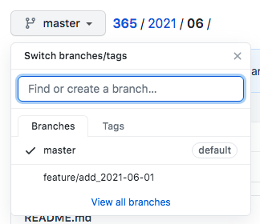
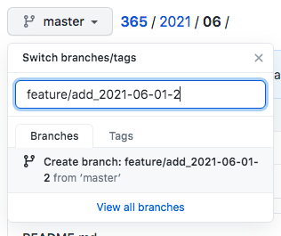
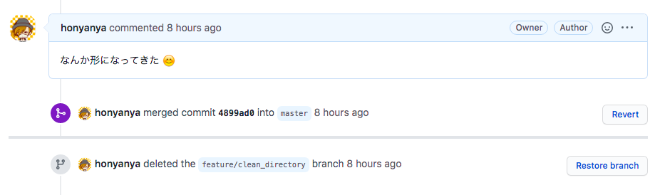

# 2021/06

## 2021/06/01 Tue

普段 GitLab 使ってて GitHub 使うと戸惑ったところ  

GitHub に自由に記録を残し初めて 6 月に入りました  
GitHub Pull Request ベースで作っていますが、普段お仕事では GitLab を使ってて  
〇〇がしたいってなった時に UI が異なってるので操作が戸惑っている  

ブランチを作る  

最初どこからブランチを作れば良いのかとなったが、実はブランチ切り替えの場所から作ることができる  
本当に GitHub を触ってなかったので戸惑った......
Issue は使えてないので本当はそこから作るよーかもだけど  

  
  

ブランチを消す  

最初はブランチ一覧で都度消していたが、実は PR を merge したあとに削除ができる  
merge 後に Delete branch と出てくるのでそこを押せば OK  
画像はボタン押したあとだけど

  

確か他にもあった気がするので、都度書いてければ良いかな  


## 2021/06/02 Wed

テキストファイルを複数行出力したい  

ちょっとしたテキストファイルの内容を複数行出力したくて、該当箇所をコピー&ペーストしたい  
cat は全内容をサクッと出力したい時に使うけど、対象箇所までスクロール移動が必要  
grep は対象文字列の検索で使っているので、検索次第では内容が無い場合がある  
less などである場所まで見てみるのもいいけど、これも結局スクロール移動が必要  

調べてみると tail や head をうまく使いこなせばできるみたい  

こんなテキストファイルを用意する  

```txt
1 a い あ 一
2 b ろ い 二
3 c は う 三
4 d に え 四
5 e ほ お 五
6 f へ か 六
7 g と き 七
8 h ち く 八
9 i り け 九
0 j ぬ こ 十
```

`cat [file] | head -n [出力したい末尾の行番号] | tail -n [出力したい末尾の行番号 - (出力したい開始の行番号 + 1)]` で出力できる  

例えば 4~8 行目を出力させたい場合はこんな感じでできる  

```sh
$ cat ./test.txt | head -n 8 | tail -n 5
4 d に え 四
5 e ほ お 五
6 f へ か 六
7 g と き 七
8 h ち く 八
```

やりたいことは cat でやりましたが sed で抽出した方が簡単でした......  
こういう時に同じコマンドばっかり使うのはよろしくない  

```sh
$ sed -n '4, 8p' ./test.txt
4 d に え 四
5 e ほ お 五
6 f へ か 六
7 g と き 七
8 h ち く 八
```

- 参考
  - [【linux】ファイルの特定の範囲の行を取り出すコマンド（headとtail） at softelメモ](https://www.softel.co.jp/blogs/tech/archives/1210)

ちょっと体調が思わしくないので明日以降は更新できない可能性があります  


## 2021/06/03 Thu

Scala 3 のガイドドキュメントを流し見する  

Scala 3 が 2021/05/14 に正式リリースされて、全然情報を追えてないことを反省しながらも[ガイドドキュメント](https://docs.scala-lang.org/ja/scala3/guides.html)があったので軽く見ることにした  
[Compatibility Reference](https://docs.scala-lang.org/scala3/guides/migration/compatibility-intro.html)、[Tour of the Migration Tools | Scala 3 Migration Guide | Scala Documentation](https://docs.scala-lang.org/scala3/guides/migration/tooling-tour.html)、[Scala 3 Migration Mode | Scala 3 Migration Guide | Scala Documentation](https://docs.scala-lang.org/scala3/guides/migration/tooling-migration-mode.html)あたりを見ました  
まだまだ見きれてないけど、メモとしてはこんな感じ  

- Scala 2.13 からの移行はスムーズにできる
  - クロスコンパイルできる
  - Scala 2.13 <- Scala 3 で依存可能
  - 下位／上位互換ができる
  - コンパイルオプション有
- sbt は sbt 1.5 から Scala 3 をサポート
- Metals はサポート有、IntelliJ IDEA は本格的なサポートは準備段階
- Scalafmt v3.0.0-RC3 は Scala 2.13, Scala 3 をサポート
- Scalafix はまだで Scala 2.13 のみ
- [Scala 3 Migrate](https://github.com/scalacenter/scala3-migrate) という移行 sbt プラグインがある
- scalac migration オプション、 rewrite オプションで書き換え可能

ちゃんと言語もライブラリもアップデートしていないと......  

- 参考
  - [Scala 3 のガイド | Scala Documentation](https://docs.scala-lang.org/ja/scala3/guides.html)

胃腸の調子、疲労感は昨日と比べて回復しました  


## 2021/06/04 Fri

個人の環境依存ファイルの除外の仕方を考える  

Git ではバージョン管理したくないファイルを `.gitignore` で管理している  
この `honyanya / 365` リポジトリも `.gitignore` を用意している  

今ある `.gitignore` はこんな感じ  

```sh
## Mac
.DS_Store
```

macOS で自動生成される `.DS_Store` を除外扱いにしている  
他にも `.swp` や Windows で生成される `Thumb.db` とかもよく入るかな  
ディレクトリで言うと `.idea/` とかも入るみたい  

同期から↑のような個人の環境依存ファイルは `.gitignore` は含めないで、 `core.excludesFile` に含めると良いアドバイスをもらった   

`.gitignore_global` というようなファイルを作って  

```sh
$ cat ~/.gitignore_global
## Mac
.DS_Store
```

git global に設定すれば良いみたい  

```sh
## 設定
$ git config --global core.excludesfile ~/.gitignore_global

## 確認
$ git config --list | grep core.excludesfile
core.excludesfile=/Users/user/.gitignore_global
```

いろいろ調べてみると個人の環境依存ファイルを含めないプロジェクトもあれば含めるプロジェクトもあるみたい  
基本的に `core.excludesFile` で良いかなと思ったけど、いちいち説明をするのも大変だし、 `git add .` されてああ......ってなるぐらいなら `.gitignore` でも良いのかなと思ったり  
個人のものは `core.excludesFile` に持っていこう  

- 参考
  - [Ignoring files - GitHub Docs](https://help.github.com/articles/ignoring-files)
  - [プロジェクトの.gitignoreに.swpファイルなど個人環境依存のファイルは含めない | 高木のブログ](https://takagi.blog/gitignore_global/)
  - [.gitignoreに.DS_Storeなど個人環境依存のファイルを含めても良いのではないか | blog.tai2.net](https://blog.tai2.net/gitignore.html)
  - [gitignore に書くべきでないものは gitignore_global へ - Qiita](https://qiita.com/elzup/items/4c92a2abdab56db3fb4e)


## 2021/06/05 Sat

textlint を実行してみる  

text にも lint があって、せっかくなので入れてみて実行してみた  

yarn で追加する  

```sh
$ yarn add --dev \
    textlint \
    textlint-rule-preset-ja-spacing \
    textlint-rule-preset-ja-technical-writing \
    textlint-rule-spellcheck-tech-word
```

作られた `package.json` はこんな感じ  

```json
$ cat 
{
  "devDependencies": {
    "textlint": "^12.0.0",
    "textlint-rule-preset-ja-spacing": "^2.1.3",
    "textlint-rule-preset-ja-technical-writing": "^6.0.0",
    "textlint-rule-spellcheck-tech-word": "^5.0.0"
  }
}
```

ルールを書く `.textlintrc` を作成する  

```sh
$ yarn textlint --init
```

作られた `.textlintrc`  
基本的に yarn add したルールは `true` になっている  

```sh
$ cat .textlintrc
{
  "filters": {},
  "rules": {
    "preset-ja-spacing": true,
    "preset-ja-technical-writing": true,
    "spellcheck-tech-word": true
  }
}
```

`textlint` を実行してみる  
いろいろエラーが出てくる  

```sh
$ yarn textlint 2021/05/README.md 
yarn run v1.22.10
warning package.json: No license field
$ /Users/user/workspace/365/node_modules/.bin/textlint 2021/05/README.md

/Users/user/workspace/365/2021/05/README.md
   22:6   ✓ error  原則として、全角文字と半角文字の間にスペースを入れません。                                                ja-spacing/ja-space-between-half-and-full-width
   22:18  error    文末が"。"で終わっていません。                                                                            ja-technical-writing/ja-no-mixed-period
   24:6   ✓ error  原則として、全角文字と半角文字の間にスペースを入れません。                                                ja-spacing/ja-space-between-half-and-full-width
   24:11  error    "て" が連続して2回使われています。                                                                        ja-technical-writing/ja-no-successive-word
   25:44  error    文末が"。"で終わっていません。                                                                            ja-technical-writing/ja-no-mixed-period
   31:52  error    文末が"。"で終わっていません。                                                                            ja-technical-writing/ja-no-mixed-period
   37:3   ✓ error  原則として、全角文字と半角文字の間にスペースを入れません。                                                ja-spacing/ja-space-between-half-and-full-width
   37:34  error    文末が"。"で終わっていません。                                                                            ja-technical-writing/ja-no-mixed-period
   40:14  ✓ error  原則として、全角文字と半角文字の間にスペースを入れません。                                                ja-spacing/ja-space-between-half-and-full-width
   43:40  error    一文に二回以上利用されている助詞 "と" がみつかりました。                                                  ja-technical-writing/no-doubled-joshi
   48:16  ✓ error  原則として、全角文字と半角文字の間にスペースを入れません。                                                ja-spacing/ja-space-between-half-and-full-width
   48:34  error    文末が"。"で終わっていません。                                                                            ja-technical-writing/ja-no-mixed-period
   50:1   error    Line 50 sentence length(120) exceeds the maximum sentence length of 100.
Over 20 characters                                  ja-technical-writing/sentence-length
   50:8   ✓ error  原則として、全角文字と半角文字の間にスペースを入れません。                                                ja-spacing/ja-space-between-half-and-full-width
   51:16  ✓ error  原則として、全角文字と半角文字の間にスペースを入れません。                                                ja-spacing/ja-space-between-half-and-full-width
   51:20  ✓ error  原則として、全角文字と半角文字の間にスペースを入れません。                                                ja-spacing/ja-space-between-half-and-full-width
   52:5   ✓ error  原則として、全角文字と半角文字の間にスペースを入れません。                                                ja-spacing/ja-space-between-half-and-full-width
   52:10  ✓ error  原則として、全角文字と半角文字の間にスペースを入れません。                                                ja-spacing/ja-space-between-half-and-full-width
   52:36  error    文末が"。"で終わっていません。                                                                            ja-technical-writing/ja-no-mixed-period
   55:6   ✓ error  原則として、全角文字と半角文字の間にスペースを入れません。                                                ja-spacing/ja-space-between-half-and-full-width
   55:11  ✓ error  原則として、全角文字と半角文字の間にスペースを入れません。                                                ja-spacing/ja-space-between-half-and-full-width
   55:38  error    文末が"。"で終わっていません。                                                                            ja-technical-writing/ja-no-mixed-period
   57:16  error    文末が"。"で終わっていません。                                                                            ja-technical-writing/ja-no-mixed-period
   65:8   ✓ error  原則として、全角文字と半角文字の間にスペースを入れません。                                                ja-spacing/ja-space-between-half-and-full-width
   65:13  ✓ error  原則として、全角文字と半角文字の間にスペースを入れません。                                                ja-spacing/ja-space-between-half-and-full-width
   65:29  ✓ error  原則として、全角文字と半角文字の間にスペースを入れません。                                                ja-spacing/ja-space-between-half-and-full-width
   65:46  error    文末が"。"で終わっていません。                                                                            ja-technical-writing/ja-no-mixed-period
   68:70  ✓ error  原則として、全角文字と半角文字の間にスペースを入れません。                                                ja-spacing/ja-space-between-half-and-full-width
   68:85  ✓ error  原則として、全角文字と半角文字の間にスペースを入れません。                                                ja-spacing/ja-space-between-half-and-full-width
   69:49  ✓ error  【dict2】 "することができた"は冗長な表現です。"することが"を省き簡潔な表現にすると文章が明瞭になります。
解説: https://github.com/textlint-ja/textlint-rule-ja-no-redundant-expression#dict2  ja-technical-writing/ja-no-redundant-expression
   69:56  error    文末が"。"で終わっていません。                                                                            ja-technical-writing/ja-no-mixed-period
   71:11  ✓ error  原則として、全角文字と半角文字の間にスペースを入れません。                                                ja-spacing/ja-space-between-half-and-full-width
   71:13  ✓ error  原則として、全角文字と半角文字の間にスペースを入れません。                                                ja-spacing/ja-space-between-half-and-full-width
   71:14  error    文末が"。"で終わっていません。                                                                            ja-technical-writing/ja-no-mixed-period
   77:4   ✓ error  原則として、全角文字と半角文字の間にスペースを入れません。                                                ja-spacing/ja-space-between-half-and-full-width
   77:19  ✓ error  原則として、全角文字と半角文字の間にスペースを入れません。                                                ja-spacing/ja-space-between-half-and-full-width
   77:42  error    文末が"。"で終わっていません。                                                                            ja-technical-writing/ja-no-mixed-period
   85:9   ✓ error  原則として、全角文字と半角文字の間にスペースを入れません。                                                ja-spacing/ja-space-between-half-and-full-width
   85:16  ✓ error  原則として、全角文字と半角文字の間にスペースを入れません。                                                ja-spacing/ja-space-between-half-and-full-width
   85:36  error    弱い表現: "かも" が使われています。                                                                       ja-technical-writing/ja-no-weak-phrase
   85:47  ✓ error  文末が"。"で終わっていません。                                                                            ja-technical-writing/ja-no-mixed-period
   93:7   ✓ error  原則として、全角文字と半角文字の間にスペースを入れません。                                                ja-spacing/ja-space-between-half-and-full-width
   93:9   ✓ error  原則として、全角文字と半角文字の間にスペースを入れません。                                                ja-spacing/ja-space-between-half-and-full-width
   93:14  ✓ error  原則として、全角文字と半角文字の間にスペースを入れません。                                                ja-spacing/ja-space-between-half-and-full-width
   93:16  error    文末が"。"で終わっていません。                                                                            ja-technical-writing/ja-no-mixed-period
   95:6   ✓ error  原則として、全角文字と半角文字の間にスペースを入れません。                                                ja-spacing/ja-space-between-half-and-full-width
   95:13  ✓ error  原則として、全角文字と半角文字の間にスペースを入れません。                                                ja-spacing/ja-space-between-half-and-full-width
   96:24  error    文末が"。"で終わっていません。                                                                            ja-technical-writing/ja-no-mixed-period
  102:21  ✓ error  原則として、全角文字と半角文字の間にスペースを入れません。                                                ja-spacing/ja-space-between-half-and-full-width
  102:26  ✓ error  原則として、全角文字と半角文字の間にスペースを入れません。                                                ja-spacing/ja-space-between-half-and-full-width
  102:34  ✓ error  ？っ => ？ っ                                                                                             spellcheck-tech-word
  102:34  error    Disallow to use "？"                                                                                      ja-technical-writing/no-exclamation-question-mark
  103:5   ✓ error  原則として、全角文字と半角文字の間にスペースを入れません。                                                ja-spacing/ja-space-between-half-and-full-width
  103:23  ✓ error  原則として、全角文字と半角文字の間にスペースを入れません。                                                ja-spacing/ja-space-between-half-and-full-width
  103:28  ✓ error  原則として、全角文字と半角文字の間にスペースを入れません。                                                ja-spacing/ja-space-between-half-and-full-width
  103:39  error    文末が"。"で終わっていません。                                                                            ja-technical-writing/ja-no-mixed-period
  124:7   ✓ error  原則として、全角文字と半角文字の間にスペースを入れません。                                                ja-spacing/ja-space-between-half-and-full-width
  124:9   ✓ error  原則として、全角文字と半角文字の間にスペースを入れません。                                                ja-spacing/ja-space-between-half-and-full-width
  124:14  ✓ error  原則として、全角文字と半角文字の間にスペースを入れません。                                                ja-spacing/ja-space-between-half-and-full-width
  124:34  error    文末が"。"で終わっていません。                                                                            ja-technical-writing/ja-no-mixed-period
  137:62  error    一文に二回以上利用されている助詞 "に" がみつかりました。                                                  ja-technical-writing/no-doubled-joshi
  138:16  error    文末が"。"で終わっていません。                                                                            ja-technical-writing/ja-no-mixed-period
  148:8   ✓ error  原則として、全角文字と半角文字の間にスペースを入れません。                                                ja-spacing/ja-space-between-half-and-full-width
  148:40  error    文末が"。"で終わっていません。                                                                            ja-technical-writing/ja-no-mixed-period
  150:8   ✓ error  原則として、全角文字と半角文字の間にスペースを入れません。                                                ja-spacing/ja-space-between-half-and-full-width
  151:25  ✓ error  原則として、全角文字と半角文字の間にスペースを入れません。                                                ja-spacing/ja-space-between-half-and-full-width
  151:36  error    文末が"。"で終わっていません。                                                                            ja-technical-writing/ja-no-mixed-period
  153:26  error    文末が"。"で終わっていません。                                                                            ja-technical-writing/ja-no-mixed-period
  166:12  ✓ error  原則として、全角文字と半角文字の間にスペースを入れません。                                                ja-spacing/ja-space-between-half-and-full-width
  166:17  ✓ error  原則として、全角文字と半角文字の間にスペースを入れません。                                                ja-spacing/ja-space-between-half-and-full-width
  166:20  error    文末が"。"で終わっていません。                                                                            ja-technical-writing/ja-no-mixed-period
  179:30  ✓ error  原則として、全角文字と半角文字の間にスペースを入れません。                                                ja-spacing/ja-space-between-half-and-full-width
  179:35  ✓ error  原則として、全角文字と半角文字の間にスペースを入れません。                                                ja-spacing/ja-space-between-half-and-full-width
  179:58  error    文末が"。"で終わっていません。                                                                            ja-technical-writing/ja-no-mixed-period
  184:6   ✓ error  原則として、全角文字と半角文字の間にスペースを入れません。                                                ja-spacing/ja-space-between-half-and-full-width
  184:26  error    文末が"。"で終わっていません。                                                                            ja-technical-writing/ja-no-mixed-period
  186:4   ✓ error  原則として、全角文字と半角文字の間にスペースを入れません。                                                ja-spacing/ja-space-between-half-and-full-width
  186:21  ✓ error  原則として、全角文字と半角文字の間にスペースを入れません。                                                ja-spacing/ja-space-between-half-and-full-width
  186:25  ✓ error  原則として、全角文字と半角文字の間にスペースを入れません。                                                ja-spacing/ja-space-between-half-and-full-width
  187:24  error    文末が"。"で終わっていません。                                                                            ja-technical-writing/ja-no-mixed-period
  194:1   error    文中に逆接の接続助詞 "が" が二回以上使われています。                                                      ja-technical-writing/no-doubled-conjunctive-particle-ga
  195:37  ✓ error  文末が"。"で終わっていません。                                                                            ja-technical-writing/ja-no-mixed-period
  206:28  error    文末が"。"で終わっていません。                                                                            ja-technical-writing/ja-no-mixed-period
  222:10  error    文末が"。"で終わっていません。                                                                            ja-technical-writing/ja-no-mixed-period
  227:20  error    文末が"。"で終わっていません。                                                                            ja-technical-writing/ja-no-mixed-period
  238:7   ✓ error  原則として、全角文字と半角文字の間にスペースを入れません。                                                ja-spacing/ja-space-between-half-and-full-width
  238:49  error    文末が"。"で終わっていません。                                                                            ja-technical-writing/ja-no-mixed-period
  242:2   error    文末が"。"で終わっていません。                                                                            ja-technical-writing/ja-no-mixed-period
  249:2   ✓ error  かっこの外側、内側ともにスペースを入れません。                                                            ja-spacing/ja-no-space-around-parentheses
  249:5   ✓ error  原則として、全角文字と半角文字の間にスペースを入れません。                                                ja-spacing/ja-space-between-half-and-full-width
  250:5   ✓ error  原則として、全角文字と半角文字の間にスペースを入れません。                                                ja-spacing/ja-space-between-half-and-full-width
  250:22  ✓ error  原則として、全角文字と半角文字の間にスペースを入れません。                                                ja-spacing/ja-space-between-half-and-full-width
  250:55  error    文末が"。"で終わっていません。                                                                            ja-technical-writing/ja-no-mixed-period
  255:36  error    文末が"。"で終わっていません。                                                                            ja-technical-writing/ja-no-mixed-period
  260:23  error    文末が"。"で終わっていません。                                                                            ja-technical-writing/ja-no-mixed-period
  262:1   error    Line 262 sentence length(107) exceeds the maximum sentence length of 100.
Over 7 characters                                 ja-technical-writing/sentence-length
  263:46  error    文末が"。"で終わっていません。                                                                            ja-technical-writing/ja-no-mixed-period
  265:1   error    Line 265 sentence length(102) exceeds the maximum sentence length of 100.
Over 2 characters                                 ja-technical-writing/sentence-length
  267:32  ✓ error  原則として、全角文字と半角文字の間にスペースを入れません。                                                ja-spacing/ja-space-between-half-and-full-width
  267:44  error    文末が"。"で終わっていません。                                                                            ja-technical-writing/ja-no-mixed-period
  271:29  error    文末が"。"で終わっていません。                                                                            ja-technical-writing/ja-no-mixed-period
  281:7   ✓ error  原則として、全角文字と半角文字の間にスペースを入れません。                                                ja-spacing/ja-space-between-half-and-full-width
  281:14  error    文末が"。"で終わっていません。                                                                            ja-technical-writing/ja-no-mixed-period
  284:53  error    文末が"。"で終わっていません。                                                                            ja-technical-writing/ja-no-mixed-period
  287:70  error    一文に二回以上利用されている助詞 "で" がみつかりました。                                                  ja-technical-writing/no-doubled-joshi
  287:77  error    文末が"。"で終わっていません。                                                                            ja-technical-writing/ja-no-mixed-period
  289:5   ✓ error  原則として、全角文字と半角文字の間にスペースを入れません。                                                ja-spacing/ja-space-between-half-and-full-width
  289:13  ✓ error  原則として、全角文字と半角文字の間にスペースを入れません。                                                ja-spacing/ja-space-between-half-and-full-width
  289:16  ✓ error  原則として、全角文字と半角文字の間にスペースを入れません。                                                ja-spacing/ja-space-between-half-and-full-width
  289:25  error    文末が"。"で終わっていません。                                                                            ja-technical-writing/ja-no-mixed-period
  295:5   ✓ error  原則として、全角文字と半角文字の間にスペースを入れません。                                                ja-spacing/ja-space-between-half-and-full-width
  295:7   ✓ error  原則として、全角文字と半角文字の間にスペースを入れません。                                                ja-spacing/ja-space-between-half-and-full-width
  295:15  ✓ error  原則として、全角文字と半角文字の間にスペースを入れません。                                                ja-spacing/ja-space-between-half-and-full-width
  296:39  error    文末が"。"で終わっていません。                                                                            ja-technical-writing/ja-no-mixed-period
  325:65  error    文末が"。"で終わっていません。                                                                            ja-technical-writing/ja-no-mixed-period
  340:5   ✓ error  原則として、全角文字と半角文字の間にスペースを入れません。                                                ja-spacing/ja-space-between-half-and-full-width
  340:7   ✓ error  原則として、全角文字と半角文字の間にスペースを入れません。                                                ja-spacing/ja-space-between-half-and-full-width
  340:14  ✓ error  原則として、全角文字と半角文字の間にスペースを入れません。                                                ja-spacing/ja-space-between-half-and-full-width
  340:17  error    文末が"。"で終わっていません。                                                                            ja-technical-writing/ja-no-mixed-period
  342:4   ✓ error  原則として、全角文字と半角文字の間にスペースを入れません。                                                ja-spacing/ja-space-between-half-and-full-width
  342:11  ✓ error  原則として、全角文字と半角文字の間にスペースを入れません。                                                ja-spacing/ja-space-between-half-and-full-width
  344:7   ✓ error  原則として、全角文字と半角文字の間にスペースを入れません。                                                ja-spacing/ja-space-between-half-and-full-width
  344:17  error    文末が"。"で終わっていません。                                                                            ja-technical-writing/ja-no-mixed-period
  346:19  ✓ error  文末が"。"で終わっていません。                                                                            ja-technical-writing/ja-no-mixed-period
  360:8   ✓ error  原則として、全角文字と半角文字の間にスペースを入れません。                                                ja-spacing/ja-space-between-half-and-full-width
  361:4   ✓ error  原則として、全角文字と半角文字の間にスペースを入れません。                                                ja-spacing/ja-space-between-half-and-full-width
  361:13  error    文末が"。"で終わっていません。                                                                            ja-technical-writing/ja-no-mixed-period
  365:27  error    文末が"。"で終わっていません。                                                                            ja-technical-writing/ja-no-mixed-period
  374:11  error    文末が"。"で終わっていません。                                                                            ja-technical-writing/ja-no-mixed-period
  376:1   error    Line 376 sentence length(108) exceeds the maximum sentence length of 100.
Over 8 characters                                 ja-technical-writing/sentence-length
  376:68  ✓ error  原則として、全角文字と半角文字の間にスペースを入れません。                                                ja-spacing/ja-space-between-half-and-full-width
  376:70  ✓ error  原則として、全角文字と半角文字の間にスペースを入れません。                                                ja-spacing/ja-space-between-half-and-full-width
  378:34  error    文末が"。"で終わっていません。                                                                            ja-technical-writing/ja-no-mixed-period
  381:10  error    一文に二回以上利用されている助詞 "も" がみつかりました。                                                  ja-technical-writing/no-doubled-joshi
  381:13  error    文末が"。"で終わっていません。                                                                            ja-technical-writing/ja-no-mixed-period
  383:23  error    文末が"。"で終わっていません。                                                                            ja-technical-writing/ja-no-mixed-period
  399:53  error    Disallow to use "？"                                                                                      ja-technical-writing/no-exclamation-question-mark
  400:9   error    文末が"。"で終わっていません。                                                                            ja-technical-writing/ja-no-mixed-period
  416:31  error    文末が"。"で終わっていません。                                                                            ja-technical-writing/ja-no-mixed-period

✖ 139 problems (139 errors, 0 warnings)
✓ 75 fixable problems.
Try to run: $ textlint --fix [file]

error Command failed with exit code 1.
info Visit https://yarnpkg.com/en/docs/cli/run for documentation about this command.
```

`textlint --fix [file]` で修正できるみたいなので実施してみる  

```sh
$ yarn textlint --fix 2021/05/README.md 
yarn run v1.22.10
warning package.json: No license field
$ /Users/user/workspace/365/node_modules/.bin/textlint --fix 2021/05/README.md

/Users/user/workspace/365/2021/05/README.md
  102:34  ✔   ？っ => ？ っ                                                                                             spellcheck-tech-word
  249:2   ✔   かっこの外側、内側ともにスペースを入れません。                                                            ja-spacing/ja-no-space-around-parentheses
   22:6   ✔   原則として、全角文字と半角文字の間にスペースを入れません。                                                ja-spacing/ja-space-between-half-and-full-width
   24:6   ✔   原則として、全角文字と半角文字の間にスペースを入れません。                                                ja-spacing/ja-space-between-half-and-full-width
   37:3   ✔   原則として、全角文字と半角文字の間にスペースを入れません。                                                ja-spacing/ja-space-between-half-and-full-width
   40:14  ✔   原則として、全角文字と半角文字の間にスペースを入れません。                                                ja-spacing/ja-space-between-half-and-full-width
   48:16  ✔   原則として、全角文字と半角文字の間にスペースを入れません。                                                ja-spacing/ja-space-between-half-and-full-width
   50:8   ✔   原則として、全角文字と半角文字の間にスペースを入れません。                                                ja-spacing/ja-space-between-half-and-full-width
   51:16  ✔   原則として、全角文字と半角文字の間にスペースを入れません。                                                ja-spacing/ja-space-between-half-and-full-width
   51:20  ✔   原則として、全角文字と半角文字の間にスペースを入れません。                                                ja-spacing/ja-space-between-half-and-full-width
   52:5   ✔   原則として、全角文字と半角文字の間にスペースを入れません。                                                ja-spacing/ja-space-between-half-and-full-width
   52:10  ✔   原則として、全角文字と半角文字の間にスペースを入れません。                                                ja-spacing/ja-space-between-half-and-full-width
   55:6   ✔   原則として、全角文字と半角文字の間にスペースを入れません。                                                ja-spacing/ja-space-between-half-and-full-width
   55:11  ✔   原則として、全角文字と半角文字の間にスペースを入れません。                                                ja-spacing/ja-space-between-half-and-full-width
   65:8   ✔   原則として、全角文字と半角文字の間にスペースを入れません。                                                ja-spacing/ja-space-between-half-and-full-width
   65:13  ✔   原則として、全角文字と半角文字の間にスペースを入れません。                                                ja-spacing/ja-space-between-half-and-full-width
   65:29  ✔   原則として、全角文字と半角文字の間にスペースを入れません。                                                ja-spacing/ja-space-between-half-and-full-width
   68:70  ✔   原則として、全角文字と半角文字の間にスペースを入れません。                                                ja-spacing/ja-space-between-half-and-full-width
   68:85  ✔   原則として、全角文字と半角文字の間にスペースを入れません。                                                ja-spacing/ja-space-between-half-and-full-width
   71:11  ✔   原則として、全角文字と半角文字の間にスペースを入れません。                                                ja-spacing/ja-space-between-half-and-full-width
   71:13  ✔   原則として、全角文字と半角文字の間にスペースを入れません。                                                ja-spacing/ja-space-between-half-and-full-width
   77:4   ✔   原則として、全角文字と半角文字の間にスペースを入れません。                                                ja-spacing/ja-space-between-half-and-full-width
   77:19  ✔   原則として、全角文字と半角文字の間にスペースを入れません。                                                ja-spacing/ja-space-between-half-and-full-width
   85:9   ✔   原則として、全角文字と半角文字の間にスペースを入れません。                                                ja-spacing/ja-space-between-half-and-full-width
   85:16  ✔   原則として、全角文字と半角文字の間にスペースを入れません。                                                ja-spacing/ja-space-between-half-and-full-width
   93:7   ✔   原則として、全角文字と半角文字の間にスペースを入れません。                                                ja-spacing/ja-space-between-half-and-full-width
   93:9   ✔   原則として、全角文字と半角文字の間にスペースを入れません。                                                ja-spacing/ja-space-between-half-and-full-width
   93:14  ✔   原則として、全角文字と半角文字の間にスペースを入れません。                                                ja-spacing/ja-space-between-half-and-full-width
   95:6   ✔   原則として、全角文字と半角文字の間にスペースを入れません。                                                ja-spacing/ja-space-between-half-and-full-width
   95:13  ✔   原則として、全角文字と半角文字の間にスペースを入れません。                                                ja-spacing/ja-space-between-half-and-full-width
  102:21  ✔   原則として、全角文字と半角文字の間にスペースを入れません。                                                ja-spacing/ja-space-between-half-and-full-width
  102:26  ✔   原則として、全角文字と半角文字の間にスペースを入れません。                                                ja-spacing/ja-space-between-half-and-full-width
  103:5   ✔   原則として、全角文字と半角文字の間にスペースを入れません。                                                ja-spacing/ja-space-between-half-and-full-width
  103:23  ✔   原則として、全角文字と半角文字の間にスペースを入れません。                                                ja-spacing/ja-space-between-half-and-full-width
  103:28  ✔   原則として、全角文字と半角文字の間にスペースを入れません。                                                ja-spacing/ja-space-between-half-and-full-width
  124:7   ✔   原則として、全角文字と半角文字の間にスペースを入れません。                                                ja-spacing/ja-space-between-half-and-full-width
  124:9   ✔   原則として、全角文字と半角文字の間にスペースを入れません。                                                ja-spacing/ja-space-between-half-and-full-width
  124:14  ✔   原則として、全角文字と半角文字の間にスペースを入れません。                                                ja-spacing/ja-space-between-half-and-full-width
  148:8   ✔   原則として、全角文字と半角文字の間にスペースを入れません。                                                ja-spacing/ja-space-between-half-and-full-width
  150:8   ✔   原則として、全角文字と半角文字の間にスペースを入れません。                                                ja-spacing/ja-space-between-half-and-full-width
  151:25  ✔   原則として、全角文字と半角文字の間にスペースを入れません。                                                ja-spacing/ja-space-between-half-and-full-width
  166:12  ✔   原則として、全角文字と半角文字の間にスペースを入れません。                                                ja-spacing/ja-space-between-half-and-full-width
  166:17  ✔   原則として、全角文字と半角文字の間にスペースを入れません。                                                ja-spacing/ja-space-between-half-and-full-width
  179:30  ✔   原則として、全角文字と半角文字の間にスペースを入れません。                                                ja-spacing/ja-space-between-half-and-full-width
  179:35  ✔   原則として、全角文字と半角文字の間にスペースを入れません。                                                ja-spacing/ja-space-between-half-and-full-width
  184:6   ✔   原則として、全角文字と半角文字の間にスペースを入れません。                                                ja-spacing/ja-space-between-half-and-full-width
  186:4   ✔   原則として、全角文字と半角文字の間にスペースを入れません。                                                ja-spacing/ja-space-between-half-and-full-width
  186:21  ✔   原則として、全角文字と半角文字の間にスペースを入れません。                                                ja-spacing/ja-space-between-half-and-full-width
  186:25  ✔   原則として、全角文字と半角文字の間にスペースを入れません。                                                ja-spacing/ja-space-between-half-and-full-width
  238:7   ✔   原則として、全角文字と半角文字の間にスペースを入れません。                                                ja-spacing/ja-space-between-half-and-full-width
  249:4   ✔   原則として、全角文字と半角文字の間にスペースを入れません。                                                ja-spacing/ja-space-between-half-and-full-width
  250:5   ✔   原則として、全角文字と半角文字の間にスペースを入れません。                                                ja-spacing/ja-space-between-half-and-full-width
  250:22  ✔   原則として、全角文字と半角文字の間にスペースを入れません。                                                ja-spacing/ja-space-between-half-and-full-width
  267:32  ✔   原則として、全角文字と半角文字の間にスペースを入れません。                                                ja-spacing/ja-space-between-half-and-full-width
  281:7   ✔   原則として、全角文字と半角文字の間にスペースを入れません。                                                ja-spacing/ja-space-between-half-and-full-width
  289:5   ✔   原則として、全角文字と半角文字の間にスペースを入れません。                                                ja-spacing/ja-space-between-half-and-full-width
  289:13  ✔   原則として、全角文字と半角文字の間にスペースを入れません。                                                ja-spacing/ja-space-between-half-and-full-width
  289:16  ✔   原則として、全角文字と半角文字の間にスペースを入れません。                                                ja-spacing/ja-space-between-half-and-full-width
  295:5   ✔   原則として、全角文字と半角文字の間にスペースを入れません。                                                ja-spacing/ja-space-between-half-and-full-width
  295:7   ✔   原則として、全角文字と半角文字の間にスペースを入れません。                                                ja-spacing/ja-space-between-half-and-full-width
  295:15  ✔   原則として、全角文字と半角文字の間にスペースを入れません。                                                ja-spacing/ja-space-between-half-and-full-width
  340:5   ✔   原則として、全角文字と半角文字の間にスペースを入れません。                                                ja-spacing/ja-space-between-half-and-full-width
  340:7   ✔   原則として、全角文字と半角文字の間にスペースを入れません。                                                ja-spacing/ja-space-between-half-and-full-width
  340:14  ✔   原則として、全角文字と半角文字の間にスペースを入れません。                                                ja-spacing/ja-space-between-half-and-full-width
  342:4   ✔   原則として、全角文字と半角文字の間にスペースを入れません。                                                ja-spacing/ja-space-between-half-and-full-width
  342:11  ✔   原則として、全角文字と半角文字の間にスペースを入れません。                                                ja-spacing/ja-space-between-half-and-full-width
  344:7   ✔   原則として、全角文字と半角文字の間にスペースを入れません。                                                ja-spacing/ja-space-between-half-and-full-width
  360:8   ✔   原則として、全角文字と半角文字の間にスペースを入れません。                                                ja-spacing/ja-space-between-half-and-full-width
  361:4   ✔   原則として、全角文字と半角文字の間にスペースを入れません。                                                ja-spacing/ja-space-between-half-and-full-width
  376:68  ✔   原則として、全角文字と半角文字の間にスペースを入れません。                                                ja-spacing/ja-space-between-half-and-full-width
  376:70  ✔   原則として、全角文字と半角文字の間にスペースを入れません。                                                ja-spacing/ja-space-between-half-and-full-width
  102:33  ✔   文末に感嘆符を使用し、後に別の文が続く場合は、直後に全角スペースを挿入します。                            ja-spacing/ja-space-after-question
   85:45  ✔   文末が"。"で終わっていません。                                                                            ja-technical-writing/ja-no-mixed-period
  195:37  ✔   文末が"。"で終わっていません。                                                                            ja-technical-writing/ja-no-mixed-period
  346:19  ✔   文末が"。"で終わっていません。                                                                            ja-technical-writing/ja-no-mixed-period
   69:49  ✔   【dict2】 "することができた"は冗長な表現です。"することが"を省き簡潔な表現にすると文章が明瞭になります。
解説: https://github.com/textlint-ja/textlint-rule-ja-no-redundant-expression#dict2  ja-technical-writing/ja-no-redundant-expression

✔ Fixed 76 problems
✖ Remaining 51 problems

✨  Done in 4.60s.
```

けっこうな差分が出てきた  
今回の PR も作っておいた  
[[feature/add_textlint][add] textlint の導入と実施 by honyanya · Pull Request #20 · honyanya/365](https://github.com/honyanya/365/pull/20/)

ルールは他にもあるみたい  
どうしようかな  

- 参考
  - [textlint と VS Code で始める文章校正 - Qiita](https://qiita.com/takasp/items/22f7f72b691fda30aea2)
  - [textlintを導入した - Qiita](https://qiita.com/myazzy0/items/a1c5ddf3f2ae446cd1ed)


## 2021/06/06 Sun

プロンプトをサクッと変更する  

普段は bash を使っている（いい加減 zsh 切り替えたいなと思いつつ）  

ちょっと検証でコピペする時にわざわざユーザ名などを消すのは大変なので一時的にプロンプトの表示を変えたい  
`PS1` という環境変数を `~/.bashrc` に設定している  

```sh
$ printenv PS1
\[\033[32m\]\u@\h \[\033[35m\]bash \v \[\033[33m\]\w\[\033[36m\]$(__git_ps1) \[\033[00m\]\n \$
```

なので一時的に変更するには `PS1` 値を変更すれば OK  

```sh
$ PS1="$ "

$ printenv PS1
$
```

コピペしやすくなった  

```sh
$ echo 'hello'
hello
$ echo 'world'
world
```

