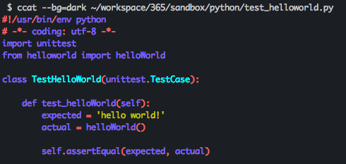

# 2021/07

<!-- TOC -->

- [2021/07](#202107)
    - [2021/07/01 Thu](#20210701-thu)
    - [2021/07/02 Fri](#20210702-fri)
    - [2021/07/03 Sat](#20210703-sat)
    - [2021/07/04 Sun](#20210704-sun)
    - [2021/07/05 Mon](#20210705-mon)
    - [2021/07/06 Tue](#20210706-tue)
    - [2021/07/07 Wed](#20210707-wed)
    - [2021/07/08 Thu](#20210708-thu)
    - [2021/07/09 Fri](#20210709-fri)
    - [2021/07/10 Sat](#20210710-sat)
    - [2021/07/11 Sun](#20210711-sun)
    - [2021/07/12 Mon](#20210712-mon)
    - [2021/07/13 Tue](#20210713-tue)
    - [2021/07/14 Wed](#20210714-wed)
    - [2021/07/15 Thu](#20210715-thu)
    - [2021/07/16 Fri](#20210716-fri)
    - [2021/07/17 Sat](#20210717-sat)
    - [2021/07/18 Sun](#20210718-sun)
    - [2021/07/19 Mon](#20210719-mon)
    - [2021/07/20 Tue](#20210720-tue)
    - [2021/07/21 Wed](#20210721-wed)
    - [2021/07/22 Thu](#20210722-thu)
    - [2021/07/23 Fri](#20210723-fri)
    - [2021/07/24 Sat](#20210724-sat)
    - [2021/07/25 Sun](#20210725-sun)
    - [2021/07/26 Mon](#20210726-mon)

<!-- /TOC -->


## 2021/07/01 Thu

Python でテストをやってみる  

前に Python でスクリプトを書いてみたので、テストコードを書くことにしてみた  
シンプルに "hello world!" と出力されているかをテストで書いてみる  

こんなスクリプトを用意して  

`helloworld.py`

```py
#!/usr/bin/env python
# -*- coding: utf-8 -*-

def main():
    message = helloWorld()
    print(message)

def helloWorld():
    return 'hello world!'

if __name__ == "__main__":
    main()
```

実行するとこんな感じ  

```sh
$ python ./helloworld.py
hello world!
```

テストを書いてみる  
`unittest` を使用してこんな感じに書く  

`test_hellowold.py`

```py
#!/usr/bin/env python
# -*- coding: utf-8 -*-
import unittest
from helloworld import helloWorld

class TestHelloWorld(unittest.TestCase):

    def test_helloWorld(self):
        expected = 'hello world!'
        actual = helloWorld()

        self.assertEqual(expected, actual)

if __name__ == "__main__":
    unittest.main()
```

テストを実行するとこんな感じ  

```sh
$ python ./test_helloworld.py 
.
----------------------------------------------------------------------
Ran 1 test in 0.000s
```

- 参考
  - [Python標準のunittestの使い方メモ - Qiita](https://qiita.com/aomidro/items/3e3449fde924893f18ca)
  - [最短で試すPythonテストコード - Qiita](https://qiita.com/phorizon20/items/acb929772aaae4f52101)


## 2021/07/02 Fri

jq コマンドで出力した結果のダブルクォーテーションを外す  

こんな JSON があって  

```json
{
  "key1": "value1",
  "key2": "value2",
  "key3": "value3"
}
```

こんな感じで値を取得する  

```sh
$ cat ./sample.json | jq '.key2'
"value2"
```

このダブルクォーテーションを外して、別の処理に渡したい  
sed でダブルクォーテーションを空文字に変換することもできるけど  

```sh
$ cat ./sample.json | jq '.key2' | sed 's/"//g'
value2
```

jq には -r オプションがあるのでそちらを使うと OK  

```sh
$ cat ./sample.json | jq -r '.key2'
value2
```

- 参考
  - [jq コマンドを使う日常のご紹介 - Qiita](https://qiita.com/takeshinoda@github/items/2dec7a72930ec1f658af)


## 2021/07/03 Sat

GitHub API で PR 作成  

1 ヶ月以上手動で作成していたが、せっかくなので GitHub API 経由で PR を作成してみることにした  

まずは Token の設定を変更する  
[Personal Access Tokens](https://github.com/settings/tokens) にアクセスして `public_repo` にチェックを入れた  

こんな感じで環境変数を用意して  

```sh
export GITHUB_TOKEN=
export GITHUB_USER=
export GITHUB_REPOSITORY=
export GITHUB_FEATURE_BRANCH=
export GITHUB_PR_TITLE=
```

curl で叩けば OK  

```sh
curl -H "Authorization: token $GITHUB_TOKEN" \
  "https://api.github.com/repos/$GITHUB_USER/$GITHUB_REPOSITORY/pulls" \
  -d "{\"title\": \"$GITHUB_PR_TITLE\", \"head\": \"$GITHUB_USER:$GITHUB_FEATURE_BRANCH\", \"base\": \"main\"}"
```

push 後にタイトルとかは修正するが、本日分の PR は API で作成を行った  
https://github.com/honyanya/365/pull/63  

- 参考
  - [github で自分のリポジトリに pull request を投げたい - げっとシステムログ](https://www.getto.systems/entry/2016/04/20/192727)


## 2021/07/04 Sun

GitHub API でブランチ作成  

昨日の続き  
今日は branch を GitHub API で作成する  

まずはこんな感じでリビジョンハッシュを取得する  

```sh
curl -H "Authorization: token ${GITHUB_TOKEN}" \
  "https://api.github.com/repos/${GITHUB_USER}/${GITHUB_REPOSITORY}/git/refs/heads/${BASE_BRANCH}" -s \
  | jq -r '.[].object.sha'
```

がこの方法だとブランチの数だけリビジョンハッシュが出力されてしまう  
なので jq をちょこっとだけ修正して、 main ブランチのリビジョンハッシュを取得できるようにする  

```sh
curl -H "Authorization: token ${GITHUB_TOKEN}" \
  "https://api.github.com/repos/${GITHUB_USER}/${GITHUB_REPOSITORY}/git/refs/heads/${BASE_BRANCH}" -s \
  | jq -r '.[] | select(.ref == "refs/heads/main") | .object.sha'
```

このあとの処理でこのリビジョンハッシュは使うため、変数として用意しておく  

```sh
github_hash=$(curl -H "Authorization: token ${GITHUB_TOKEN}" \
  "https://api.github.com/repos/${GITHUB_USER}/${GITHUB_REPOSITORY}/git/refs/heads/${BASE_BRANCH}" -s \
  | jq -r '.[] | select(.ref == "refs/heads/main") | .object.sha')

echo $github_hash
```

準備は完了  
下記のように API を叩くことでブランチが作成できる

```sh
curl -X POST \
  -H "Authorization: token ${GITHUB_TOKEN}" \
  -d "{\"ref\": \"refs/heads/${GITHUB_FEATURE_BRANCH}\", \"sha\":\"${github_hash}\"}" \
  https://api.github.com/repos/${GITHUB_USER}/${GITHUB_REPOSITORY}/git/refs
```

- 参考
  - [GitHub APIを使ってブランチを新規作成する - ぷらすのブログ](https://blog.p1ass.com/posts/create-branch-using-github-api/)


## 2021/07/05 Mon

GitHub API を使って、 GitHub の画面を触らずに執筆ができる状態にした  

昨日の続き  
昨日までの内容を元にスクリプトを繋ぎ合わせてみた  
これでブランチ作成や PR 作成もブラウザを使わずに作成できることが可能になった  
執筆開始までのリードタイム削減に繋がった  

```sh
## 環境変数の設定（未入力値は設定する）
export GITHUB_TOKEN=
export GITHUB_USER=
export GITHUB_REPOSITORY=
export GITHUB_BASE_BRANCH=main
export GITHUB_FEATURE_BRANCH="feature/add_$(date "+%Y-%m-%d")"
export GITHUB_PR_TITLE=
export GITHUB_PR_DESCRIPTION="$(date "+%Y/%m/%d") 分"

## リビジョンハッシュの取得
github_hash=$(curl -H "Authorization: token ${GITHUB_TOKEN}" \
  "https://api.github.com/repos/${GITHUB_USER}/${GITHUB_REPOSITORY}/git/refs/heads/${BASE_BRANCH}" -s \
  | jq -r '.[] | select(.ref == "refs/heads/main") | .object.sha')

## リモートブランチの作成
curl -X POST \
  -H "Authorization: token ${GITHUB_TOKEN}" \
  -d "{\"ref\": \"refs/heads/${GITHUB_FEATURE_BRANCH}\", \"sha\":\"${github_hash}\"}" \
  https://api.github.com/repos/${GITHUB_USER}/${GITHUB_REPOSITORY}/git/refs

## ローカルブランチを作成し、空コミットをプッシュする
git fetch origin
git checkout -b ${GITHUB_FEATURE_BRANCH} origin/${GITHUB_FEATURE_BRANCH}
git commit --allow-empty -m "${GITHUB_PR_TITLE}"
git push origin ${GITHUB_FEATURE_BRANCH}

## PR の作成
curl -H "Authorization: token ${GITHUB_TOKEN}" \
  "https://api.github.com/repos/${GITHUB_USER}/${GITHUB_REPOSITORY}/pulls" \
  -d "{\"title\": \"${GITHUB_PR_TITLE}\", \"body\": \"${GITHUB_PR_DESCRIPTION}\", \"head\": \"${GITHUB_USER}:${GITHUB_FEATURE_BRANCH}\", \"base\": \"${GITHUB_BASE_BRANCH}\"}"
```

同期から CLI ツール触ってみたら？という提案が合ったので明日はそれを触ろうかな  


## 2021/07/06 Tue

GitHub CLI を触る  

昨日の続き  
昨日までは GitHub API でブランチなどを作成していたが今日からは [GitHub CLI](https://cli.github.com/) を触ってみることにする  

インストール  
homebrew でインストールをした  

```sh
$ brew install gh

$ gh --version
gh version 1.12.1 (2021-07-01)
https://github.com/cli/cli/releases/tag/v1.12.1
```

まずは GitHub CLI でログインする  

```sh
$ gh auth login
```

Github.com や SSH などを選択して進める  
Token を入力すると下記エラーが出た  

```sh
? Paste your authentication token:
error validating token: missing required scopes 'repo', 'read:org'
```

Token の権限が足りていないため、[Personal Access Tokens](https://github.com/settings/tokens) から足りていない権限を追加を行う  
再度実行して、 Token 入力後も問題無く通過した  

```sh
$ gh auth login
...
insufficient OAuth scopes
```

GitHub CLI が使えるようになったので動作確認でこのリポジトリの README を見てみる  

```sh
$ gh repo view honyanya/365
```

`gh repo view [repository]` で見れる  

- 参考
  - [GitHub CLI 1.0 がリリースされたので一通り触ってみる - michimani.net](https://michimani.net/post/development-get-started-to-use-github-cli/)


## 2021/07/07 Wed

GitHub CLI で PR を作成する  

非常に簡単にできた  
リモートブランチ作成までは作成と空コミットを行って GitHub CLI のコマンドを実行する  

カレントブランチが PR を作成したいブランチであることを確認する  

```sh
$ git branch
* feature/add_2021-07-07
  feature/add_ssg
  main
```

`gh pr create` で作成ができる  
Title, Body を入力すれば完了する  

```sh
$ gh pr create

Creating pull request for feature/add_2021-07-07 into main in honyanya/365

? Title #67
? Body <Received>
? What's next? Submit
https://github.com/honyanya/365/pull/67
```


## 2021/07/08 Thu

GitHub CLI での入力を nano から vim にする  

デフォルトだと nano が選択されてしまう  

```sh
$ gh pr create

Creating pull request for feature/add_2021-07-08 into main in honyanya/365

? Title #68
? Body [(e) to launch nano, enter to skip]
```

`EDITOR=vim` を設定すれば vim で入力することが可能になる  

```sh
$ export EDITOR=vim
$ printenv EDITOR
vim
```

`(e) to launch nano` から `(e) to launch vim` になっている  

```sh
$ gh pr create

Creating pull request for feature/add_2021-07-08 into main in honyanya/365

? Title #68
? Body [(e) to launch vim, enter to skip] 
```

実行時に `EDITOR=vim` を指定しても OK  

```sh
$ EDITOR=vim gh pr create

Creating pull request for feature/add_2021-07-08 into main in honyanya/365

? Title #68
? Body [(e) to launch vim, enter to skip] 
```

- 参考
  - [Ability to configure a default editor for use with `gh` · Issue #308 · cli/cli](https://github.com/cli/cli/issues/308)


## 2021/07/09 Fri

365 で使う GitHub CLI の操作  

昨日は PR を作ったので、他の操作も行ってみる  

PR の編集  

`gh pr edit [PR number]` で実行できる  
`--title` でタイトルの変更  
`--add-assignee` で担当者の追加

```
## タイトルの変更
$ gh pr edit 68 --title "feature/add_2021-07-08][add] GitHub CLI での入力を nano から vim にする"
https://github.com/honyanya/365/pull/68

## 担当者の変更
$ gh pr edit 68 --add-assignee @me
https://github.com/honyanya/365/pull/68
```

PR のマージ  
`gh pr merge [PR number]` で実行できる

```
$ gh pr merge 68
? What merge method would you like to use? Create a merge commit
? Delete the branch locally and on GitHub? Yes
? What's next? Submit
✓ Merged pull request #68 (feature/add_2021-07-08][add] GitHub CLI での入力を nano から vim にする)
✓ Deleted branch feature/add_2021-07-08 and switched to branch main
```

- 参考
  - 公式
    - [gh pr edit | GitHub CLI](https://cli.github.com/manual/gh_pr_edit)
    - [gh pr merge | GitHub CLI](https://cli.github.com/manual/gh_pr_merge)


## 2021/07/10 Sat

jq で整形したものをファイルに書き込む  

JSON を jq で整形してファイルに書き込みたかった  
下記のコマンドでは失敗する  

```sh
$ echo '{"key1":"value1","key2":"value2"}' | jq > ./test.json
jq - commandline JSON processor [version 1.5]
Usage: jq [options] <jq filter> [file...]
...
```

必ず要素の指定が必要  
`.` を指定してあげればファイルに書き込み可能  

```sh
$ echo '{"key1":"value1","key2":"value2"}' | jq . > ./test.json
$ cat ./test.json 
{
  "key1": "value1",
  "key2": "value2"
}
```

- 参考
  - [jqの結果をファイルにリダイレクトする - Qiita](https://qiita.com/kazumax55/items/c6533523b617fededea2)


## 2021/07/11 Sun

curl: (3) Illegal characters found in URL の対応  

ちょっと bash でスクリプトを書いてて  
なぜか curl でエラーが出るようになってしまった  

```sh
$ ./sample_script.sh 
curl: (3) Illegal characters found in URL
```

`./sample_script.sh` は環境変数を読み込むような形にしていた  

```sh
## 環境変数の読み込み
. ./.env
```

原因は `./.env` が CRLF で保存されており、 `^M` が入っていることでした......  
LF で保存してエラーが出ないことを確認した  

環境変数の読み込みもシェルが違うと対応できないのでいろいろ工夫がありそうだった  

- 参考
  - [【Bash】curl: (3) Illegal characters found in URLというエラーの解消法 - (O+P)ut](https://www.mtioutput.com/entry/curl-illegal-error)


## 2021/07/12 Mon

bash で ! を出力する  

bash で ! は最新のコマンドが実行される  
ヒストリ展開とも呼ばれてるみたい  
なので純粋に ! を使うことができない  

```sh
$ echo "!"
bash: !: event not found
```

例えば hello world! と出力しても ! がヒストリが参照されこのような実行になってしまった  

```sh
$ echo "hello world!"
echo "hello world"
hello world
```

解決策は `set +H` で機能を無効化することができる  

```sh
$ set +H

$ echo "!"
!

$ echo "hello world!"
hello world!
```

- 参考
  - [command line - -bash: !": event not found - Stack Overflow](https://stackoverflow.com/questions/26443880/bash-event-not-found)
  - [[Bash] ダブルクォートで囲んだコマンド置換中で!を使うとエラーになる（例: echo "$(echo '!')"） - Qiita](https://qiita.com/anqooqie/items/785f46a8cc5f10ba7abb)


## 2021/07/13 Tue

hub と gh  

ちょっと前まで GitHub CLI である gh を使った内容を書いていた  
数ヶ月前に hub コマンドについてもちょっと話をした記憶があって、リポジトリの状況を見てみることにした  

hub  
リポジトリ: [github/hub: A command-line tool that makes git easier to use with GitHub.](https://github.com/github/hub)  
[hub 2.14.2](https://github.com/github/hub/releases/tag/v2.14.2) が latest で 2020/03/06 以降の更新は無い感じ  

gh
リポジトリ: [cli/cli: GitHub’s official command line tool](https://github.com/cli/cli)  
[GitHub CLI 1.12.1](https://github.com/cli/cli/releases/tag/v1.12.1) が 13 日前にリリースされている  

hub の情報は特に追わなくても大丈夫そう  
gh を触っていこう  

- 参考
  - [よく使う "hub" コマンドを調べて "gh" コマンドに移行した - kakakakakku blog](https://kakakakakku.hatenablog.com/entry/2020/11/11/214450)


## 2021/07/14 Wed

shell を切り替える  

bash 以外にも zsh を触っておいた方が良いかなと思ってて  
なかなか重い腰を上げられていないが、切替方法をメモしておく  

shell の一覧  

```sh
$ cat /etc/shells 
# List of acceptable shells for chpass(1).
# Ftpd will not allow users to connect who are not using
# one of these shells.

/bin/bash
/bin/csh
/bin/ksh
/bin/sh
/bin/tcsh
/bin/zsh
```

zsh に切り替える  

```sh
$ /bin/zsh
```

永続的に切り替える  

```sh
$ chsh -s /bin/zsh
```

```sh
% printenv SHELL
/bin/zsh
```

戻す時も chsh で変更する  

```sh
$ chsh -s /bin/bash
```

- 参考
  - [chsh | ログインシェルを変更するためのコマンド](https://bi.biopapyrus.jp/os/linux/chsh.html)


## 2021/07/15 Thu

Oh My Zsh をインストールする  

zsh で調べると Oh My Zsh の記事を多く見かけるので入れてみることにした  
インストール用のシェルを実行するだけで OK  

```sh
sh -c "$(curl -fsSL https://raw.github.com/ohmyzsh/ohmyzsh/master/tools/install.sh)"
```

プロンプトや補完がわかりやすくなる  

- 参考
  - [Oh My Zsh - a delightful & open source framework for Zsh](https://ohmyz.sh/)


## 2021/07/16 Fri

Mac の data コマンドで 1 日前を指定する  

Mac だと -d オプションで指定ができなかったのでメモ  
普段 CentOS などでは下記のように実行している  

```sh
$ date '+%Y-%m-%d' -d '1 day ago'
2021-07-15
```

Mac だと -v オプションで指定する必要がある  

```sh
$ date -v -1d '+%Y-%m-%d'
2021-07-15
```

どうやら Free BSD 系などの OS は -v で指定するみたい  

- 参考
  - [Macのdateコマンドで前日の日付を取得する - Qiita](https://qiita.com/___uhu/items/3c2312359da542cda163)
  - [dateコマンドの使い方: UNIX/Linuxの部屋](http://x68000.q-e-d.net/~68user/unix/pickup?date#prgmemo-date-date-calc-bsd)


## 2021/07/17 Sat

シェルスクリプトで標準入力  

簡単なスクリプトを書いてて、標準出力した内容をスクリプトに渡したい  

`cat -` と入力することで可能になる  
入力したものがそのまま出力される  

こんな感じのスクリプトを書いた  
標準出力を渡して、文字を結合して出力を行うスクリプト  

```sh
#!/bin/sh

readonly CONTENTS=$(cat -)
echo $CONTENTS "is input value."
```

実行結果  

```sh
$ echo 'a b c d e' | ./sample_input.sh
a b c d e is input value.
```

テキストファイルを整形して、スクリプトに渡して処理が可能になる  


## 2021/07/18 Sun

git でカレントブランチを取得  

```sh
$ git symbolic-ref --short HEAD
feature/add_sgg_by_gatsby
```

echo での展開例  
git commit 時にも応用できる  

```sh
$ echo "[$(git symbolic-ref --short HEAD)][add] commit messages"
[feature/add_sgg_by_gatsby][add] commit messages
```

- 参考
  - [get current branch name - Qiita](https://qiita.com/sugyan/items/83e060e895fa8ef2038c)


## 2021/07/19 Mon

favicon の画像を取得する  

他に登録した favicon のアイコンをそのまま使いたかった  
下記のようにすれば取得ができる  
例として Google の favicon を取得している  

https://www.google.com/s2/favicons?domain=https://www.google.com/

ダウンロードしたい場合は wget で取得すれば OK

```sh
$ wget -O favicon.ico https://www.google.com/s2/favicons?domain=https://www.google.com/
```

- 参考
  - [Faviconを取得する : すぐに忘れちゃうので覚書](http://blog.livedoor.jp/suguniwasurechau/archives/31961831.html)


## 2021/07/20 Tue

BusyBox date を触る  

date コマンドで実行しているスクリプトがあって  
Alpine Linux の環境で動かすと期待度通りに動いてくれなかった  

そもそも date コマンドには 3 つあるみたい  

- BSD date
- GNU coreutils date
- BusyBox date

2021/07/16 の記事では BSD date と GNU coreutils date について書いたが、今回は BusyBox date を簡単に触る  

Docker で Alpine Linux を触る  

```sh
$ docker run -it alpine:latest /bin/sh
```

date コマンドを見てみる  

```sh
# date --help
BusyBox v1.33.1 () multi-call binary.
...
```

もちろん BSD date や GNU coreutils date で使える日付操作のオプションが使えない  

```sh
# date '+%Y-%m-%d' -d '1 day ago'
date: invalid date '1 day ago'

# date '+%Y-%m-%d' -v -1d
date: unrecognized option: v
...
```

日付計算で出力する必要がある  

```sh
# date '+%Y-%m-%d' -d "1970.01.01-00:00:$(( $( date +%s ) - $(( 24 * 60 * 60 )) ))"
2021-07-19
```

月末の日を求めたかったが計算がややこしくなりそうだったので BusyBox date を使わない別の方法を考えることにした  

- 参考
  - [date コマンドつらい - bearmini's blog](https://bearmini.hatenablog.com/entry/2017/06/19/115255)


## 2021/07/21 Wed

Base64 のエンコード・デコードをワンライナーで実行する  

昔サーバ構築の際に教わったが忘れてしまっていたので  
Perl を用いてワンライナーで実行することができるので楽  

Base64 へエンコードする  

```sh
$ echo "user1:password1" | perl -MMIME::Base64 -0777 -ne 'print encode_base64($_)'
dXNlcjE6cGFzc3dvcmQxCg==
```

Base64 からデコードする  

```sh
echo "dXNlcjE6cGFzc3dvcmQxCg==" | perl -MMIME::Base64 -0777 -ne 'print decode_base64($_)'
user1:password1
```

- 参考
  - [Perl の便利な 1 行コマンド](http://www.redout.net/data/oneliner.html)


## 2021/07/22 Thu

Gatsby.js 触る  

gatsby cli あることが前提  

`gatsby-starter-blog` テーマを使ってプロジェクトを作成する  

```sh
$ gatsby new gatsby-starter-blog https://github.com/gatsbyjs/gatsby-starter-blog
```

作成されたプロジェクトに移動する  

```sh
$ cd gatsby-starter-blog/
```

開発用環境を起動する  
ホットリロードで自動更新される  
実行後 http://localhost:8000/ で確認  

```sh
$ gatsby develop
```

デプロイ用に成果物をビルドする  
ビルドされたファイルは `./public/` に配置される  

```sh
$ gatsby build
```

ビルドされた成果物を元にサーバを起動して動作確認を行う  
デプロイ前に実施する  
実行後 http://localhost:9000/ で確認  

```sh
$ gatsby serve
```


## 2021/07/23 Fri

USB の読み込みができなくなった  

ちょっとラップトップの SSD を整理しようかなと思い、ちょっと前に使ってた USB を出して接続してみた  
最初はファイルが見れていたがある時から「ディスクの不正な取り出し」というポップアップが出てきて、数回試しても読み込みができなくなった  

USB だけに入れていたデータどうしようと思いつつも df コマンドを叩いてみた  

```sh
$ df -h | grep '/dev/disk3s1'
/dev/disk3s1    29Gi   13Gi   17Gi    44%        0       0  100%   /Volumes/usb-32g
```

grep しているので分かりづらいのでヘッダー情報も付けてみる  

```sh
$ df -h | egrep 'Filesystem|/dev/disk2s2'
Filesystem      Size   Used  Avail Capacity  iused   ifree %iused  Mounted on
/dev/disk3s1    29Gi   13Gi   17Gi    44%        0       0  100%   /Volumes/usb-32g
```

isued / ifree がともに 0 で %iused が 100% になっている  
確かにファイル数が多かったが、 isued / ifree がともに 0 になっていたのでどうしようかなと悩み中  
また悩みが増えてきた  


## 2021/07/24 Sat

Gatsby をサブディレクトリにデプロイする  

`gatsby-config.js` に `pathPrefix` を追加する  

```js
  ...
  // sub directory
  pathPrefix: `/tmp-2021`,
}
```

ビルドに `--prefix-paths` オプションを追加する  

```sh
$ gatsby build --prefix-paths
```

ビルドした成果物の確認でも `--prefix-paths` オプションを追加して確認をする  

```
$ gatsby serve --prefix-paths
```

サブディレクトリにデプロイして動作確認をした  

- 参考
  - [Adding a Path Prefix | Gatsby](https://www.gatsbyjs.com/docs/how-to/previews-deploys-hosting/path-prefix/)
  - [reactjs - I want to "Gatsby Build" and deploy to a subdirectory - Stack Overflow](https://stackoverflow.com/questions/63276158/i-want-to-gatsby-build-and-deploy-to-a-subdirectory)


## 2021/07/25 Sun

vim じゃない方法でシンタックスハイライトをしたい  

`vim -R xxx` 以外な方法でシンタックスハイライトをしたい  
`ccat` ものがあるので使ってみた  

インストール  

```sh
brew install ccat
```

確認する  

```sh
$ ccat --bg=dark ./test_helloworld.py
```

こんな感じで出力される  

  

- 参考
  - [Linuxメモ : 「ccat」でcatをシンタックスハイライトする - もた日記](https://wonderwall.hatenablog.com/entry/2017/08/24/213000)


## 2021/07/26 Mon

シェルスクリプトで標準入力 2  

`read ` を使う  
`-p` オプションでメッセージも出力可能  

```sh
$ vim ./input.sh
#!/usr/bin/env sh

read -p "input : " INPUT
echo "output : ${INPUT}"
```

実行してみる  

```sh
$ ./input.sh
input : hello
output : hello
```

- 参考
  - [Linux コマンド　【read編】 - Qiita](https://qiita.com/14fr049/items/71036e4e783fec07d520)

