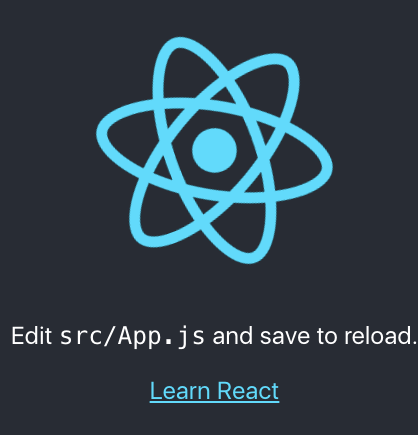
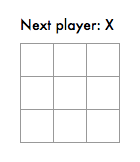

# 2021/08

<!-- TOC -->

- [2021/08](#202108)
    - [2021/08/01 Sun](#20210801-sun)
    - [2021/08/02 Mon](#20210802-mon)
    - [2021/08/03 Tue](#20210803-tue)
    - [2021/08/04 Wed](#20210804-wed)
    - [2021/08/05 Thu](#20210805-thu)

<!-- /TOC -->


## 2021/08/01 Sun

Mac でスクリーンショットのファイル名を変更する  

下記のコマンドで変更ができる  
`name` で名前、 `include-date` で日時をどうするかを決める  

```sh
## `スクリーンショット 2021-08-01 23.56.11.png` -> `screenshot.png`
$ defaults write com.apple.screencapture name "screenshot"
$ defaults write com.apple.screencapture include-date -bool false

## デフォルトに戻す
$ defaults write com.apple.screencapture name スクリーンショット
$ defaults delete com.apple.screencapture include-date
```

`killall SystemUIServer` は Sierra 以降なら不要みたい

- 参考
  - [Macでスクリーンショットのファイル名・形式・保存場所を変更する | Qookie Tech](https://tech.qookie.jp/posts/custom-mac-screenshot/)
  - [[macOS] そのkillallは本当に必要？ [screenshot] - Qiita](https://qiita.com/masakihori/items/646bad690b14cb6df430)


## 2021/08/02 Mon

AWS S3 で圧縮されたファイルを手元で確認する  

少し前に AWS S3 で圧縮されたファイルの中身を確認したいことがあって  
ブラウザからダウンロードして解答して確認するのは大変だったりする  
aws cli でできないものかと思ってたら普通にできるみたい  

```sh
$ aws s3 cp s3://[bucket_name]/sample.gz - | zgrep 'hogefuga'
```

`aws s3 cp` で target を `-` にすると標準出力になる  
[公式ドキュメント](https://docs.aws.amazon.com/ja_jp/cli/latest/userguide/cli-services-s3-commands.html#using-s3-commands-managing-objects-copy)にもストリームされる旨が書いてある  

- 参考
  - [AWS S3上ファイルの中身をLinuxコマンドだけで超絶簡単に確認する方法 - Qiita](https://qiita.com/mimimi-no-sesese/items/0e7955172ab53ccbbde1)


## 2021/08/03 Tue

React チュートリアルを触る  

Gatsby.js を触ったがいまいち理解ができていないので、大元の React.js を触ってみることにした  

Node.js インストールは済み  

まずは[ここ](https://ja.reactjs.org/docs/create-a-new-react-app.html#create-react-app)を見てローカルに React の環境を作る  

```sh
$ npx create-react-app my-app
$ cd my-app/
$ yarn start
```

http://localhost:3000/ にアクセスすると以下のように React のロゴが回っている  

  

`Edit src/App.js and save to reload.` とあるので見てみる  

`App()` の中の HTML を返している  

```js
function App() {
  return (
    <div className="App">
      <header className="App-header">
        
        <p>
          Edit <code>src/App.js</code> and save to reload.
        </p>
        <a
          className="App-link"
          href="https://reactjs.org"
          target="_blank"
          rel="noopener noreferrer"
        >
          Learn React
        </a>
      </header>
    </div>
  );
}
```

返す HTML をシンプルにする  

```js
function App() {
  return (
    <div className="App">
      <h1>Hello World!</h1>
    </div>
  );
}
```

これで Hello World! が出力される  


## 2021/08/04 Wed

React チュートリアルを触る#2  

まだまだ準備編  
まずはチュートリアルに書いてあるとおり、 `src` ディレクトリ内を削除する  

```sh
$ cd my-app
$ cd src
$ rm -f *
$ cd ..
```

4~6 の手順を進める  
`index.css`, `index.js` を作る  
コードは Codepen に書いてあるのでそのままコピーして持ってくる  

ここでブラウザで動作確認すると五目並べの表示が確認できる  

  

ローカルでチュートリアルできる準備が整ったので写経をしていく  


## 2021/08/05 Thu

GitHub で PR が閉じて Reopen もできない  

この 365 は PR を通して行っている  
ブランチ作成、 PR 作成など、複数でやっている  

rebase 後に force push すると勝手に PR が閉じられて Reopen もできなくなった  


`There are no new commits on the feature/xxx branch.` と書いてあった  
（画像は撮り忘れた......）  

新しいコミットを push することで Reopen することができた  
  

