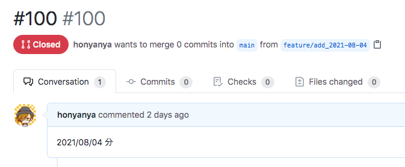
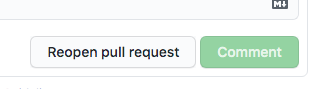
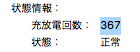
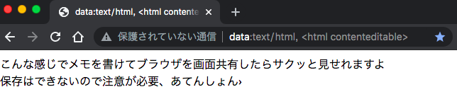
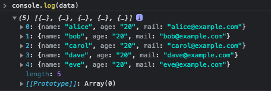
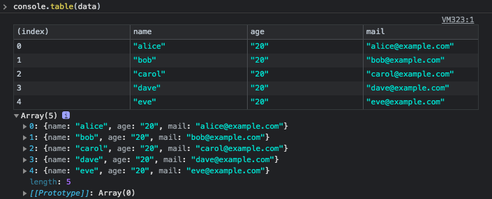

# 2021/08

<!-- TOC -->

- [2021/08](#202108)
    - [2021/08/01 Sun](#20210801-sun)
    - [2021/08/02 Mon](#20210802-mon)
    - [2021/08/03 Tue](#20210803-tue)
    - [2021/08/04 Wed](#20210804-wed)
    - [2021/08/05 Thu](#20210805-thu)
    - [2021/08/06 Fri](#20210806-fri)
    - [2021/08/07 Sat](#20210807-sat)
    - [2021/08/08 Sun](#20210808-sun)
    - [2021/08/09 Mon](#20210809-mon)
    - [2021/08/10 Tue](#20210810-tue)
    - [2021/08/11 Wed](#20210811-wed)
    - [2021/08/12 Thu](#20210812-thu)
    - [2021/08/13 Fir](#20210813-fir)
    - [2021/08/14 Sat](#20210814-sat)
    - [2021/08/15 Sun](#20210815-sun)
    - [2021/08/16 Mon](#20210816-mon)
    - [2021/08/17 Tue](#20210817-tue)
    - [2021/08/18 Wed](#20210818-wed)
    - [2021/08/19 Thu](#20210819-thu)
    - [2021/08/20 Fri](#20210820-fri)
    - [2021/08/21 Sat](#20210821-sat)

<!-- /TOC -->


## 2021/08/01 Sun

Mac でスクリーンショットのファイル名を変更する  

下記のコマンドで変更ができる  
`name` で名前、 `include-date` で日時をどうするかを決める  

```sh
## `スクリーンショット 2021-08-01 23.56.11.png` -> `screenshot.png`
$ defaults write com.apple.screencapture name "screenshot"
$ defaults write com.apple.screencapture include-date -bool false

## デフォルトに戻す
$ defaults write com.apple.screencapture name スクリーンショット
$ defaults delete com.apple.screencapture include-date
```

`killall SystemUIServer` は Sierra 以降なら不要みたい

- 参考
  - [Macでスクリーンショットのファイル名・形式・保存場所を変更する | Qookie Tech](https://tech.qookie.jp/posts/custom-mac-screenshot/)
  - [[macOS] そのkillallは本当に必要？ [screenshot] - Qiita](https://qiita.com/masakihori/items/646bad690b14cb6df430)


## 2021/08/02 Mon

AWS S3 で圧縮されたファイルを手元で確認する  

少し前に AWS S3 で圧縮されたファイルの中身を確認したいことがあって  
ブラウザからダウンロードして解答して確認するのは大変だったりする  
aws cli でできないものかと思ってたら普通にできるみたい  

```sh
$ aws s3 cp s3://[bucket_name]/sample.gz - | zgrep 'hogefuga'
```

`aws s3 cp` で target を `-` にすると標準出力になる  
[公式ドキュメント](https://docs.aws.amazon.com/ja_jp/cli/latest/userguide/cli-services-s3-commands.html#using-s3-commands-managing-objects-copy)にもストリームされる旨が書いてある  

- 参考
  - [AWS S3上ファイルの中身をLinuxコマンドだけで超絶簡単に確認する方法 - Qiita](https://qiita.com/mimimi-no-sesese/items/0e7955172ab53ccbbde1)


## 2021/08/03 Tue

React チュートリアルを触る  

Gatsby.js を触ったがいまいち理解ができていないので、大元の React.js を触ってみることにした  

Node.js インストールは済み  

まずは[ここ](https://ja.reactjs.org/docs/create-a-new-react-app.html#create-react-app)を見てローカルに React の環境を作る  

```sh
$ npx create-react-app my-app
$ cd my-app/
$ yarn start
```

http://localhost:3000/ にアクセスすると以下のように React のロゴが回っている  

  

`Edit src/App.js and save to reload.` とあるので見てみる  

`App()` の中の HTML を返している  

```js
function App() {
  return (
    <div className="App">
      <header className="App-header">
        
        <p>
          Edit <code>src/App.js</code> and save to reload.
        </p>
        <a
          className="App-link"
          href="https://reactjs.org"
          target="_blank"
          rel="noopener noreferrer"
        >
          Learn React
        </a>
      </header>
    </div>
  );
}
```

返す HTML をシンプルにする  

```js
function App() {
  return (
    <div className="App">
      <h1>Hello World!</h1>
    </div>
  );
}
```

これで Hello World! が出力される  


## 2021/08/04 Wed

React チュートリアルを触る#2  

まだまだ準備編  
まずはチュートリアルに書いてあるとおり、 `src` ディレクトリ内を削除する  

```sh
$ cd my-app
$ cd src
$ rm -f *
$ cd ..
```

4~6 の手順を進める  
`index.css`, `index.js` を作る  
コードは Codepen に書いてあるのでそのままコピーして持ってくる  

ここでブラウザで動作確認すると五目並べの表示が確認できる  

  

ローカルでチュートリアルできる準備が整ったので写経をしていく  


## 2021/08/05 Thu

GitHub で PR が閉じて Reopen もできない  

この 365 は PR を通して行っている  
ブランチ作成、 PR 作成など、複数でやっている  

rebase 後に force push すると勝手に PR が閉じられて Reopen もできなくなった  



`There are no new commits on the feature/xxx branch.` と書いてあった  
（画像は撮り忘れた......）  

新しいコミットを push することで Reopen することができた  
  


## 2021/08/06 Fri

HTML で同じ要素に存在しているテキストを取得する  

半スクレイピング的なこと  
よくまとめて情報取得したいが、ガッツリコードを書くほどでも無いってときは開発者ツールのコンソールを使用している  

こんな HTML があったとして  

```html
<div class="contents">
  <div class="hoge_name">eins</div>
  <div class="hoge_name">zwei</div>
  <div class="hoge_name">drei	</div>
  <div class="hoge_name">vier</div>
  <div class="hoge_name">fünf</div>
</div>
```

こんな JS をブラウザのコンソールで実行すれば取得ができる  

```js
Array.from(document.getElementsByClassName('hoge_name')).map(element => element.innerText);
// (5) ["eins", "zwei", "drei", "vier", "fünf"]
```

`getElementsByClassName` だと `HTMLCollection` のが返ってくる  

```js
document.getElementsByClassName('hoge_name');
// HTMLCollection(5) [div.hoge_name, div.hoge_name, div.hoge_name, div.hoge_name, div.hoge_name]
```

そのため、 [Array.form](https://developer.mozilla.org/ja/docs/Web/JavaScript/Reference/Global_Objects/Array/from) メソッドを使用して、 Array インスタンスを生成する  
[Array.prototype.map](https://developer.mozilla.org/ja/docs/Web/JavaScript/Reference/Global_Objects/Array/map) メソッドを使用して、各 Element のテキストのみを抽出している  


## 2021/08/07 Sat

pyenv で Python のバージョンが切り替わらなかったときの対応  

Python の新しいバージョンをインストールする  
複数のバージョンを入れれるよう pyenv を使うことにした  

特に設定は変えていないので、システムのデフォルトは Python2 になっている  

```sh
$ python --version
Python 2.7.10

$ which python
/usr/bin/python
```

GitHub から clone して pyenv を入れる  

```sh
$ git clone https://github.com/pyenv/pyenv.git ~/.pyenv

$ echo 'export PYENV_ROOT="$HOME/.pyenv"' >> ~/.bashrc
$ echo 'export PATH="$PYENV_ROOT/bin:$PATH"' >> ~/.bashrc
$ echo 'eval "$(pyenv init )"' >> ~/.bashrc
$ source ~/.bashrc

$ pyenv --version
pyenv 2.0.4-8-gd209e061

$ pyenv install 3.9.6
$ pyenv global 3.9.6
```

インストール時はこんな感じ  
openssl と python をインストールしていた  

```sh
$ pyenv install 3.9.6
Downloading openssl-1.1.1k.tar.gz...
-> https://www.openssl.org/source/openssl-1.1.1k.tar.gz
Installing openssl-1.1.1k...
Installed openssl-1.1.1k to /Users/user/.pyenv/versions/3.9.6

python-build: use readline from homebrew
Downloading Python-3.9.6.tar.xz...
-> https://www.python.org/ftp/python/3.9.6/Python-3.9.6.tar.xz
Installing Python-3.9.6...
python-build: use readline from homebrew
Installed Python-3.9.6 to /Users/user/.pyenv/versions/3.9.6
```

しかし Python のバージョンは変わらなかった  

```sh
$ python --version
Python 2.7.10

$ which python
/usr/bin/python
```

`pyenv init` を実行してみた  

```sh
$ pyenv init

# (The below instructions are intended for common
# shell setups. See the README for more guidance
# if they don't apply and/or don't work for you.)

# Add pyenv executable to PATH and
# enable shims by adding the following
# to ~/.profile:

export PYENV_ROOT="$HOME/.pyenv"
export PATH="$PYENV_ROOT/bin:$PATH"
eval "$(pyenv init --path)"

# If your ~/.profile sources ~/.bashrc,
# the lines need to be inserted before the part
# that does that. See the README for another option.

# If you have ~/.bash_profile, make sure that it
# also executes the above lines -- e.g. by
# copying them there or by sourcing ~/.profile

# Load pyenv into the shell by adding
# the following to ~/.bashrc:

eval "$(pyenv init -)"

# Make sure to restart your entire logon session
# for changes to profile files to take effect.
```

`to ~/.profile:` に `eval "$(pyenv init --path)"` を書いてあるため修正してみた  

```diff
- eval "$(pyenv init -)"
+ eval "$(pyenv init --path)"
```

これでバージョンが変わった  

```sh
$ source ~/.bashrc

$ which python
/Users/user/.pyenv/shims/python

$ python --version
Python 3.9.6
```

Python3 の最新バージョン入れるまとめ  

```
$ git clone https://github.com/pyenv/pyenv.git ~/.pyenv

$ echo 'export PYENV_ROOT="$HOME/.pyenv"' >> ~/.bashrc
$ echo 'export PATH="$PYENV_ROOT/bin:$PATH"' >> ~/.bashrc
$ echo 'eval "$(pyenv init --path)"' >> ~/.bashrc
$ source ~/.bashrc

$ pyenv --version
pyenv 2.0.4-8-gd209e061

$ pyenv install 3.9.6
$ pyenv global 3.9.6

$ which python
/Users/user/.pyenv/shims/python

$ python --version
Python 3.9.6
```

- 参考
  - [pyenv globalでpythonのバージョンが切り替わらない(mac) - Qiita](https://qiita.com/jackbook1750/items/a8513a1cadd702d84651)
  - [pyenvでPythonのバージョンを切り替えられない場合の対処法＋ - Qiita](https://qiita.com/TheHiro/items/88d885ef6a4d25ec3020)


## 2021/08/08 Sun

pip のバージョンを上げる  

virtualenv を pip で入れた際にバージョンを上げてねというメッセージが出た  

```sh
$ pip install virtualenv
...
WARNING: You are using pip version 21.1.3; however, version 21.2.3 is available.
You should consider upgrading via the '/Users/user/.pyenv/versions/3.9.6/bin/python3.9 -m pip install --upgrade pip' command.
```

現在の pip のバージョン  

```sh
$ pip --version
pip 21.1.3 from /Users/user/.pyenv/versions/3.9.6/lib/python3.9/site-packages/pip (python 3.9)
```

バージョンを上げる  

```sh
$ python -m pip install --upgrade pip
```

21.1.3 -> 21.2.3 に上がったことを確認した  

```
$ pip --version
pip 21.2.3 from /Users/user/.pyenv/versions/3.9.6/lib/python3.9/site-packages/pip (python 3.9)
```


## 2021/08/09 Mon

virtualenv をインストールする  

pip でインストールする方法  

```sh
$ pip install virtualenv

$ virtualenv --version
virtualenv 20.7.0 from /Users/user/.pyenv/versions/3.9.6/lib/python3.9/site-packages/virtualenv/__init__.py
```

pyenv virtualenv をインストールする方法  

```sh
$ git clone https://github.com/yyuu/pyenv-virtualenv.git ~/.pyenv/plugins/pyenv-virtualenv
$ echo 'eval "$(pyenv virtualenv-init -)"' >> ~/.bashrc
$ source ~/.bashrc

$ pyenv virtualenv --version
pyenv-virtualenv 1.1.5 (virtualenv virtualenv 20.7.0 from /Users/user/.pyenv/versions/3.9.6/lib/python3.9/site-packages/virtualenv/__init__.py)
```

軽く調べると 3 系を使うなら venv を使うのが良いのかも  


## 2021/08/10 Tue

brew update で最近見るメッセージ  

最近 `brew update` をするとよく見かけるメッセージやエラー  
なんだろうなと思いつつ、再実行してみると出なかったりする  

頻度も低く、再実行で問題なかったので深くは見なかった  

```sh
$ brew update
Auto packing the repository in background for optimum performance.
See "git help gc" for manual housekeeping.

$ brew update
Error: Another active Homebrew update process is already in progress.
Please wait for it to finish or terminate it to continue.

$ brew update
xcrun: error: invalid active developer path (/Library/Developer/CommandLineTools), missing xcrun at: /Library/Developer/CommandLineTools/usr/bin/xcrun
```

## 2021/08/11 Wed

Mac のバッテリー充放電回数を調べる  

GUI だと Option を押しながら Apple マークを押すことで、 `この Mac について` が `システム情報` に変わる  

システム情報から電源を選択することで見ることが可能  



これをコマンドで見てみる  

コマンドだと以下でシステム情報から見れる電源の情報が出力される  

```sh
$ system_profiler SPPowerDataType
```

あとは項目を絞り込めば見ることができる  

```sh
$ system_profiler SPPowerDataType | egrep 'Health Information:|Cycle Count:|Condition: Normal'
      Health Information:
          Cycle Count: 367
          Condition: Normal
```

充放電回数が 1000 回で交換の目安みたいなのでまだまだ使えそう  


- 参考
  - [Macの電源アダプタの充電電力をコマンドラインから確認する方法 - Qiita](https://qiita.com/apollo_program/items/56a56932450a5d326cc1)


## 2021/08/12 Thu

SQLite のバージョンが古くて Django を起動することができない  

Django を起動しようとしたが SQLite のバージョンが古くて起動ができなかった  

```sh
$ python manage.py runserver
Watching for file changes with StatReloader
Exception in thread django-main-thread:
Traceback (most recent call last):
...
django.core.exceptions.ImproperlyConfigured: SQLite 3.9.0 or later is required (found 3.8.10.2).
```

SQLite のバージョンを確認する  
`3.8.10.2` と古い  

```sh
$ which sqlite3
/usr/bin/sqlite3

$ sqlite3 --version
3.8.10.2 2015-05-20 18:17:19 2ef4f3a5b1d1d0c4338f8243d40a2452cc1f7fe4
```

Python でも実行してみる  
同じく `3.8.10.2` が出力される  

```sh
$ python
Python 3.9.6 (default, Aug  8 2021, 17:12:14)
[Clang 8.0.0 (clang-800.0.42.1)] on darwin
Type "help", "copyright", "credits" or "license" for more information.
>>> import sqlite3
>>> sqlite3.sqlite_version
'3.8.10.2'
```

SQLite のバージョンを上げるため、 Homebrew で SQLite をインストールする  

```sh
$ brew install sqlite
```

バージョンが `3.36.0` となる  

```sh
$ which sqlite3
/usr/local/opt/sqlite/bin/sqlite3

$ sqlite3 --version
3.36.0 2021-06-18 18:36:39 5c9a6c06871cb9fe42814af9c039eb6da5427a6ec28f187af7ebfb62eafa66e5
```

Python で実行してみると変わらず `3.8.10.2` が出力される  

```sh
$ python
Python 3.9.6 (default, Aug  8 2021, 17:12:14)
[Clang 8.0.0 (clang-800.0.42.1)] on darwin
Type "help", "copyright", "credits" or "license" for more information.
>>> import sqlite3
>>> sqlite3.sqlite_version
'3.8.10.2'
```

さて、どうしたものか  


## 2021/08/13 Fir

SQLite のバージョンが古くて Django を起動することができない 2  

昨日の続き  

`/usr/local/bin/` に対してシンボリックリンクを貼ってみたり  

```sh
$ cd /usr/local/bin/
$ ln -s ../Cellar/sqlite/3.36.0/bin/sqlite3 sqlite3

$ ls -l /usr/local/bin/sqlite3
lrwxr-xr-x  1 user  admin  35  8 15 00:44 /usr/local/bin/sqlite3 -> ../Cellar/sqlite/3.36.0/bin/sqlite3
```

`LD_LIBRARY_PATH` 環境変数を設定してみると良いとあったりしたが変わらず  

```sh
$ export LD_LIBRARY_PATH="/usr/local/Cellar/sqlite/3.36.0/lib:$LD_LIBRARY_PATH"
```

そもそも `LD_LIBRARY_PATH` の環境変数が適用されない問題もある  

```sh
$ export LD_LIBRARY_PATH="/usr/local/Cellar/sqlite/3.36.0/lib:$LD_LIBRARY_PATH"
$ printenv LD_LIBRARY_PATH

$ export TEST_ENV="test_env"
$ printenv TEST_ENV
test_env
```

久々にハマって抜け出せないでいる  
ちょっとしばらく置いて、改めて見た方が良いかも  


## 2021/08/14 Sat

Docker を使う時にプチ意識していること  

ちょっと知人の開発を見る機会があって  
Docker の扱い方について数年前の自分と同じことをしていたので懐かしつつももっと効率的にできるよ的な話をしたのでここにも書いておく  

Dockerfile を作成する  

調べては、 Dockerfile にすぐ記述して動かそうとしていた  
いきなり Dockerfile に書いたりすると、build 時に動かなかったりして、時間を使うことになる  
`docker run` で起動してからまずはそこで構築した方が良いことを伝えた  

```sh
docker run -it centos:centos7.9.2009 /bin/bash
```

これで指定したタグのコンテナが起動できるので、ここで叩いたコマンドを Dockerfile に残していくと良い  


## 2021/08/15 Sun

Docker を使う時にプチ意識していること 2  

昨日の続き  
Docker コンテナに入って状態を確認したい時があるが、 docker-compose を使用しているのに docker コマンドで入っていたりした  
オプションの指定やコンテナの名前を調べる必要がある  

```sh
docker-compose ps
docker exec -it pj_app_1 /bin/bash
```

`docker-compose exec [container_name]` で問題なく同じことができる  

```sh
docker-compose exec app /bin/bash
```


## 2021/08/16 Mon

RDS で process を kill する場合  

RDS 上で動かしているクエリが重くて kill しようとした  
`SHOW PROCESSLIST;` でクエリを見て該当のクエリの ID を見た  
process を kill しようにもできなかった  

```sh
mysql> KILL 101;
ERROR 1095 (HY000): You are not owner of thread 101
```

owner が違うということだが...  
確かに MySQL のコンソールは RDS の admin ユーザで入っており、クエリは別で作成したシステムのユーザで実行している  

root では無いため、そのまま kill することはできない  
RDS の場合は `CALL mysql.rds_kill(xxxx);` を使用する  

```sh
mysql> CALL mysql.rds_kill(101);
Query OK, 0 rows affected (0.06 sec)
```

問題なく、クエリが kill された  

- 参考
  - [mysql.rds_kill - Amazon Relational Database Service](https://docs.aws.amazon.com/ja_jp/AmazonRDS/latest/UserGuide/mysql_rds_kill.html)


## 2021/08/17 Tue

SELECT で固定した値を返す  

数年前に作ったアプリケーションを直す機会が生まれそうで  
今思うとあまりよくない設計なのか、ある返却値を変更して固定値にしたいだけなのにアプリケーションコードの改修だと修正に時間がかかりそうだった  
クエリの結果を固定にして、そのまま返却しようと思う  

`SELECT` のあとに任意の値を書けば固定値で返してくれる  

例えば `-1` を返却する

```sh
mysql> SELECT -1;
+----+
| -1 |
+----+
| -1 |
+----+
1 row in set (0.00 sec)
```

列名も値も同じ `-1` が少しきになるのでちゃんと別名を付ける  

```sh
mysql> SELECT -1 AS dummy;
+-------+
| dummy |
+-------+
|    -1 |
+-------+
1 row in set (0.01 sec)
```

もちろん任意の文字列も返すことができる  

```sh
mysql> SELECT 'hoge';
+------+
| hoge |
+------+
| hoge |
+------+
1 row in set (0.00 sec)

mysql> SELECT 'success' AS status;
+---------+
| status  |
+---------+
| success |
+---------+
1 row in set (0.00 sec)
```


## 2021/08/18 Wed

ブラウザをメモ帳代わりにする  

会議中に同期から教えてもらったネタ  
サクッと共有したい時に便利  

ブラウザに下記を入力すればメモ帳代わりに使える  
```
data:text/html, <html contenteditable>
```

でブックマークに保存すればそのまま使える  



保存はできないので注意  
このご時世なのでリモートでの会議が多いが、チャットやドキュメントの内容をサクッと共有したい時に便利  


## 2021/08/19 Thu

開発者ツールで JSON を表で出力させる  

`console.table` で可能  

こんな JSON がある  

```js
const data = [
    {
        "name": "alice",
        "age": "20",
        "mail": "alice@example.com"
    },
    {
        "name": "bob",
        "age": "20",
        "mail": "bob@example.com"
    },
    {
        "name": "carol",
        "age": "20",
        "mail": "carol@example.com"
    },
    {
        "name": "dave",
        "age": "20",
        "mail": "dave@example.com"
    },
    {
        "name": "eve",
        "age": "20",
        "mail": "eve@example.com"
    }
]
```

`console.log` だとこんな感じ  

```js
console.log(data)
```



`console.table` だとこんな感じ  

```js
console.table(data)
```




## 2021/08/20 Fri

iTerm2 で SSH すると locale 関連のファイルが無いと言われる  

最近 SSH すると  

```sh
locale: Cannot set LC_ALL to default locale: No such file or directory
```

こんなメッセージが出るようになった  
直近で心当たりがあるのは macOS のアップグレードぐらい  

調べると iTerm2 の設定を変えることで解消できた  
Preference -> Profiles -> Terminal -> Envirionment -> Set locale variables automatically のチェックを外す  
これで locale 関連のメッセージは出なくなった  

- 参考
  - [macOS Mojave 10.14 にアップデート後、iTerm2 で SSH したら文字化けした - Qiita](https://qiita.com/junz/items/357fce241373170e6ed6)


## 2021/08/21 Sat

Ubuntu のコードネーム名  

Vagrant のイメージで Ubuntu を使おうとするといつも迷ってしまう（ちゃんとページを見ると説明にはバージョンが書いてある......）  
CentOS はバージョンで書いてあるけど、 Ubuntu はバージョンでは無く、コードネーム名でボックス名を指定する  
https://app.vagrantup.com/centos  
https://app.vagrantup.com/ubuntu  

ボックス名とバージョンのまとめ  

| Box Name                                                             | Code Name     | Version      | 
| -------------------------------------------------------------------- | ------------- | ------------ | 
| [ubuntu/trusty64](https://app.vagrantup.com/ubuntu/boxes/trusty64)   | Trusty Tahr   | Ubuntu 14.04 | 
| [ubuntu/xenial64](https://app.vagrantup.com/ubuntu/boxes/xenial64)   | Xenial Xerus  | Ubuntu 16.04 | 
| [ubuntu/bionic64](https://app.vagrantup.com/ubuntu/boxes/bionic64)   | Bionic Beaver | Ubuntu 18.04 | 
| [ubuntu/focal64](https://app.vagrantup.com/ubuntu/boxes/focal64)     | Focal Fossa   | Ubuntu 20.04 | 
| [ubuntu/hirsute64](https://app.vagrantup.com/ubuntu/boxes/hirsute64) | Hirsute Hippo | Ubuntu 21.04 | 
| [ubuntu/impish64](https://app.vagrantup.com/ubuntu/boxes/impish64)   | Impish Indri  | Ubuntu 21.10 | 