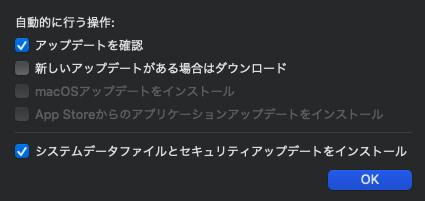

いつの間にか容量が増えてると思ったら macOS Monterey のインストーラーがダウンロードされていた。

```sh
$ df -h ~/
Filesystem     Size   Used  Avail Capacity iused      ifree %iused  Mounted on
/dev/disk1s1  113Gi   65Gi   32Gi    67% 1428487 1181413993    0%   /System/Volumes/Data
```

最近の macOS は `/System/Volumes/Data/Previous\ System/Applications/` 以下にインストーラーがダウンロードされる。

```sh
$ ls -l /System/Volumes/Data/Previous\ System/Applications/Install\ macOS\ Monterey.app/
total 0
drwxr-xr-x  12 root  wheel  384  1 22 13:01 Contents

$ du -sh /System/Volumes/Data/Previous\ System/Applications/Install\ macOS\ Monterey.app/
 11G	/System/Volumes/Data/Previous System/Applications/Install macOS Monterey.app/
```

前までは `/Application` 以下のインストーラーをそのまま削除したり、 Launchpad から削除したら消えていた記憶だが、 `/Application` 以下には無いし、 Launchpad からの削除もできなかった。  
App Store の管理からシステム環境設定の管理になったからだろうか？

`/System` 以下なので `sudo` 付けて削除すれば OK 。

```sh
$ sudo rm -rf /System/Volumes/Data/Previous\ System/Applications/Install\ macOS\ Monterey.app/
```

再起動後、容量が減っていることを確認できた。  

```sh
## before
$ df -h ~/
Filesystem     Size   Used  Avail Capacity iused      ifree %iused  Mounted on
/dev/disk1s1  113Gi   65Gi   32Gi    67% 1428487 1181413993    0%   /System/Volumes/Data

## after
$ df -h ~/
Filesystem     Size   Used  Avail Capacity iused      ifree %iused  Mounted on
/dev/disk1s1  113Gi   53Gi   44Gi    55% 1426949 1181415531    0%   /System/Volumes/Data
```

ちなみに自動で macOS のインストーラーをダウンロードしていた件は下記画像の「新しいアップデートがある場合はダウンロード」がチェック付いてたため。  
ひとまず macOS のバージョンを上げたいときはまたその時にダウンロードするので、チェックは外しておいた。  



