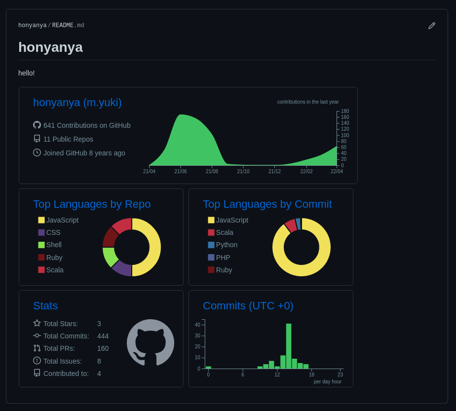

昨日の続きで GitHub Profile の中身を増やしていく  
github-profile-summary-card を使って GitHub の情報を SVG で出力してくれる  
出力した SVG を README に貼る  

github-profile-summary-card  
https://github.com/vn7n24fzkq/github-profile-summary-cards


## 手順

- 1: Personal Access Token の発行
- 2: Repository Secrets に Personal Access Token を登録
- 3: GitHub Actions 作成
- 4: README に貼る

### 1: Personal Access Token の発行

https://github.com/settings/tokens で今回使用する Token を発行する  

必要な権限  
以下 5 つの権限が必要

- repo
  - repo:status
  - repo_deployment
  - public_repo
- user
  - read:user
  - user:email

生成された Token を控えておく


### 2: Repository Secrets に Personal Access Token を登録

https://github.com/{username}/{username}/settings/secrets/actions から登録  

- Name
  - `SUMMARY_GITHUB_TOKEN`
- Value
  - 1 で発行した Personal Access Token


### 3: GitHub Actions 作成

https://github.com/vn7n24fzkq/github-profile-summary-cards#github-actions-usage の通りに作成すれば問題ない  
実際に作成した PR: https://github.com/honyanya/honyanya/pull/2/files

```yml
---
name: GitHub-Profile-Summary-Cards

on:
  schedule: # execute every 24 hours
    - cron: '* */24 * * *'
  workflow_dispatch:

jobs:
  build:
    runs-on: ubuntu-latest
    name: generate

    steps:
      - uses: actions/checkout@v2
      - uses: vn7n24fzkq/github-profile-summary-cards@release
        env:
          GITHUB_TOKEN: ${{ secrets.SUMMARY_GITHUB_TOKEN  }}
        with:
          USERNAME: ${{ github.repository_owner }}
```

main merge 後、 GitHub Actions から `GitHub-Profile-Summary-Cards` を動かして動作確認を行う  
問題なければ `profile-summary-card-output` というディレクトリが増えコミットされる  
GitHub Actions で schedule を指定してるため、定期的に更新される仕組みになる  

https://github.com/honyanya/honyanya/tree/main/profile-summary-card-output


### 4: README に貼る

プレビュー見れるのでお好きなテーマを README に貼れば OK

完成



## 参考

- [GitHubのプロフィールかっこよくする - kosappi の日記](https://blog.kosappi.net/entry/2021/04/17/002051)
