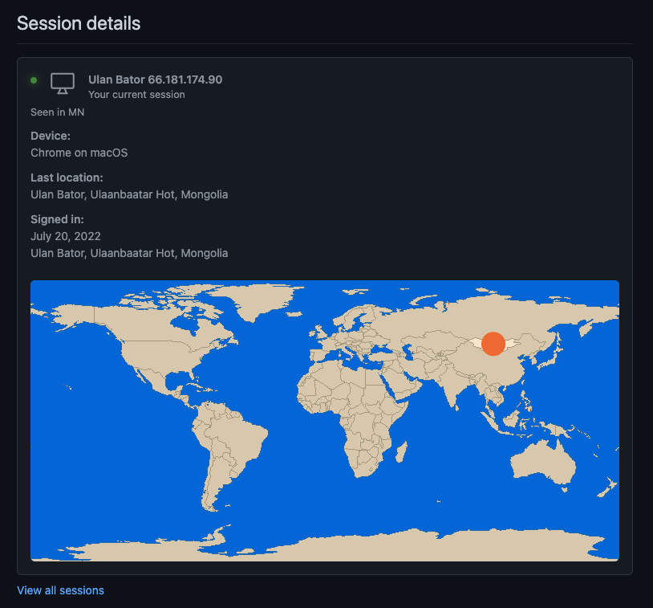

旅行のタイミングでたまたま重なっただけかもしれないけど一応記録  
GitHub でログインすると下記のメールが来た  
よくある「ログインされたけど貴方ですか？正しいですか？」という内容

```
Hey honyanya!

Your GitHub account was successfully signed in to but we did not recognize the location of the sign in. You can review this sign in attempt by visiting https://github.com/settings/sessions/authentications/xxxxxxxxxx.

If you recently signed in to your account, you do not need to take any further action.

If you did not sign in to your account, your password may be compromised. Visit https://github.com/settings/security to create a new, strong password for your GitHub account.

For more information, see "https://docs.github.com/articles/keeping-your-account-and-data-secure/" in the GitHub Help.

To see this and other security events for your account, visit https://github.com/settings/security-log

If you run into problems, please contact support by visiting https://github.com/contact

Thanks,
The GitHub Team
```

実際に Sessions にアクセスして確認してみた



本当に海外に居るんだなーと改めて実感
