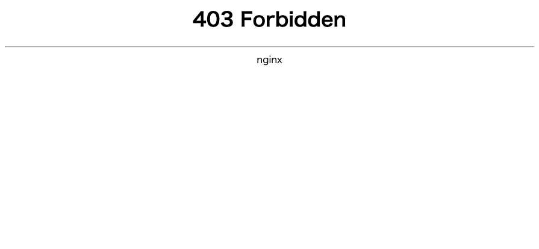

※ 長いのでタイトルの文章はいろいろ削った  
（本当のタイトル: 日本国内の IP アドレスのみでアクセス制限された Web ページがあったので macOS で L2TP/IPsec VPN クライアントを使い VPN Gate を用いて Web ページにアクセスをする）

日本国内のみアクセス許可をしており、海外からのアクセスが禁止になっている Web ページがある  
実際にアクセスしてみたかったので調べてみた

今回はサクッと [VPN Gate](https://www.vpngate.net/ja/) を使用することにした  
学生の時、ネットワークの授業で触った記憶が懐かしい  
Windows では VPN Gate Client をインストールする必要があるが、 Mac では OS 標準の機能でできるのでやってみる

## 設定方法

基本的に [Mac での接続方法 (L2TP/IPsec VPN)](https://www.vpngate.net/ja/howto_l2tp.aspx#mac) に書かれている内容を実施すれば OK  
スクリーンショットは OS X 時代のものだけど、 macOS Monterey で実際にできた

問題なく設定ができると接続ができる  

## 動作確認

VPN 使用前  
Nginx の 403 エラーを返している

VPN 使用後  
WordPress の管理画面ログインのページにアクセスができる

---

大きな問題が無ければ明日 7/25 お昼頃に帰国予定です
