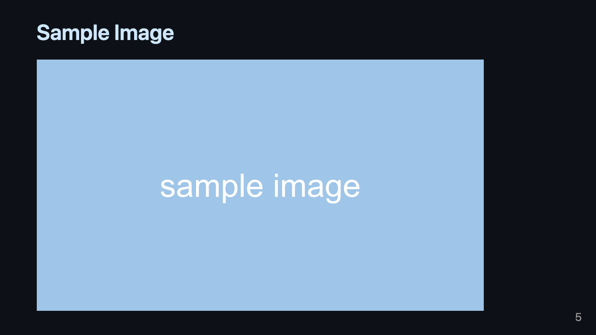
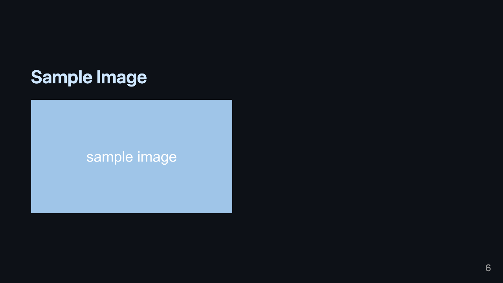

最近 marp で資料を作る機会は増え [marp-cli](https://github.com/marp-team/marp-cli) を使っているので簡単なまとめ  
マークダウンで資料作れるのは非常に便利で量産もできる

[Marp for VS Code](https://marketplace.visualstudio.com/items?itemName=marp-team.marp-vscode) を使えば VSCode でプレビューや書き出しもできるので入れておくと便利


# インストール

homebrew なら下記で OK

```sh
$ brew install marp-cli
$ marp -v
@marp-team/marp-cli v2.1.2 (w/ @marp-team/marp-core v3.3.2)
```


# 書き方

## Front Matter

まずは Front Matter を書いて、 marp を使う旨やデザインのテーマなどを決める

```md
---
marp: true
theme: default
class: invert
paginate: true
---
```

- marp
  - marp を使う
- theme
  - テーマを指定する
  - デフォルトで用意されているテーマは[ここ](https://github.com/marp-team/marp-core/tree/main/themes)から確認ができる
  - CSS を使ってオリジナルテーマも作ることができるが今日の記事では割愛
- class
  - `invert` を指定することで色を反転することが可能
- paginate
  - ページ番号表示の有無


## 内容

見出しが文字となり、罫線がページ区切りとなる

```md

# marp で LT 資料爆速作成 🏃💨
## めっちゃ便利

---

# みなさんマークダウン好きですか？
# 自分は大好きです

```

こんな書き出すとこんな感じになる


## 画像

マークダウンと同じ要領で読み込めば OK  
ただし細かい画像の制御はできないが、簡単な操作は画像タイトルに書けばできる

```md

# Sample Image


---

# Sample Image


```






# PDF に書き出し

発表時やチャットで共有するために書き出しをする

```sh
$ marp --pdf /path/to/index.md
$ ls /path/to/
index.md        index.pdf
```

もし画像を読み込んでいる場合は `--allow-local-files` オプションが必要なので忘れずに  
(v1.4.1 の時は使わずに読み込めていた気がするが、公式の README にはオプションが存在していたので気の所為だった？)

```sh
$ marp --pdf --allow-local-files /path/to/index.md
```


# ドキュメント

他にもいろいろできるので下記を参照

- 書き方
  - https://marpit.marp.app/markdown
- cli の使い方
  - https://github.com/marp-team/marp-cli#basic-usage

helloworld リポジトリにも触ったの push してます

- https://github.com/honyanya/helloworld/tree/main/marp-hello-world
