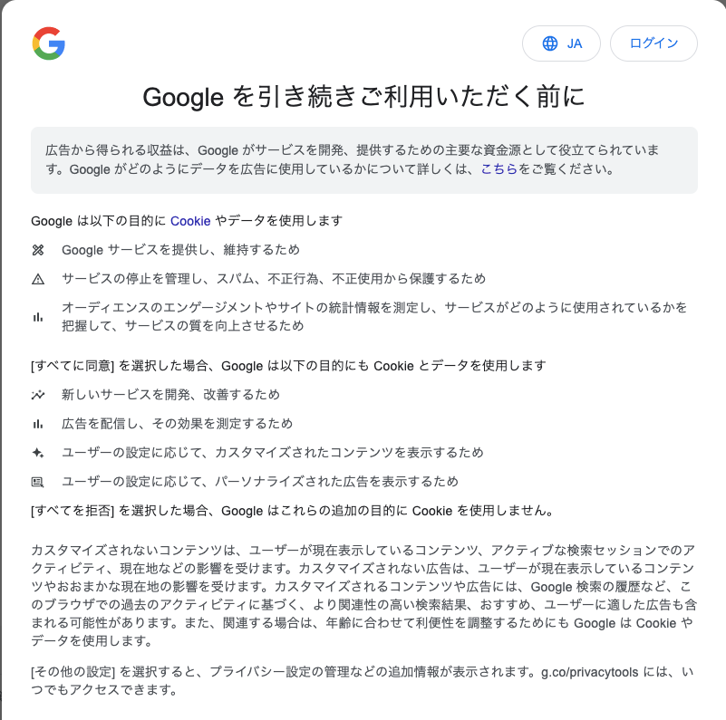

日本じゃ出てこないポップアップがでてきた

> Google を引き続きご利用いただく前に\
> 広告から得られる収益は、Google がサービスを開発、提供するための主要な資金源として役立てられています。Google がどのようにデータを広告に使用しているかについて詳しくは、こちらをご覧ください。\
> Google は以下の目的に Cookie やデータを使用します\
> Google サービスを提供し、維持するため\
> サービスの停止を管理し、スパム、不正行為、不正使用から保護するため\
> オーディエンスのエンゲージメントやサイトの統計情報を測定し、サービスがどのように使用されているかを把握して、サービスの質を向上させるため\
> [すべてに同意] を選択した場合、Google は以下の目的にも Cookie とデータを使用します\
> 新しいサービスを開発、改善するため\
> 広告を配信し、その効果を測定するため\
> ユーザーの設定に応じて、カスタマイズされたコンテンツを表示するため\
> ユーザーの設定に応じて、パーソナライズされた広告を表示するため\
> [すべてを拒否] を選択した場合、Google はこれらの追加の目的に Cookie を使用しません。\
> カスタマイズされないコンテンツは、ユーザーが現在表示しているコンテンツ、アクティブな検索セッションでのアクティビティ、現在地などの影響を受けます。カスタマイズされない広告は、ユーザーが現在表示しているコンテンツやおおまかな現在地の影響を受けます。カスタマイズされるコンテンツや広告には、Google 検索の履歴など、このブラウザでの過去のアクティビティに基づく、より関連性の高い検索結果、おすすめ、ユーザーに適した広告も含まれる可能性があります。また、関連する場合は、年齢に合わせて利便性を調整するためにも Google は Cookie やデータを使用します。\
> [その他の設定] を選択すると、プライバシー設定の管理などの追加情報が表示されます。g.co/privacytools には、いつでもアクセスできます。\

広告や Cookie の話なので GDPR で確認を取るために出してるのかなと  

[EU ユーザーの同意ポリシーに関するヘルプ](https://www.google.com/intl/ja/about/company/user-consent-policy-help/) に下記の記載があった

> EEA または英国に拠点を置くパブリッシャーや広告主は、すべてのユーザーに対してこのポリシーを適用する必要がありますか？
> Google の EU ユーザーの同意ポリシーは、EEA または英国に拠点を置くエンドユーザーにのみ適用されます。

EU のエンドユーザー扱いになってるのでポリシー確認ためのポップアップだという認識をした  
Android でも同じポップアップが出ていたことを思い出した
